# Abstract

Learning to recite the Qur'an correctly has historically required a qualified teacher listening in real time and correcting errors as they occur. That correction loop is the pedagogy, and it is also the bottleneck: it does not scale, and in regions with few qualified reciters it is largely unavailable. Existing Qur'an applications play professional recitation but do not listen; general-purpose Arabic speech recognition produces a transcript, which structurally cannot report which phoneme within a word was mispronounced or that an elongation was held for two counts instead of four.

**Bayaan** is an Android application that closes that loop with a machine listener. A learner selects an ayah from a page-faithful mushaf reproducing all six hundred and four pages of the printed Madani text through per-page glyph fonts, records their recitation, and receives a per-character analysis painted directly onto the Arabic script: which letters were substituted, which tajweed rule was violated, whether an elongation was cut short or held too long, and whether the letter characteristics (*sifat*) the ear should hear were present in the audio. Around that core the system adds a complete guided Arabic curriculum — forty-one authored lessons across eight units, terminating in graded recitation of Al-Fatihah — and a three-module Tajweed track covering *ghunnah*, *qalqalah*, and *madd*, unlocked on graduation.

The system is built as three components: a Jetpack Compose Android application; a thin Ktor service that verifies identity tokens locally against a published key set, forwards audio, normalises grading output, and persists results to PostgreSQL; and a pretrained MIT-licensed wav2vec2 recitation model with multi-level CTC heads, deployed to a scale-to-zero serverless GPU. The project trains no model of its own — a decision taken deliberately and documented with its costs.

The principal technical contribution is an endpoint that extends the pretrained engine from grading *known ayat* to grading **arbitrary short Uthmani text**, so that the same phoneme-level and attribute-level analysis that evaluates a full recitation also evaluates a beginner saying a single syllable. Making that usable in a product required two additions beyond the endpoint itself: a pause-form authoring convention enforced mechanically by the content pipeline, without which correct learners are systematically marked wrong because the phonetiser applies stop rules word-finally; and a tolerance policy — implemented as a pure, unit-tested normaliser — that discards breath artefacts at clip boundaries, maps a single ambiguous phoneme to a retry rather than a failure, and converts a known upstream decoder defect into a recoverable verdict instead of a server error. Each of these rules traces to a measured error mode in an empirical spike of forty-three clips across two speakers, in which planted errors were localised to the exact phoneme in sixteen of seventeen wrong clips.

The delivered system comprises 7,241 lines of Kotlin across forty-eight Android source files, 3,135 lines of Kotlin in the service of which 1,194 are tests spanning sixty executable assertions, a single-file GPU deployment, and a dependency-free content pipeline that validates and deterministically packs forty-four lessons and two hundred and ninety-two exercise items with zero stubs. This report documents the requirements, the analysis, the design, the implementation, and the verification of that system, and gives equal weight to the engineering decisions behind it — including four capabilities deliberately excluded, among them a costed feasibility study of a browser target that concluded in a documented rejection. Known limitations are stated without mitigation: the grading tolerances are tuned on native-speaker data and remain unvalidated on beginner audio, ninety-one pedagogical audio clips await human recording, and font licensing blocks public distribution.

**Keywords:** Qur'an recitation, tajweed, computer-assisted pronunciation training, phoneme-level speech grading, wav2vec2, connectionist temporal classification, Arabic natural language processing, Android, Kotlin, Jetpack Compose, Ktor, serverless GPU, spaced repetition, mobile learning.

---

# Table of Contents

- Certificate of Originality
- Dedication
- Acknowledgement
- Abstract
- Table of Contents
- List of Figures
- List of Tables

**Chapter 1: Introduction**

- 1.1 Introduction
- 1.2 Problem Statement
- 1.3 Project Objectives
- 1.4 Project Limitations
- 1.5 Project Scope
    - 1.5.1 Targeted-Audience Scope
    - 1.5.2 Geographical Scope
    - 1.5.3 Devices and Platforms Scope
- 1.6 Project Stages
    - 1.6.1 Choice of Software Development Model
    - 1.6.2 Development Stages
- 1.7 Tools and Equipment
    - 1.7.1 Hardware
    - 1.7.2 Front-End Software Tools
    - 1.7.3 Back-End and Infrastructure Software Tools
    - 1.7.4 Machine Learning and Content Tools
    - 1.7.5 Development and Testing Tools
- 1.8 Jetpack Compose — Framework Overview
- 1.9 Ktor — Framework Overview
- 1.10 Supabase — Platform Overview
- 1.11 Modal and the Muaalem Engine — Platform Overview

**Chapter 2: System Specifications**

- 2.1 Stakeholder Lists
    - 2.1.1 Primary Stakeholders
    - 2.1.2 Secondary Stakeholders
    - 2.1.3 Tertiary Stakeholders
    - 2.1.4 Internal Stakeholders
- 2.2 Functional Requirements
    - 2.2.1 R0 — System-Wide Requirements
    - 2.2.2 R1 — Learner Requirements
    - 2.2.3 R2 — Content Author Requirements
    - 2.2.4 R3 — System Administrator Requirements
- 2.3 Non-Functional Requirements
    - 2.3.1 NFR1 — Performance
    - 2.3.2 NFR2 — Scalability
    - 2.3.3 NFR3 — Reliability and Availability
    - 2.3.4 NFR4 — Security
    - 2.3.5 NFR5 — Usability
    - 2.3.6 NFR6 — Compatibility
    - 2.3.7 NFR7 — Maintainability
    - 2.3.8 NFR8 — Legal and Compliance

**Chapter 3: System Analysis**

- 3.1 Use Case Diagrams
    - 3.1.1 System-Level Use Case Diagram
    - 3.1.2 Learner Use Case Diagram
    - 3.1.3 Content Author and System Administrator Use Case Diagram
- 3.2 Use Case List
- 3.3 Use Case Descriptions (UC01 – UC24)

**Chapter 4: System Design**

- 4.1 Architecture Design
    - 4.1.1 The Three-Box Architecture
    - 4.1.2 Why the Backend Is Thin
    - 4.1.3 Deployment Topology
- 4.2 Class Diagrams
    - 4.2.1 Android Client
    - 4.2.2 Backend Domain
- 4.3 Sequence Diagrams
    - 4.3.1 Sign-In and Session Restore
    - 4.3.2 Full-Ayah Recitation Analysis
    - 4.3.3 Spoken Echo Exercise Grading
    - 4.3.4 Lesson Completion, Experience, and Review Seeding
    - 4.3.5 Learning Path Retrieval and Unlock Derivation
    - 4.3.6 Content Authoring, Validation, and Packing
- 4.4 Entity-Relationship Diagram and Database Schema
    - 4.4.1 Entity-Relationship Diagram
    - 4.4.2 Schema Design Notes
    - 4.4.3 Table Ownership by Repository
- 4.5 Lesson Player State Machine
- 4.6 Speech-Grade Normaliser Pipeline
- 4.7 Navigation and Screen Map
- 4.8 Theme and Colour Scheme
    - 4.8.1 Design Intent
    - 4.8.2 Palette
    - 4.8.3 Mistake-Highlight Families
    - 4.8.4 Gamification and Teaching Accents
    - 4.8.5 Typography
    - 4.8.6 Motion Vocabulary

**Chapter 5: Implementation**

- 5.1 Overview and Repository Structure
    - 5.1.1 Measured Size
    - 5.1.2 Architectural Correction to Earlier Documentation
- 5.2 Android Application
    - 5.2.1 Component Inventory
    - 5.2.2 State Management
    - 5.2.3 Audio Capture
    - 5.2.4 The Page-Faithful Mushaf Renderer
    - 5.2.5 Lesson Player and the Exercise Taxonomy
    - 5.2.6 Authentication on the Client
- 5.3 Backend Service
    - 5.3.1 Endpoint Surface
    - 5.3.2 JWT Verification
    - 5.3.3 POST /audio/analyze
    - 5.3.4 POST /speech/grade
    - 5.3.5 Learn Endpoints
    - 5.3.6 Progress Endpoints
    - 5.3.7 Persistence Layer
- 5.4 The Recitation Engine
    - 5.4.1 Deployment Shape
    - 5.4.2 The Inference Pipeline
    - 5.4.3 The Two Endpoints
    - 5.4.4 Why the Upstream Server Stack Is Not Used
- 5.5 The Speech-Grading Normaliser
    - 5.5.1 Stage 1 — Transport-Level Handling
    - 5.5.2 Stage 2 — Edge-Insertion Rejection
    - 5.5.3 Stage 3 — Error Classification
    - 5.5.4 Stage 4 — Attribute Mapping
    - 5.5.5 Stage 5 — Verdict and Score
    - 5.5.6 Rule-Name Reconciliation for the Tajweed Track
- 5.6 The Content Pipeline
    - 5.6.1 Design Principle
    - 5.6.2 Validation Rules
    - 5.6.3 The Pause-Form Rule
    - 5.6.4 Packing and Determinism
    - 5.6.5 Measured Content State
- 5.7 The Learning Track
    - 5.7.1 Arabic Track Structure
    - 5.7.2 Tajweed Track Structure
    - 5.7.3 Gamification Mechanics
    - 5.7.4 The Spaced-Repetition Ladder
- 5.8 Design Decisions and Rationale
    - 5.8.1 Rent the Recitation Model Rather Than Train One
    - 5.8.2 Path A over Path B for Speech Grading
    - 5.8.3 No Large Language Model in This Release
    - 5.8.4 Tajweed Track Scoped to Three Modules
    - 5.8.5 Audio Sourcing Policy
    - 5.8.6 Thin Proxy Backend Rather Than Business Logic on the Device
    - 5.8.7 Bundle All Mushaf Fonts Rather Than Fetch Them
    - 5.8.8 Native Android Rather Than a Cross-Platform Runtime
- 5.9 Deployment and Infrastructure
- 5.10 Security and Privacy Implementation
- 5.11 Ethical and Religious-Sensitivity Considerations
    - 5.11.1 Qur'anic Audio Must Be Human
    - 5.11.2 The Non-Qur'anic Boundary and Its Own Gate
    - 5.11.3 Not Claiming to Replace a Teacher
    - 5.11.4 Feedback Tone
    - 5.11.5 Voice Data
    - 5.11.6 Attribution and Licensing

**Chapter 6: Testing and Verification**

- 6.1 Verification Strategy
- 6.2 Backend Test Suite
    - 6.2.1 LearnRoutesTest — 17 tests
    - 6.2.2 EngineResponseParserTest — 12 tests
    - 6.2.3 ProgressRoutesTest — 12 tests
    - 6.2.4 SpeechGradeNormalizerTest — 6 tests
    - 6.2.5 AnalyzeRouteTest and SpeechGradeRouteTest — 4 tests each
    - 6.2.6 ServerTest — 5 tests
    - 6.2.7 The Test Harnesses
    - 6.2.8 Content Pipeline Tests
- 6.3 Content Validation Results
- 6.4 Spike S1 — Empirical Validation of Arbitrary-Text Grading
    - 6.4.1 Question and Method
    - 6.4.2 Raw Results
    - 6.4.3 The Decisive Finding — Errors Are Localised
    - 6.4.4 False-Positive Taxonomy — All Three Causes Are Non-Model
    - 6.4.5 The Crash and Its Handling
    - 6.4.6 Decision and Its Honest Caveat
- 6.5 Device Verification
- 6.6 Requirements Traceability
- 6.7 Known Defects and Open Risks

**Chapter 7: Conclusion and Future Work**

- 7.1 Summary of Achievement
    - 7.1.1 The Technical Contribution
    - 7.1.2 The Engineering Contribution
- 7.2 Limitations
    - 7.2.1 The Grading Policy Is Unvalidated on Beginner Audio
    - 7.2.2 Pedagogical Audio Is Not Recorded
    - 7.2.3 Font Licensing Blocks Public Release
    - 7.2.4 Free-Tier Cold Starts
    - 7.2.5 Android Only
    - 7.2.6 No Large-Scale User Testing
    - 7.2.7 No Automated Client Test Suite
    - 7.2.8 Curriculum Breadth in the Tajweed Track
- 7.3 Feasibility Study — Compose Multiplatform Browser Target
    - 7.3.1 The Question
    - 7.3.2 The Blocking Fact
    - 7.3.3 Measured Migration Surface
    - 7.3.4 Two Unbounded Risks
    - 7.3.5 Cost and Verdict
    - 7.3.6 What Was Adopted Instead
    - 7.3.7 A Bounded Middle Path, If Revisited
- 7.4 Future Work
- 7.5 Concluding Remarks

**References**

---

# List of Figures

| Figure | Caption | Section |
|---|---|---|
| Figure 1 | The incremental, milestone-gated development process used for Bayaan | 1.6.2 |
| Figure 2 | System-level use case diagram | 3.1.1 |
| Figure 3 | Learner use case diagram | 3.1.2 |
| Figure 4 | Content Author and System Administrator use case diagram | 3.1.3 |
| Figure 5 | The three-box architecture | 4.1.1 |
| Figure 6 | Deployment topology | 4.1.3 |
| Figure 7 | Android client class diagram | 4.2.1 |
| Figure 8 | Backend domain class diagram | 4.2.2 |
| Figure 9 | Sequence — sign-in and session restore | 4.3.1 |
| Figure 10 | Sequence — full-ayah recitation analysis | 4.3.2 |
| Figure 11 | Sequence — spoken echo exercise grading | 4.3.3 |
| Figure 12 | Sequence — lesson completion, experience, and review seeding | 4.3.4 |
| Figure 13 | Sequence — learning path retrieval and unlock derivation | 4.3.5 |
| Figure 14 | Sequence — content authoring, validation, and packing | 4.3.6 |
| Figure 15 | Entity-relationship diagram | 4.4.1 |
| Figure 16 | Lesson player state machine | 4.5 |
| Figure 17 | Speech-grade normaliser decision pipeline | 4.6 |
| Figure 18 | Navigation graph and screen map | 4.7 |
| Figure 19 | The spaced-repetition ladder | 5.7.4 |
| Figure 20 | The four-layer verification strategy | 6.1 |

Every figure in this report is supplied as Mermaid source in a monospace block immediately above its caption, together with a marker indicating where the rendered image is to be inserted. The source can be pasted directly into a Mermaid renderer to produce the diagram.

---

# List of Tables

| Table | Caption | Section |
|---|---|---|
| Table 1 | Use case list with primary actor and requirement traceability | 3.2 |
| Table 2 | Repository-to-table ownership map | 4.4.3 |
| Table 3 | Core theme palette | 4.8.2 |
| Table 4 | Mistake-highlight colour families | 4.8.3 |
| Table 5 | Gamification and harakat teaching accents | 4.8.4 |
| Table 6 | Typographic scale | 4.8.5 |
| Table 7 | Motion vocabulary | 4.8.6 |
| Table 8 | Measured implementation size | 5.1.1 |
| Table 9 | Android component inventory | 5.2.1 |
| Table 10 | The exercise-type taxonomy | 5.2.5 |
| Table 11 | Exercise items by type across all 44 authored lessons | 5.2.5 |
| Table 12 | Exercise items by grading tier | 5.2.5 |
| Table 13 | The complete HTTP surface | 5.3.1 |
| Table 14 | Server-authoritative values in lesson completion | 5.3.5 |
| Table 15 | Attribute-head mapping | 5.5.4 |
| Table 16 | Verdict and score derivation | 5.5.5 |
| Table 17 | Content validation rules | 5.6.2 |
| Table 18 | Measured content pipeline output | 5.6.5 |
| Table 19 | The Arabic track | 5.7.1 |
| Table 20 | Lesson-level curriculum map | 5.7.1 |
| Table 21 | The Tajweed track as scoped for this release | 5.7.2 |
| Table 22 | Gamification mechanics and where each is authoritative | 5.7.3 |
| Table 23 | Audio sourcing policy | 5.8.5 |
| Table 24 | Deployment summary | 5.9 |
| Table 25 | Security and privacy controls | 5.10 |
| Table 26 | Backend test suite | 6.2 |
| Table 27 | LearnRoutesTest cases | 6.2.1 |
| Table 28 | EngineResponseParserTest cases | 6.2.2 |
| Table 29 | ProgressRoutesTest cases | 6.2.3 |
| Table 30 | SpeechGradeNormalizerTest cases | 6.2.4 |
| Table 31 | Route-level integration tests | 6.2.5 |
| Table 32 | Content validation results | 6.3 |
| Table 33 | Spike S1 method | 6.4.1 |
| Table 34 | Spike S1 raw results under strict scoring | 6.4.2 |
| Table 35 | Device verification | 6.5 |
| Table 36 | Requirements traceability matrix | 6.6 |
| Table 37 | Known defects and open risks | 6.7 |
| Table 38 | Objectives against outcomes | 7.1 |
| Table 39 | Measured migration surface for a browser target | 7.3.3 |
| Table 40 | Browser-target cost estimate | 7.3.5 |
| Table 41 | Adopted alternatives to a browser target | 7.3.6 |
| Table 42 | Prioritised future work | 7.4 |

---

# Chapter 1: Introduction

## 1.1 Introduction

Reciting the Qur'an correctly is not a matter of reading words off a page. Arabic is written with a script whose letters change shape according to their position in a word, whose short vowels are written as small marks above and below the consonantal skeleton, and whose Qur'anic orthography — the Uthmani rasm — preserves spellings that differ from ordinary modern Arabic. On top of the script sits *tajweed*: a codified body of rules governing the articulation point (*makhraj*) of every letter, the intrinsic characteristics (*sifat*) each letter must carry, the duration of elongations (*madd*), the nasalisation (*ghunnah*) of doubled *noon* and *meem*, and the echo-bounce (*qalqalah*) of certain letters in a closed syllable. A recitation can be perfectly intelligible as Arabic and still be incorrect as recitation.

Historically, this has been taught through *talaqqi* — direct oral transmission from a qualified teacher who listens, hears the error, and corrects it in the moment. That correction loop is the pedagogy. It is also the bottleneck: it requires a qualified teacher, physically or virtually present, for every learner, in every session.

**Bayaan** is an Android application that reproduces the core of that correction loop with a machine listener. The learner selects an ayah, records their recitation into the phone's microphone, and the application returns a per-character analysis: which letters were mispronounced, which tajweed rule was violated, whether an elongation was cut short or held too long, and whether the letter characteristics the ear should hear were actually present in the audio. The errors are painted directly onto the Arabic script — not described in a paragraph of English text, but highlighted at the exact character range where the mistake occurred.

Around that analytical core, Bayaan adds a second, larger system: a guided **Arabic learning track** that takes a learner who cannot read a single Arabic letter to the point of reciting Surah Al-Fatihah aloud and being graded on it. The track is built from forty-one authored lessons across eight units, mixing recognition exercises (hear a sound, tap the letter) with spoken exercises (hear a syllable, say it back, receive phoneme-level feedback). Completing the Arabic track unlocks a third component, the **Tajweed track**, which teaches three named rules — *ghunnah*, *qalqalah*, and *madd* — each as a teach-then-recite module graded against curated Qur'anic ayat.

This report documents the complete system: its requirements, its analysis and design, its implementation across three deployed components and one content pipeline, the empirical validation of its grading approach, and — with equal weight — the engineering decisions that shaped it, including the ones that ended in a deliberate refusal to build something.

## 1.2 Problem Statement

The problem Bayaan addresses can be stated precisely:

**A learner who wants to recite the Qur'an correctly needs immediate, specific, positional feedback on their own voice, and the only reliable source of that feedback today is a qualified human teacher whose availability does not scale.**

This decomposes into four concrete failures of the current landscape:

1. **Access to qualified instruction is unevenly distributed.** In Gaza — the context this project was built in — and in many other regions and diaspora communities, the ratio of qualified reciters to learners is low, travel is constrained, and scheduled tuition is expensive relative to income. A learner's progress is throttled by their teacher's calendar.

2. **Existing Qur'an applications are playback devices, not listeners.** The dominant category of Qur'an software presents the text, plays a professional recitation, and tracks which pages were read. The learner hears what *correct* sounds like but receives no information at all about what *their own* recitation sounded like. The feedback loop is open.

3. **Generic speech recognition does not solve the problem.** A general-purpose Arabic speech-to-text system produces a transcript. A transcript can tell you that a word was wrong; it cannot tell you that the *madd* on the alif in `مَالِكِ` was held for two counts instead of four, or that the *saad* in `الصِّرَاطَ` was articulated as a *seen*, or that the *qalqalah* bounce on a closing *qaf* was absent. Those are sub-word, phonetic and durational properties. String comparison over a transcript discards exactly the information the learner needs.

4. **Language-learning applications do not cover Qur'anic Arabic.** Mainstream language apps teach conversational Modern Standard Arabic or a dialect. They do not teach the Uthmani script, they do not teach tajweed, and their speech grading is tuned for intelligibility, not for liturgical precision.

Bayaan's thesis is that these four failures can be addressed simultaneously on a commodity smartphone, by combining a pretrained phoneme-and-attribute-level recitation analysis model with a purpose-built learning curriculum and a thin, cheap service layer — without the project itself having to train a speech model.

## 1.3 Project Objectives

The project set out to achieve the following objectives:

1. **Deliver a working end-to-end recitation analysis loop on a physical Android device** — microphone capture, upload, machine analysis, and positional error display — with no desktop or server-side manual step in between.

2. **Render the Qur'an page-faithfully**, matching the printed Madani mushaf line for line and glyph for glyph, so that the text the learner reads on the phone is visually identical to the printed page they may have memorised from.

3. **Surface machine feedback at character-level positions on that script**, rather than as prose, so a learner immediately sees *where* the mistake was, not merely *that* there was one.

4. **Extend phoneme-level grading beyond whole ayat to arbitrary short Arabic text** — isolated syllables, single letters with vowels, individual words — so the same analytical engine that grades a full recitation can grade a beginner saying `بَا` for the first time.

5. **Author a complete, validated beginner curriculum** that starts from letter recognition and terminates in graded recitation of the five short surahs a learner typically graduates on, with every lesson machine-validated against a frozen content schema before it can ship.

6. **Make the learning experience retain learners** through explicit progression mechanics: experience points, daily streaks, a spaced-repetition review queue for missed items, and locked/unlocked lesson gating derived on the server.

7. **Keep the running cost of the deployed system at or near zero at idle**, so the project can remain live for demonstration and evaluation without ongoing funding.

8. **Build the system so that every layer is independently verifiable** — an automated backend test suite, a content pipeline that fails loudly on a malformed lesson, and a documented empirical spike behind the single riskiest technical assumption.

9. **Record the engineering decisions with their alternatives and their costs**, so that the reasoning behind the system's shape — including the features deliberately excluded — is auditable rather than implicit.

## 1.4 Project Limitations

The following constraints bounded what the project could deliver, and are stated here rather than discovered later by the reader:

1. **Single platform.** The application ships for Android only. No iOS build, no web build, and no cross-platform shared module exists. A costed feasibility study for a browser target was carried out and the target was rejected; see §7.3.

2. **Font licensing restricts distribution.** The page-faithful mushaf is rendered with the KFGQPC QCF v4 glyph fonts. The underlying page data is openly licensed; the font binaries are not. The application is therefore an academic and demonstration artefact until written permission from KFGQPC is obtained. It cannot be published to a public application store in its current form.

3. **Pedagogical audio is not final.** The curriculum references ninety-one distinct audio clips (letters, words, and Qur'anic ayat). None of them are final human recordings yet; the bundled clips are development placeholders. The recording specification, naming convention, and file list are complete and machine-generated, but the recording session itself is outstanding.

4. **The grading policy was validated on native speakers.** The empirical spike that decided the speech-grading approach used two speakers who were subsequently confirmed to be native Arabic speakers. The mechanism is proven; its fairness on genuinely non-native beginner audio is not. This is stated as an open caveat rather than papered over — see §6.4.5.

5. **Free-tier infrastructure imposes cold starts.** The backend sleeps when idle and the GPU inference container scales to zero. A first request after an idle period can take up to approximately sixty seconds. This is a deliberate cost trade, not a defect, but it constrains the demonstrated user experience.

6. **No large-scale user study.** Verification was carried out on one physical device with the developer and one additional speaker. There is no cohort study, no A/B test, and no longitudinal retention data. Claims in this report are limited to what was measured.

7. **No large language model in the shipped system.** All learner-facing feedback is produced from a fixed set of templated feedback keys. Dynamic tutoring, conversational explanation, and generated coaching summaries were scoped out; see §5.8.3.

8. **Hardware constraints on the development machine.** The development laptop is low-powered and cannot run an Android emulator or GPU inference locally. All machine-learning execution was offloaded to a serverless GPU platform, and all device verification was performed on a physical handset.

## 1.5 Project Scope

### 1.5.1 Targeted-Audience Scope

Bayaan is scoped to three audience segments, in priority order.

**Primary — the absolute beginner in Qur'anic Arabic.** A user who may be a fluent speaker of another language, may or may not speak conversational Arabic, and cannot read the Arabic script. The Arabic track is designed for this user from its first lesson: it assumes no prior knowledge of letters, letter forms, or vowel marks. This is the segment the eight-unit curriculum exists for.

**Secondary — the improving reciter.** A user who can already read the Arabic script and recite, but whose tajweed is imprecise or self-taught. This user's entry point is the mushaf browser and the full-ayah analysis loop, not the beginner curriculum. The placement test exists to route this user past lessons they do not need.

**Tertiary — the Qur'an teacher.** A teacher or *halaqah* leader who uses the application as an assignment and self-study tool between sessions, letting students drill privately and arriving at the lesson with specific weaknesses already identified. Bayaan does not currently model a teacher account or a classroom; this segment is served indirectly.

Explicitly **out of audience scope** for this release: children requiring a supervised, parent-controlled experience; users seeking memorisation (*hifz*) scheduling; and users seeking translation, exegesis, or study of meaning. Bayaan is a pronunciation and recitation coach, not a study companion.

### 1.5.2 Geographical Scope

The application has no geographical gating and functions anywhere with a data connection. In practice the deployment is scoped as follows:

- **Development and evaluation:** Gaza, Palestine.
- **Language of the interface:** English for instructional and navigational copy, with Arabic used for all Qur'anic and pedagogical content (letters, glyphs, ayat, unit and lesson titles). Interface localisation to Arabic is future work.
- **Content:** the Hafs `an` `Asim recitation (*rewaya*), which is the transmission used across the Arab world, Africa, and most of the Muslim world. Other transmissions (Warsh, Qalun, and others) are not supported; the reference phonetiser is configured for Hafs.
- **Infrastructure regions:** the managed services used are hosted in their providers' default regions. Latency for users far from those regions is untested.

### 1.5.3 Devices and Platforms Scope

| Aspect | Scope |
|---|---|
| Operating system | Android 8.0 (API 26) and above |
| Compile and target SDK | API 34 |
| Form factor | Handset (phone). Tablet and foldable layouts untested; no Wear OS, TV, or Auto target |
| Orientation | Portrait |
| Language / toolchain | Kotlin 2.3.21, Java 17 bytecode target, Gradle Kotlin DSL |
| UI framework | Jetpack Compose with Material 3; no XML layouts anywhere in the project |
| Required hardware | Microphone, audio output, network connection |
| Required permissions | `RECORD_AUDIO`, `INTERNET` |
| Distribution | Sideloaded debug/release APK; not published to any store |
| Verification device | Xiaomi Redmi Note 10 Pro |
| Backend runtime | JVM 21, containerised, Linux |
| Inference runtime | Python 3.11 on an NVIDIA L4 GPU container |

Explicitly out of platform scope: iOS, desktop, browser, and any Kotlin Multiplatform arrangement. The `android/` directory is a plain, single-module Android project — `settings.gradle.kts` includes exactly one Gradle module, `:app`. Earlier planning documents in the repository speculated about a Kotlin Multiplatform structure and a WebSocket audio-streaming path; neither was built, and this report describes the system as it exists.

## 1.6 Project Stages

### 1.6.1 Choice of Software Development Model

Bayaan was built using an **incremental, milestone-gated iterative model** rather than a waterfall, a pure agile sprint cadence, or a spiral model. The choice was driven by four properties of this specific project:

**The riskiest assumption was technical, not requirement-level.** The entire product depends on one question — *can a pretrained recitation model grade arbitrary short Arabic text spoken plainly by a learner, rather than only full recited ayat?* — that could only be answered by building a probe and measuring it. A waterfall model would have deferred that answer until after a full design phase, when a negative answer would have invalidated the design. The chosen model front-loads the risk into an explicit **spike** stage whose only deliverable is a decision.

**Requirements were stable; feasibility was not.** Unlike a client-facing business system, the functional requirements of a recitation coach were clear and unlikely to churn: record, analyse, highlight, teach, track. What was uncertain was whether each requirement could be *met* with the available components. Agile's strength — absorbing requirement volatility — was not the constraint being optimised for. Incremental delivery of vertical slices, each ending in a working artefact, was.

**Each layer had a natural completion gate.** The system decomposes into a small number of components with hard interfaces between them (client ↔ backend ↔ inference engine ↔ content pack). Freezing an interface contract and then building both sides against it independently was possible and desirable. This is the shape an incremental model handles well.

**The team was small, changed size mid-project, and worked asynchronously.** The project ran solo for its first phase, then expanded to a small team with divided ownership. A model whose ceremony scales with team size — full Scrum with sprint planning, review, and retrospective — would have imposed process overhead disproportionate to the team. The milestone gate, by contrast, is the same artefact whether one person or four are working behind it.

The concrete practice attached to the model was: **branch per workstream chunk, pull request to the main branch, single-reviewer approval, and an acceptance list per milestone that must be green on a physical device — not merely compiling — before the milestone closes.**

### 1.6.2 Development Stages

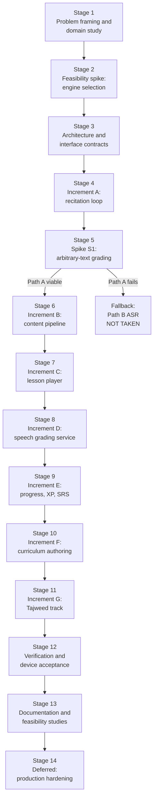
```mermaid
flowchart TD
    S1["Stage 1<br/>Problem framing and<br/>domain study"] --> S2["Stage 2<br/>Feasibility spike:<br/>engine selection"]
    S2 --> S3["Stage 3<br/>Architecture and<br/>interface contracts"]
    S3 --> S4["Stage 4<br/>Increment A:<br/>recitation loop"]
    S4 --> S5["Stage 5<br/>Spike S1:<br/>arbitrary-text grading"]
    S5 -->|Path A viable| S6["Stage 6<br/>Increment B:<br/>content pipeline"]
    S5 -->|Path A fails| SX["Fallback:<br/>Path B ASR<br/>NOT TAKEN"]
    S6 --> S7["Stage 7<br/>Increment C:<br/>lesson player"]
    S7 --> S8["Stage 8<br/>Increment D:<br/>speech grading service"]
    S8 --> S9["Stage 9<br/>Increment E:<br/>progress, XP, SRS"]
    S9 --> S10["Stage 10<br/>Increment F:<br/>curriculum authoring"]
    S10 --> S11["Stage 11<br/>Increment G:<br/>Tajweed track"]
    S11 --> S12["Stage 12<br/>Verification and<br/>device acceptance"]
    S12 --> S13["Stage 13<br/>Documentation and<br/>feasibility studies"]
    S13 --> S14["Stage 14<br/>Deferred:<br/>production hardening"]
```

`[FIGURE — render from the mermaid source above and insert image]`

**Figure 1.** The incremental, milestone-gated development process used for Bayaan, showing the two decision spikes and the branch not taken.

The stages executed were:

1. **Problem framing and domain study.** Establishing what tajweed rules a system could plausibly detect, what the Uthmani script requires of a renderer, and what existing applications do and do not provide.

2. **Feasibility spike — engine selection.** Evaluating whether to train a recitation model or deploy a pretrained one, and if the latter, which. Concluded with the selection of an MIT-licensed pretrained model and the decision that no model training would occur inside this project. See §5.8.1.

3. **Architecture and interface contracts.** Fixing the three-component split (client, thin backend, inference engine), the request/response shape of every endpoint, and the content-pack schema. Two contracts were explicitly frozen before parallel work began: the content schema and the speech-grading response shape.

4. **Increment A — the recitation loop.** Microphone capture, in-memory WAV construction, authenticated upload, engine invocation, response parsing, and character-range highlighting. This is the vertical slice that proves the thesis.

5. **Spike S1 — arbitrary-text grading.** Forty-three recorded clips across two speakers, measured against a fixed pass criterion set before the run. This is the decision gate between the two possible grading architectures. See §6.4.

6. **Increment B — the content pipeline.** A dependency-free validator and packer that enforces the content schema, enforces the pause-form reference convention discovered by Spike S1, walks every audio reference, and emits a deterministic Android asset bundle.

7. **Increment C — the lesson player.** The client-side phase machine (Teach → Drill → Wrap) and the recognition exercise composables.

8. **Increment D — the speech-grading service.** The arbitrary-text inference endpoint and the server-side normaliser that turns raw model output into a stable three-valued verdict under the tolerance policy Spike S1 prescribed.

9. **Increment E — progress, experience points, and spaced repetition.** Server-derived lesson unlocking, XP accounting, UTC-day streaks, and the review ladder.

10. **Increment F — curriculum authoring.** All forty-one Arabic-track lessons written, validated, and frozen unit by unit.

11. **Increment G — the Tajweed track.** Three rule modules authored and wired, including the reconciliation of rule naming between the client's expectations and the engine's attribute vocabulary.

12. **Verification and device acceptance.** Automated backend suite, content pipeline determinism check, and manual acceptance on a physical handset.

13. **Documentation and feasibility studies.** This report, plus the costed browser-target study that concluded in a rejection (§7.3).

14. **Production hardening — deferred.** Paid infrastructure tiers, observability, rate limiting, cost caps, store packaging, privacy policy, and font licensing were scoped out of this release by explicit decision.

## 1.7 Tools and Equipment

### 1.7.1 Hardware

| Item | Specification | Role in the project |
|---|---|---|
| Development laptop | Low-powered consumer laptop; insufficient for Android emulation or local GPU inference | All coding, content authoring, backend testing, and document production |
| Test handset | Xiaomi Redmi Note 10 Pro | The only device the application was executed and accepted on; also the microphone used for all recorded evaluation clips |
| Inference GPU | NVIDIA L4, rented per-second from a serverless GPU provider | Every model inference in the project, including the evaluation spike |
| Audio capture | Handset built-in microphone, 16 kHz mono | Both the production capture path and the spike corpus |

The hardware constraint is load-bearing on the architecture. Because the development machine could not run an emulator, **every** user-facing behaviour had to be verified on a physical device, which in turn made a fast, sideloadable debug build a hard requirement. Because it could not run GPU inference, the model was never run locally — it was deployed to a serverless GPU from the first day, which pushed the project towards a thin-client, remote-inference architecture earlier than it might otherwise have gone.

### 1.7.2 Front-End Software Tools

| Tool | Version / detail | Purpose |
|---|---|---|
| Kotlin | 2.3.21 | Application language |
| Jetpack Compose | Compose BOM 2024.05.00 | Declarative UI toolkit; the entire interface |
| Material 3 | via Compose BOM | Design system, theming, dynamic colour |
| Navigation Compose | 2.8.0-beta01 | Single-activity navigation graph and the authentication gate |
| AndroidX Lifecycle | 2.8.0 | `ViewModel`, `AndroidViewModel`, Compose lifecycle integration |
| Activity Compose | 1.9.0 | Compose host activity |
| Ktor Client (CIO engine) | Ktor 3.5.0 catalogue | All HTTP to the backend, including multipart audio upload |
| Supabase Kotlin SDK (Auth) | 3.1.4 | Email/password authentication and session persistence |
| `android.media.AudioRecord` | Platform | Raw 16-bit PCM microphone capture at 16 kHz |
| `android.media.MediaPlayer` / `SoundPool` | Platform | Lesson prompt playback and interaction sound effects |
| `org.json` | Platform | JSON parsing on the client, avoiding an extra dependency |
| Amiri Quran font | Bundled resource | Uthmani text outside the mushaf renderer |
| QCF v4 glyph fonts | 48 bundled font files | Page-faithful mushaf rendering |
| Android Gradle Plugin | 8.13.2 | Build |

### 1.7.3 Back-End and Infrastructure Software Tools

| Tool | Version / detail | Purpose |
|---|---|---|
| Kotlin | JVM 21 target | Backend language — the same language as the client |
| Ktor Server (Netty engine) | 3.5.0 catalogue | HTTP server, routing, content negotiation |
| `ktor-server-auth-jwt` | 3.5.0 | JSON Web Token authentication plugin |
| `com.auth0:jwk` | via Ktor auth-jwt | JWKS retrieval and caching for ES256 signature verification |
| Exposed ORM | 0.61.0 (core, jdbc, kotlin-datetime) | Typed SQL DSL over PostgreSQL |
| HikariCP | 6.2.1 | JDBC connection pool, ten connections, lazily initialised |
| PostgreSQL JDBC driver | 42.7.4 | Database transport |
| kotlinx.serialization | via Ktor | Response serialisation and engine-response parsing |
| kotlinx-datetime | 0.6.1 | UTC date arithmetic for streaks and the review ladder |
| Logback | via catalogue | Structured logging |
| Docker | Multi-stage: JDK 21 build → JRE 21 runtime | Backend packaging and deployment |
| Supabase | Free tier | Managed PostgreSQL and hosted authentication |
| Render | Free tier, Docker service | Backend hosting with auto-deploy from version control |
| Modal | Pay-per-second L4 GPU, scale-to-zero | Inference hosting |

### 1.7.4 Machine Learning and Content Tools

| Tool | Version | Purpose |
|---|---|---|
| `quran-muaalem` | 0.1.0 (pinned) | Pretrained wav2vec2-based recitation analysis model with multi-level CTC heads |
| `quran-transcript` | 0.5.2 (pinned) | Uthmani text retrieval, phonetisation, and the phoneme/sifat error explanation functions |
| `diff-match-patch` | 20241021 (pinned) | Sequence diff between reference and predicted phoneme strings |
| `librosa` | 0.11.0 | Audio resampling to 16 kHz |
| `soundfile` | 0.14.0 | Audio decoding |
| FastAPI | via `fastapi[standard]` | Multipart HTTP endpoints on the inference container |
| Python | 3.11 | Inference and content tooling |
| `scripts/build_content.py` | Project-internal, zero third-party dependencies | Curriculum validation, pause-form enforcement, asset walking, deterministic packing |
| `scripts/build_report.py` | Project-internal, `python-docx` | Renders this report's Markdown source to a formatted document |

Every inference dependency is **version-pinned deliberately**. The upstream model and transcript libraries are single-maintainer projects that define the JSON error and attribute schema the backend parser depends on; an unpinned release could silently reshape that schema on the next container cold build, breaking parsing in production with no code change on our side.

### 1.7.5 Development and Testing Tools

| Tool | Purpose |
|---|---|
| Git | Version control; branch-per-workstream with pull-request review |
| GitHub | Remote hosting, pull-request templates, code-owner routing |
| Android Studio | Android development environment |
| Gradle (Kotlin DSL) | Build orchestration on both client and backend, with a shared Ktor version catalogue |
| `kotlin.test` + Ktor `testApplication` | Backend unit and integration testing |
| H2 (in-memory, PostgreSQL compatibility mode) | Database under test, so the suite needs no live database |
| JDK `com.sun.net.httpserver` | A loopback JWKS server used by the test harness so JWT verification is exercised for real rather than mocked |
| `adb` | Debug-build installation and log capture on the physical handset |
| `modal` CLI | Inference deployment, log inspection, and container lifecycle control |
| `ffmpeg` | Conversion of evaluation clips to 16 kHz mono WAV |
| AI coding assistants | Used under a written, repository-committed instruction set (`AGENTS.md`) that constrains scope, commit format, and prohibited operations per module |

## 1.8 Jetpack Compose — Framework Overview

Jetpack Compose is Android's declarative user-interface toolkit. Instead of inflating an XML layout tree and mutating it imperatively through view references, the developer writes composable functions that describe the interface as a function of state. When state changes, the framework recomposes the affected subtree. Bayaan contains no XML layout files whatsoever; all forty-eight Kotlin source files in the application module are Compose or Compose-adjacent.

**Key Advantages of Jetpack Compose for this project:**

- **State-driven rendering matches the domain.** A recitation screen is a small state machine — Ready, Recording, Uploading, Result, Error. Compose lets that machine be modelled as a sealed interface and rendered by a `when` expression, eliminating the class of bug where a view is left in a state inconsistent with the model.
- **First-class right-to-left support.** Layout direction propagates through the composition. The mushaf pager reverses its layout so that swiping right advances the page, exactly as turning a page in a physical mushaf does, with a single parameter rather than a mirrored layout file.
- **Rich text as data.** `AnnotatedString` allows character-range styling to be constructed programmatically. Because the inference engine returns error positions as character ranges into the Uthmani reference string, mistake highlighting reduces to mapping those ranges onto span styles — no custom text view, no manual glyph measurement.
- **Custom drawing and animation without third-party libraries.** The score ring, the particle confetti burst, and the motion vocabulary (a 120 ms scale-pop on a correct answer, a gentle three-pixel shake on a wrong one) are all implemented on Compose's `Canvas` and animation primitives. The project adds no animation dependency.
- **Arbitrary fonts at runtime from assets.** The mushaf requires a *different* font per page. Compose's `FontFamily(Font(path, assets))` constructor allows a font to be built from an asset path at runtime and resolved off the main thread, which is precisely what a per-page glyph font demands.
- **Previews shorten the loop on constrained hardware.** With no emulator available on the development machine, `@Preview` composables were the only way to iterate on layout without a device install cycle.
- **Single-activity architecture.** The whole application is one activity hosting one navigation graph, which simplifies the authentication gate to a single conditional in one place.

## 1.9 Ktor — Framework Overview

Ktor is a Kotlin-native, coroutine-based framework for building asynchronous servers and clients. Bayaan uses it on **both** sides: the backend service is a Ktor server on the Netty engine, and the Android application talks to it through the Ktor client on the CIO engine. Both sides consume the same published Ktor version catalogue, so a single version governs the whole HTTP surface of the project.

**Key Advantages of Ktor for this project:**

- **One language across the stack.** Data classes, error envelopes, and validation logic are expressed in the same language on both sides of the wire. A developer moving between the application and the service is not switching mental models.
- **Coroutines make a slow upstream cheap.** The backend's dominant workload is *waiting* — for a GPU container that may take twenty-four seconds to cold-start. A coroutine suspended on that wait occupies no thread. A blocking-IO framework would have needed a thread pool sized for the worst-case concurrent cold start.
- **Plugin-based, additive server.** The server installs only what it uses: content negotiation, JWT authentication. There is no convention-over-configuration layer to fight and no runtime reflection scan; startup is fast, which matters on a platform that restarts the container after idle.
- **Authentication as a routing fence.** Ktor's `authenticate("auth-jwt") { ... }` block wraps a set of routes. Every private route in Bayaan sits inside exactly one such block in one file, so the question "is this endpoint protected?" is answered by looking at fifteen lines of routing code rather than auditing per-route annotations.
- **Testable without a network or a server process.** Ktor's `testApplication` builder runs the full routing stack in-process. Combined with an in-memory database and a loopback key server, the entire backend integration suite runs with no external service.
- **Multipart in and multipart out.** The service receives multipart audio from the handset and forwards multipart audio to the inference endpoint using the same library on both directions of the hop.
- **Deployable as a single fat JAR.** The Docker image is a two-stage build producing one JAR run by one command, which is what makes free-tier container hosting practical.

## 1.10 Supabase — Platform Overview

Supabase is a managed platform bundling a hosted PostgreSQL database with an authentication service, storage, and edge functions. Bayaan uses two of its capabilities: **email/password authentication** and the **PostgreSQL database**.

The authentication integration is architecturally significant. Supabase issues a JSON Web Token signed with an asymmetric elliptic-curve key (ES256). The Android application obtains that token through the Supabase Kotlin SDK and attaches it as a bearer credential to every backend call. The backend does **not** call Supabase to validate the token. Instead it fetches Supabase's public key set from the project's JWKS endpoint, caches it for twenty-four hours, and verifies the signature, issuer, and audience locally.

**Key Advantages of Supabase for this project:**

- **No authentication code to write or secure.** Password hashing, email confirmation, session refresh, and token issuance are provided. The project's authentication surface reduces to "call the SDK, store the token".
- **Asymmetric verification eliminates a shared secret.** Because verification uses a public key, no signing secret needs to exist in the backend's environment at all. The compromise surface of the backend host does not include the ability to mint tokens.
- **No per-request round trip.** Local verification with a cached key set means authentication adds microseconds, not a network hop, to every request — important when the backend already spends up to sixty seconds waiting on the inference upstream.
- **Standard PostgreSQL, not a proprietary store.** The schema is ordinary SQL with foreign keys and cascade deletes. It is portable, it can be queried with any PostgreSQL tool, and the migration file in the repository is plain DDL.
- **A free tier sufficient for the entire project.** Database, authentication, and hosting for all evaluation traffic at zero cost.

## 1.11 Modal and the Muaalem Engine — Platform Overview

The analytical core of Bayaan is **Muaalem**, an MIT-licensed pretrained model built on the wav2vec2 architecture with multi-level connectionist-temporal-classification (CTC) heads. One head predicts the phoneme sequence; ten further heads predict letter characteristics (*sifat*) directly from the waveform. It is paired with `quran-transcript`, which supplies the canonical Uthmani text of any ayah, a phonetiser that converts Uthmani text into the expected phoneme sequence under a configurable set of tajweed timing attributes, and two functions that explain the difference between a reference and a prediction — one at the phoneme level, one at the attribute level.

**Modal** is a serverless platform that runs containerised Python on rented GPUs, billed per second of execution, with scale-to-zero. Bayaan deploys the model as a single Modal class exposing two HTTP endpoints.

**Key Advantages of the Muaalem + Modal combination for this project:**

- **Phoneme-level and attribute-level output, not a transcript.** The engine reports *which phoneme* was substituted, at *which character range* of the Uthmani text, under *which tajweed rule*, and with what expected versus predicted duration. This is the information the product exists to deliver, and it is not derivable from a transcript.
- **Attributes classified from audio, not inferred from text.** Because the *sifat* heads read the waveform directly, the engine can report that the *qalqalah* bounce was absent even when the phoneme itself was recognised correctly — a distinction a text-comparison approach structurally cannot make.
- **Permissive licensing.** The MIT licence permits use, modification, and deployment without negotiation, which was a hard requirement for an academic project with no legal budget.
- **Zero idle cost.** Scale-to-zero means the GPU is billed only while a request is in flight. The project's inference bill at rest is nothing, which is what makes a live, always-available demonstration possible without funding.
- **Warm-path latency suitable for interaction.** After the first request loads the model, subsequent requests within the container's five-minute keep-alive window complete in roughly 1.7 seconds — fast enough for a drill exercise.
- **In-process invocation of the diff functions.** The upstream project ships a two-server stack that talks to itself over HTTP. Bayaan imports the two pure explanation functions directly and runs the model in-process, collapsing that into a single container with no internal network hop.
- **Reproducible images.** The container image is declared in code with every dependency pinned, so a cold build a month later produces the same environment.

---

# Chapter 2: System Specifications

This chapter states, in testable form, what the Bayaan system must do and how well it must do it. Section 2.1 identifies who has an interest in the system and what each party gains from it. Section 2.2 enumerates the functional requirements, grouped by the actor that exercises them and identified with stable requirement numbers. Section 2.3 enumerates the non-functional requirements by quality category.

Requirement identifiers follow the scheme `Rn.mm` for functional requirements — where `n` denotes the actor group and `mm` the ordinal within that group — and `NFRn.mm` for non-functional requirements, where `n` denotes the quality category. Identifiers are stable: they are referenced by the use-case descriptions in Chapter 3 and by the traceability matrix in §6.6.

## 2.1 Stakeholder Lists

### 2.1.1 Primary Stakeholders

Primary stakeholders interact with the system directly and are the reason it exists.

| Stakeholder | Who they are | How they benefit |
|---|---|---|
| **The beginner learner** | A person who cannot read the Arabic script and wants to learn to recite the Qur'an. May be a non-Arabic speaker, a heritage speaker, or a new Muslim. | Receives a structured path from zero to reciting Al-Fatihah, with an automated listener that corrects pronunciation at the level of individual letters and vowel lengths — feedback that would otherwise require a private teacher. |
| **The improving reciter** | A person who can already read and recite but whose tajweed is self-taught or imprecise. | Can open any ayah of the mushaf, recite it, and receive a positional, rule-named error report — an unlimited, private, non-judgemental practice partner available at any hour. |
| **The Qur'an teacher (*mu'allim*)** | A teacher or study-circle leader responsible for a group of students. | Gains a between-sessions drilling tool. Students arrive having already practised, with their specific weaknesses surfaced, so scarce contact time is spent on correction rather than discovery. |

### 2.1.2 Secondary Stakeholders

Secondary stakeholders do not use the running application but produce or maintain the material it depends on.

| Stakeholder | Who they are | How they benefit |
|---|---|---|
| **The content author** | The person who writes curriculum: unit and lesson definitions, teaching narration, exercise items, distractor options, and pause-form reference text for spoken exercises. | Works in plain, schema-validated JSON with a build-time validator that rejects a malformed lesson on their own machine, with a precise error pointer, rather than shipping a silent gap to a learner's device. Content changes require no application code change and no service deployment. |
| **The reciter (*qari*)** | A qualified reciter who records the canonical letter, syllable, word, and ayah audio the curriculum plays. | Receives a complete, machine-generated recording specification — exact file list, naming convention, sample rate, level, and duration targets — so that a single recording session covers the entire requirement without follow-up questions. |
| **The academic supervisor and examiners** | The faculty who evaluate the project. | Receive a system whose every layer is independently inspectable: an automated test suite with per-file coverage, a content pipeline that fails loudly, a documented empirical spike behind the riskiest assumption, and an explicit record of decisions including the ones that ended in refusal. |

### 2.1.3 Tertiary Stakeholders

Tertiary stakeholders are affected by the system without interacting with it or producing for it.

| Stakeholder | Who they are | How they benefit (or are affected) |
|---|---|---|
| **Upstream open-source maintainers** | The maintainers of the recitation model, the transcript library, and the mushaf page data. | Their work reaches an additional application and user population; defects found in production are reportable upstream. Bayaan identified and documented a reproducible decode crash in the upstream model for exactly this purpose. |
| **The font rights holder (KFGQPC)** | The institution that owns the QCF glyph fonts used for page-faithful rendering. | Their typography is used under a documented, attribution-preserving, non-commercial academic scope. Public distribution is explicitly blocked in this project pending their written permission — the constraint is honoured, not ignored. |
| **Infrastructure providers** | The hosting, database, authentication, and GPU platforms. | Their free tiers are used within their intended terms; the project is a reference case for a low-cost architecture on those tiers. |
| **The wider Muslim community** | People for whom correctness of recitation is a religious obligation, not a preference. | The system's design constrains itself on their behalf: Qur'anic audio is never synthesised, only recorded by a human reciter (§5.11), and the application makes no claim to replace qualified instruction. |

### 2.1.4 Internal Stakeholders

Internal stakeholders build, operate, and are accountable for the system.

| Stakeholder | Role | How they benefit |
|---|---|---|
| **Abdalrahman — project owner, AI and backend lead** | Owns the backend service, the inference deployment, and curriculum correctness; reviews every change on both the application and the service. | Owns a system whose interfaces are frozen contracts, so parallel work by others does not require his presence to stay coherent; and whose decisions are written down, so they are not re-litigated. |
| **Issa and Osama — Android user-interface developers** | Build screens, Compose components, and client wiring for the learning track. | Work against a frozen content schema and a frozen speech-grading response shape, so client work proceeds without waiting on service work. A shared design law document removes styling ambiguity. |
| **Ramzi — backend and infrastructure developer** | Contributes to the service layer and the content tooling. | Works against an explicit endpoint specification with fixed request and response shapes, and a test harness that exercises real token verification rather than mocks. |
| **The system administrator / operator** | The role responsible for deploying the service, deploying the inference container, and applying database migrations. In this project the role is held by the project owner, but it is modelled separately because its use cases are distinct. | Deploys the service from a single Dockerfile with no manual configuration, deploys inference with one command, and applies an idempotent, re-runnable migration file. |

## 2.2 Functional Requirements

### 2.2.1 R0 — System-Wide Requirements

These requirements are not attached to a single actor; they constrain the system as a whole.

| ID | Requirement |
|---|---|
| R0.01 | The system shall expose an unauthenticated liveness endpoint that returns a success status without touching the database, so that the hosting platform can determine service health during and after a cold start. |
| R0.02 | The system shall require a valid bearer token on every endpoint that reads or writes user-specific data. |
| R0.03 | The system shall verify bearer tokens locally against the identity provider's published public key set, without performing a network call to the identity provider on each request. |
| R0.04 | The system shall cache the identity provider's public key set for twenty-four hours and rate-limit key retrieval. |
| R0.05 | The system shall reject a request bearing a missing, malformed, expired, or wrongly-issued token with HTTP 401 and a JSON body containing an `error` and a `message` field. |
| R0.06 | The system shall derive the acting user's identity exclusively from the verified token subject, never from a client-supplied identifier. |
| R0.07 | The system shall return every error as a JSON object with a stable machine-readable `error` code and a human-readable `message`. |
| R0.08 | The system shall pass through the inference engine's own response body unchanged when the engine responds, whether that response indicates success or failure. |
| R0.09 | The system shall never persist raw learner audio. Audio shall be processed in memory for the duration of the request and discarded. |
| R0.10 | The system shall tolerate an inference cold start of up to sixty seconds on both the client and the service without timing out. |
| R0.11 | The system shall bundle all curriculum content and all Qur'anic text with the application, so that content is available without a network request. |
| R0.12 | The system shall lazily initialise its database connection pool, so that unauthenticated endpoints remain available when database configuration is absent. |
| R0.13 | The system shall create a user's profile record on first contact with any learning endpoint, without requiring a separate profile-creation call. |
| R0.14 | The system shall mirror the identity provider's user identifier into its own user table, so that all user-owned records have a valid foreign key target. |
| R0.15 | The system shall treat a request for a record owned by another user as "not found" rather than "forbidden", so that record existence is not disclosed. |

### 2.2.2 R1 — Learner Requirements

| ID | Requirement |
|---|---|
| R1.01 | The system shall allow a learner to create an account using an email address and a password. |
| R1.02 | The system shall inform a learner when account creation requires email confirmation, and shall present that state distinctly from an error. |
| R1.03 | The system shall allow a learner to sign in with an email address and a password. |
| R1.04 | The system shall translate identity-provider errors into short, human-readable messages rather than displaying raw exception text. |
| R1.05 | The system shall persist a learner's session locally and restore it on application launch without re-prompting for credentials. |
| R1.06 | The system shall treat the presence of a valid local session as the sole authority for the signed-in state, so that an unreachable backend cannot sign a learner out. |
| R1.07 | The system shall present an onboarding sequence on first launch only, and shall not present it again on subsequent launches. |
| R1.08 | The system shall allow a learner to sign out, clearing the stored session. |
| R1.09 | The system shall present a bottom navigation bar with four destinations: Learn, Qur'an, Progress, and Profile. |
| R1.10 | The system shall hide the navigation bar on drill-in destinations, namely the mushaf page view, the recitation screen, and the lesson player. |
| R1.11 | The system shall display an index of all one hundred and fourteen surahs with Arabic name, English name, verse count, and page range. |
| R1.12 | The system shall render the Qur'an as a page-faithful mushaf across all six hundred and four pages, using per-page glyph fonts so that line breaks and ligatures match the printed Madani mushaf. |
| R1.13 | The system shall page the mushaf right-to-left, so that a rightward swipe advances to the next page as in a physical mushaf. |
| R1.14 | The system shall allow a learner to tap any word on a mushaf page and shall highlight the entire ayah containing that word. |
| R1.15 | The system shall present an action sheet for a selected ayah offering recitation analysis. |
| R1.16 | The system shall record the learner's microphone input as 16 kHz mono 16-bit PCM and shall construct a WAV container in memory without writing to storage. |
| R1.17 | The system shall display elapsed recording time while recording is in progress. |
| R1.18 | The system shall upload the recorded audio together with the surah and ayah numbers to the analysis endpoint, authenticated with the learner's bearer token. |
| R1.19 | The system shall display a distinct uploading and analysing state that communicates that a wait is expected. |
| R1.20 | The system shall replace its local copy of the ayah text with the reference text returned by the engine before rendering highlights, so that character positions align exactly with the string the engine measured against. |
| R1.21 | The system shall highlight each reported phoneme or tajweed error at its exact character range within the ayah. |
| R1.22 | The system shall visually distinguish tajweed-rule errors from plain mispronunciations from letter-characteristic errors, using three separate colour families. |
| R1.23 | The system shall display, for each reported error, the tajweed rule name in English and Arabic where the engine supplies one, and the expected versus produced length where the error is a length error. |
| R1.24 | The system shall display letter-characteristic mismatches in a distinct section, showing the attribute, the expected value, the produced value, and the engine's confidence where available. |
| R1.25 | The system shall display an unambiguous success state when the engine reports no errors of any kind. |
| R1.26 | The system shall allow a learner to retry the same ayah, and to advance to the next ayah, wrapping across surah boundaries. |
| R1.27 | The system shall retain the analysis result for each ayah independently, so that navigating away and returning does not discard a result. |
| R1.28 | The system shall present a learning path of units and lessons in curriculum order, with each lesson marked completed, in progress, available, or locked. |
| R1.29 | The system shall present the learner's current experience total, streak count, daily goal, and count of reviews due at the top of the learning path. |
| R1.30 | The system shall present a lesson as a three-phase sequence: a teaching segment, a drill of exercise items, and a wrap-up summary. |
| R1.31 | The system shall support four recognition exercise types: listen and pick the letter, read and pick the sound, discriminate between two sounds, and pick the odd one out. |
| R1.32 | The system shall support two spoken exercise types: echo a prompt, and read a syllable aloud. |
| R1.33 | The system shall automatically play the prompt audio for exercise types whose task is to identify a sound. |
| R1.34 | The system shall allow a learner to replay the prompt audio on demand. |
| R1.35 | The system shall disable an option after it has been chosen incorrectly, and shall permit a bounded number of retries before marking the item failed. |
| R1.36 | The system shall record whether each item was answered correctly on the first attempt, for use in experience-point calculation. |
| R1.37 | The system shall record spoken exercise audio, cap the recording at four seconds, and submit it with the exercise's reference text and stable item identifier for grading. |
| R1.38 | The system shall display a distinct grading state while a spoken attempt is being evaluated, and shall prevent a second recording from starting during that state. |
| R1.39 | The system shall present the grading verdict as one of pass, retry, or fail, taking the verdict from the service rather than re-deriving it from the reported issues. |
| R1.40 | The system shall allow a learner to re-record after a retry verdict without advancing to the next item. |
| R1.41 | The system shall, for a Tajweed-track lesson, determine pass or fail from the presence or absence of the specific rule violation that lesson teaches, rather than from general pronunciation accuracy. |
| R1.42 | The system shall present a lesson wrap-up showing the score, the number of items correct, the experience points awarded, the running experience total, and the streak. |
| R1.43 | The system shall celebrate a passed lesson with animation and haptic feedback. |
| R1.44 | The system shall offer a practice re-drill of the missed items when a checkpoint lesson is failed. |
| R1.45 | The system shall submit lesson completion to the service, including the per-item results, so that progress is recorded server-side. |
| R1.46 | The system shall treat a lesson as passed at a score of 0.80 or above, and a checkpoint lesson at 0.85 or above. |
| R1.47 | The system shall award experience points as a base amount per lesson plus a bonus for each item answered correctly on the first attempt, with a higher base for checkpoint lessons. |
| R1.48 | The system shall increment a learner's streak at most once per UTC calendar day, increment it when the previous completion was on the preceding day, and reset it to one after a longer gap. |
| R1.49 | The system shall enqueue every item answered incorrectly into a spaced-repetition review queue, due the following day, without disturbing the ladder position of an item already queued. |
| R1.50 | The system shall present the learner's due review items, soonest first. |
| R1.51 | The system shall advance a review item one rung along the interval ladder of one, three, seven, and twenty-one days when it is answered correctly, and reset it to the first rung and record a lapse when it is answered incorrectly. |
| R1.52 | The system shall offer a placement test whose result sets the learner's starting Arabic level. |
| R1.53 | The system shall compute the placement level on the server from the ordered item results, and shall not accept a client-reported level. |
| R1.54 | The system shall unlock a lesson only when the immediately preceding lesson in the global curriculum order is completed, thereby gating the Tajweed track behind completion of the Arabic track. |
| R1.55 | The system shall present aggregate progress statistics: total recitation sessions, perfect sessions, overall accuracy, total mistakes, a breakdown of mistakes by tajweed rule, and a breakdown of letter-characteristic errors by attribute. |
| R1.56 | The system shall present a paginated history of the learner's recitation sessions, most recent first, each showing surah, ayah, correctness, and mistake count. |
| R1.57 | The system shall present the full detail of a single past session, including every recorded mistake with its character range and rule name. |
| R1.58 | The system shall provide haptic and audible feedback on interaction outcomes. |
| R1.59 | The system shall present a clear, actionable message when the microphone permission is denied, rather than failing silently. |
| R1.60 | The system shall present a clear, actionable message when the service is unreachable, and shall not lose the learner's place in the lesson. |

### 2.2.3 R2 — Content Author Requirements

| ID | Requirement |
|---|---|
| R2.01 | The system shall define the curriculum as a versioned JSON file listing units in order, each with an identifier, a track, English and Arabic titles, and an ordered list of lessons. |
| R2.02 | The system shall define each lesson as a separate JSON file containing a teaching segment and an ordered list of exercise items. |
| R2.03 | The system shall provide a validator that rejects a curriculum with a missing or duplicated unit or lesson identifier. |
| R2.04 | The system shall provide a validator that rejects a track value other than the two permitted values. |
| R2.05 | The system shall provide a validator that rejects a lesson whose identifier or checkpoint flag disagrees with the curriculum entry that references it. |
| R2.06 | The system shall provide a validator that rejects a lesson that is neither explicitly marked as a stub nor supplied with a non-empty item list. |
| R2.07 | The system shall provide a validator that rejects an authored lesson lacking teaching narration. |
| R2.08 | The system shall provide a validator that rejects an item whose identifier is not prefixed with its lesson identifier, or that duplicates another item's identifier. |
| R2.09 | The system shall provide a validator that rejects an item whose exercise type is not one of the six permitted types. |
| R2.10 | The system shall provide a validator that rejects a recognition item whose grading tier is not zero, and a spoken item whose grading tier is not one or two. |
| R2.11 | The system shall provide a validator that rejects a recognition item with fewer than two options, with an empty answer, or with an answer absent from its options. |
| R2.12 | The system shall provide a validator that rejects a sound-identification item that supplies no prompt audio. |
| R2.13 | The system shall provide a validator that rejects a read-and-pick item that supplies no Arabic prompt text. |
| R2.14 | The system shall provide a validator that rejects a spoken item whose reference text ends in a bare short vowel, tanween, or shadda, thereby enforcing the pause-form convention that prevents systematic false failures. |
| R2.15 | The system shall provide a validator that rejects an audio reference that is absolute, contains a parent-directory traversal, or does not carry the expected file extension. |
| R2.16 | The system shall report every validation failure with the offending lesson or item identifier and a specific description, and shall exit with a failure status without producing a bundle. |
| R2.17 | The system shall treat a missing audio file as a warning by default and as a hard failure under a strict flag, so that the same pipeline serves both authoring and release gating. |
| R2.18 | The system shall provide a command that lists every audio asset the curriculum requires, so that a recording session can be planned from a machine-generated list. |
| R2.19 | The system shall emit a build manifest listing the authored lessons, the stub lessons, the required assets, the pending assets, and a content hash. |
| R2.20 | The system shall produce an identical content hash for unchanged input, so that a build is verifiably deterministic. |
| R2.21 | The system shall collect every teaching narration line into a manifest keyed by content hash, each marked present or pending, so that narration audio generation is decoupled from lesson authoring. |
| R2.22 | The system shall permit content to change without a service deployment or an application code change. |
| R2.23 | The system shall degrade gracefully on the device when an asset referenced by the content pack is absent, rather than crashing the lesson. |
| R2.24 | The system shall skip an exercise item whose type is unknown to the installed application version, rather than failing to load the lesson. |

### 2.2.4 R3 — System Administrator Requirements

| ID | Requirement |
|---|---|
| R3.01 | The system shall build and deploy the backend service from a single multi-stage Dockerfile with no manual configuration step. |
| R3.02 | The system shall read its database connection string and its identity-provider project reference from environment variables, and shall fail fast with a named error if a required variable is absent. |
| R3.03 | The system shall permit the inference endpoint URL to be overridden by an environment variable, defaulting to the live deployment. |
| R3.04 | The system shall provide an idempotent, re-runnable SQL migration that creates the learning-track tables without disturbing existing data. |
| R3.05 | The system shall deploy the inference engine with a single command against a declarative, fully version-pinned container image specification. |
| R3.06 | The system shall keep an inference container warm for a bounded window after its last request, and shall scale to zero thereafter. |
| R3.07 | The system shall permit an operator to pin one warm inference container for the duration of a live demonstration and to release it afterwards. |
| R3.08 | The system shall log inference load time, audio duration, and inference duration for each request, so that latency can be attributed to cold start versus computation. |
| R3.09 | The system shall never log secrets or raw audio bytes. |
| R3.10 | The system shall reject an oversized upload with a distinct status code: ten megabytes on the full-ayah path, two megabytes on the lesson-clip path. |
| R3.11 | The system shall validate surah and ayah bounds at the inference boundary, so that an out-of-range reference produces a structured client error rather than an unhandled server error. |
| R3.12 | The system shall convert any unhandled inference pipeline exception into a structured, parseable error response rather than an opaque server error. |
| R3.13 | The system shall bound the inference reference text length on the arbitrary-text endpoint, so that the endpoint cannot be used to grade a full page of text. |

## 2.3 Non-Functional Requirements

### 2.3.1 NFR1 — Performance

| ID | Requirement |
|---|---|
| NFR1.01 | The application shall begin capturing microphone audio within 200 ms of the record control being activated, so that recording feels instantaneous. |
| NFR1.02 | The application shall perform no file input or output during audio capture; the WAV container shall be assembled entirely in memory. |
| NFR1.03 | A warm inference request shall complete within approximately two seconds of model invocation for a clip of typical lesson length. |
| NFR1.04 | A cold inference request shall complete within sixty seconds, and both the client and the service shall be configured with timeouts that accommodate it. |
| NFR1.05 | The application shall resolve and parse a mushaf page's glyph font off the main thread, so that a page swipe does not drop frames. |
| NFR1.06 | The application shall cache parsed mushaf pages and resolved font families in memory, so that a page is parsed at most once per process. |
| NFR1.07 | The application shall load the complete Uthmani text of the Qur'an once at view-model initialisation rather than per ayah. |
| NFR1.08 | The application shall cache a parsed lesson after first read for the lifetime of the process. |
| NFR1.09 | The service shall verify a bearer token without a network round trip in the common case. |
| NFR1.10 | The service shall not block a request thread while awaiting the inference upstream; all waiting shall be suspension, not thread occupancy. |
| NFR1.11 | No user-interface animation shall exceed 400 ms in duration. |
| NFR1.12 | The lesson-path query shall issue a bounded number of database queries independent of the number of lessons in the curriculum. |

### 2.3.2 NFR2 — Scalability

| ID | Requirement |
|---|---|
| NFR2.01 | The service shall maintain a bounded database connection pool of ten connections, so that concurrent load cannot exhaust the database's connection limit. |
| NFR2.02 | The inference platform shall scale container count with demand and scale to zero when idle, so that cost is proportional to use rather than to time. |
| NFR2.03 | The service shall be stateless between requests, holding no per-user session state in memory, so that instances can be added or replaced freely. |
| NFR2.04 | The curriculum tree shall be served from a static resource rather than from the database, so that the learning-path query cost does not grow with curriculum size. |
| NFR2.05 | All list endpoints shall be paginated, with a client-supplied limit clamped to a server-defined maximum. |
| NFR2.06 | Content shall ship as a bundled asset rather than being fetched per session, so that a growing learner population imposes no additional content-serving cost. |
| NFR2.07 | The system shall be able to add a curriculum unit or lesson without a schema migration or a service deployment. |

### 2.3.3 NFR3 — Reliability and Availability

| ID | Requirement |
|---|---|
| NFR3.01 | A failure of the inference engine shall never be presented to the learner as an application crash; it shall surface as a distinct, recoverable state. |
| NFR3.02 | A known upstream decode failure on short audio shall be caught and converted into a retry verdict, never a server error. |
| NFR3.03 | An unparseable inference response shall be caught, logged, and converted into a service-unavailable response. |
| NFR3.04 | A persistence failure occurring after a successful inference shall be reported distinctly from an inference failure, so that the two causes are separable in operation. |
| NFR3.05 | The recitation loop shall not lose an already-computed inference result to a foreign-key ordering problem; the user record shall be created on demand at the point of persistence. |
| NFR3.06 | A malformed entry within an otherwise valid inference response shall be skipped, and the remaining valid entries retained. |
| NFR3.07 | An unreachable service during a spoken exercise shall yield a retry verdict, allowing the learner to continue, rather than terminating the lesson. |
| NFR3.08 | An unreachable service at application launch shall not sign the learner out. |
| NFR3.09 | A missing or unparseable lesson in the content pack shall be reported as a missing lesson and shall not crash the lesson player. |
| NFR3.10 | The liveness endpoint shall respond successfully without a configured database. |
| NFR3.11 | The system shall accept, as a documented operating characteristic, a stacked cold start of up to approximately sixty seconds on the first request after both the service and the inference container have been idle. |

### 2.3.4 NFR4 — Security

| ID | Requirement |
|---|---|
| NFR4.01 | All learner-specific endpoints shall be enclosed within a single authentication fence declared in one place, so that the protected surface is auditable at a glance. |
| NFR4.02 | Token signatures shall be verified with an asymmetric algorithm against the identity provider's published public keys; no shared signing secret shall exist in the service environment. |
| NFR4.03 | Token issuer and audience claims shall be verified in addition to the signature. |
| NFR4.04 | The acting user's identity shall be taken only from the verified token subject. |
| NFR4.05 | Cross-user access to a record shall be indistinguishable from access to a non-existent record. |
| NFR4.06 | Raw learner audio shall never be written to disk, never be logged, and never be persisted to the database. |
| NFR4.07 | Secrets shall be supplied exclusively through environment variables, shall never be committed to version control, and shall be enumerated in a committed template file with empty values. |
| NFR4.08 | Upload size shall be capped on every endpoint that accepts a binary body. |
| NFR4.09 | Content asset paths shall be rejected at build time if they are absolute or contain a parent-directory traversal. |
| NFR4.10 | Application backup of the session store shall be disabled, so that the persisted session token is not extracted through a platform backup. |
| NFR4.11 | Server-authoritative values — the checkpoint flag, the pass threshold, the placement level, and the lesson unlock state — shall be computed on the server and shall never be accepted from the client. |
| NFR4.12 | Database records shall cascade on user deletion, so that removing a user removes all data derived from that user. |

### 2.3.5 NFR5 — Usability

| ID | Requirement |
|---|---|
| NFR5.01 | Errors originating from third-party libraries shall be translated into short, plain messages before display. |
| NFR5.02 | Every wait longer than approximately one second shall be represented by a visible, non-ambiguous progress state. |
| NFR5.03 | The learner shall always have exactly one obvious next action on the learning path. |
| NFR5.04 | Mistake feedback shall be positional — rendered on the script at the point of error — rather than described in prose. |
| NFR5.05 | Error highlighting shall use a muted, non-alarming palette rather than a saturated red, in keeping with the reverent tone of the subject matter. |
| NFR5.06 | A correct answer shall be rewarded with a brief scale-pop; an incorrect answer shall be indicated with a gentle horizontal shake and never with a punitive flash. |
| NFR5.07 | Every state change in the drill loop shall be animated, with a consistent easing curve throughout the application. |
| NFR5.08 | Interaction outcomes shall be reinforced with haptic and audible feedback in addition to visual feedback. |
| NFR5.09 | Arabic text shall render right-to-left with diacritics intact at a type size and line height sufficient for a beginner to distinguish vowel marks. |
| NFR5.10 | The three short vowels shall each carry a consistent accent colour wherever they are taught, so that the learner binds colour to sound. |
| NFR5.11 | Onboarding shall be shown exactly once. |
| NFR5.12 | A failed checkpoint shall offer a targeted re-drill of the missed items rather than a repetition of the entire lesson. |
| NFR5.13 | The application shall support both light and dark themes, with the mistake-highlight palette legible in both. |

### 2.3.6 NFR6 — Compatibility

| ID | Requirement |
|---|---|
| NFR6.01 | The application shall run on Android 8.0 (API 26) and above. |
| NFR6.02 | The application shall be built against and target API 34. |
| NFR6.03 | The application shall use Material 3 exclusively; Material 2 components shall not be imported. |
| NFR6.04 | The application shall contain no XML layout files. |
| NFR6.05 | The application shall function without Google Play Services. |
| NFR6.06 | The service shall run on a Java 21 runtime in a Linux container. |
| NFR6.07 | The database schema shall use standard PostgreSQL types and constructs, remaining portable off the managed provider. |
| NFR6.08 | The application and the service shall consume the same HTTP library version catalogue, so that wire behaviour cannot diverge between them. |
| NFR6.09 | The inference container shall pin every dependency version, so that a rebuild reproduces the environment that was tested. |
| NFR6.10 | The content pipeline shall depend on no third-party Python package, so that it runs on any standard interpreter. |

### 2.3.7 NFR7 — Maintainability

| ID | Requirement |
|---|---|
| NFR7.01 | The service shall contain no machine-learning logic; all model execution shall remain in the inference component. |
| NFR7.02 | User-interface state shall be hoisted into view models; composable functions shall remain stateless, receiving state and emitting events. |
| NFR7.03 | The shape of the recitation user-interface state shall be treated as a contract between the view model and the screen, changed only in both places together. |
| NFR7.04 | The grading normaliser shall be a pure function of its inputs with no input or output, so that its policy is unit-testable in isolation. |
| NFR7.05 | The inference-engine call shall be injected as a function type, so that every route can be tested without a live engine. |
| NFR7.06 | Each analysis outcome shall be modelled as a distinct case of a sealed type, each mapping to exactly one HTTP status. |
| NFR7.07 | Each database table shall be owned by exactly one repository object, and tables always written together shall be owned by the same repository. |
| NFR7.08 | Every deliberate shortcut shall carry an inline comment naming both the limitation it accepts and the upgrade path out of it. |
| NFR7.09 | Every module shall carry a committed instruction document defining its scope, conventions, prohibited operations, and pre-commit checks, binding on human and automated contributors alike. |
| NFR7.10 | Commits shall follow a fixed `type(module): description` format with an enumerated set of valid types and modules. |
| NFR7.11 | Content parsing on the device shall tolerate unknown fields and unknown exercise types, so that a newer content pack does not break an older application build. |
| NFR7.12 | The curriculum reader on the service shall ignore unknown JSON keys, so that the service consumes a strict subset of the content schema without coupling to fields it does not use. |

### 2.3.8 NFR8 — Legal and Compliance

| ID | Requirement |
|---|---|
| NFR8.01 | The recitation model and its supporting libraries shall be used only under a licence permitting redistribution and modification; the MIT licence of the selected engine satisfies this. |
| NFR8.02 | The attribution file accompanying the mushaf assets shall be retained in the application bundle and shall not be removed. |
| NFR8.03 | The application shall not be published to a public distribution channel until written permission for the glyph fonts is obtained from their rights holder; this constraint shall be documented as a release blocker. |
| NFR8.04 | Qur'anic recitation audio shall be sourced exclusively from a licensed human reciter and shall never be synthesised by a text-to-speech system. |
| NFR8.05 | Non-Qur'anic pedagogical audio — isolated letters, vowel marks, and syllables — may be synthesised only if it passes an explicit articulation-point acceptance test judged by a native Arabic speaker; otherwise it shall be human-recorded. |
| NFR8.06 | Learner audio shall not be retained, so that no biometric voice data is stored by the system. |
| NFR8.07 | Persisted data shall be limited to derived mistake and progress records, which are the minimum required to deliver progress reporting and spaced repetition. |
| NFR8.08 | Deleting a user shall remove all records derived from that user through database cascade rules. |
| NFR8.09 | Every third-party component shall be recorded with its licence in the project documentation. |
| NFR8.10 | The application shall not claim to replace qualified human instruction, and its scope shall be presented as practice and correction support. |

---

# Chapter 3: System Analysis

This chapter models the system's behaviour from the outside. Section 3.1 presents the use-case diagrams, section 3.2 enumerates the use cases, and section 3.3 describes each of them in full, including the flow of events with its validation branches and the exceptions with the literal message the learner sees.

Bayaan has three human actors and two external system actors:

- **Learner** — the person using the application. The overwhelming majority of use cases belong to this actor. Bayaan is a single-actor learning product, not a two-sided marketplace: there is no seller, no order, and no transaction.
- **Content Author** — the person who writes and validates curriculum. This actor works through the content pipeline, not through the application.
- **System Administrator** — the role that deploys the service and the inference engine and applies database migrations.
- **Identity Provider** (external system) — issues and signs authentication tokens and publishes the public key set used to verify them.
- **Recitation Engine** (external system) — the GPU-hosted model that performs phoneme and attribute analysis.

## 3.1 Use Case Diagrams

### 3.1.1 System-Level Use Case Diagram

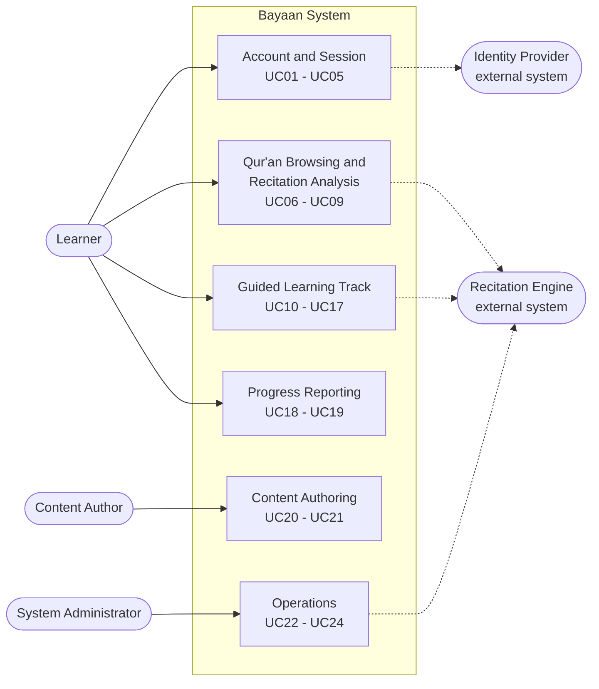
```mermaid
flowchart LR
    Learner(["Learner"])
    Author(["Content Author"])
    Admin(["System Administrator"])
    IdP(["Identity Provider<br/>external system"])
    Engine(["Recitation Engine<br/>external system"])

    subgraph Bayaan["Bayaan System"]
        direction TB
        A["Account and Session<br/>UC01 - UC05"]
        B["Qur'an Browsing and<br/>Recitation Analysis<br/>UC06 - UC09"]
        C["Guided Learning Track<br/>UC10 - UC17"]
        D["Progress Reporting<br/>UC18 - UC19"]
        E["Content Authoring<br/>UC20 - UC21"]
        F["Operations<br/>UC22 - UC24"]
    end

    Learner --> A
    Learner --> B
    Learner --> C
    Learner --> D
    Author --> E
    Admin --> F
    A -.-> IdP
    B -.-> Engine
    C -.-> Engine
    F -.-> Engine
```

`[FIGURE — render from the mermaid source above and insert image]`

**Figure 2.** System-level use case diagram, grouping the twenty-four use cases into six functional areas and showing which actor drives each and which external systems participate.

The diagram shows the essential asymmetry of the system: the Learner drives four of the six areas, while the Content Author and the System Administrator each drive one. The two external systems are reached only indirectly — the learner never contacts the recitation engine directly, and the backend never contacts the identity provider during a normal request, only when refreshing its cached key set.

### 3.1.2 Learner Use Case Diagram

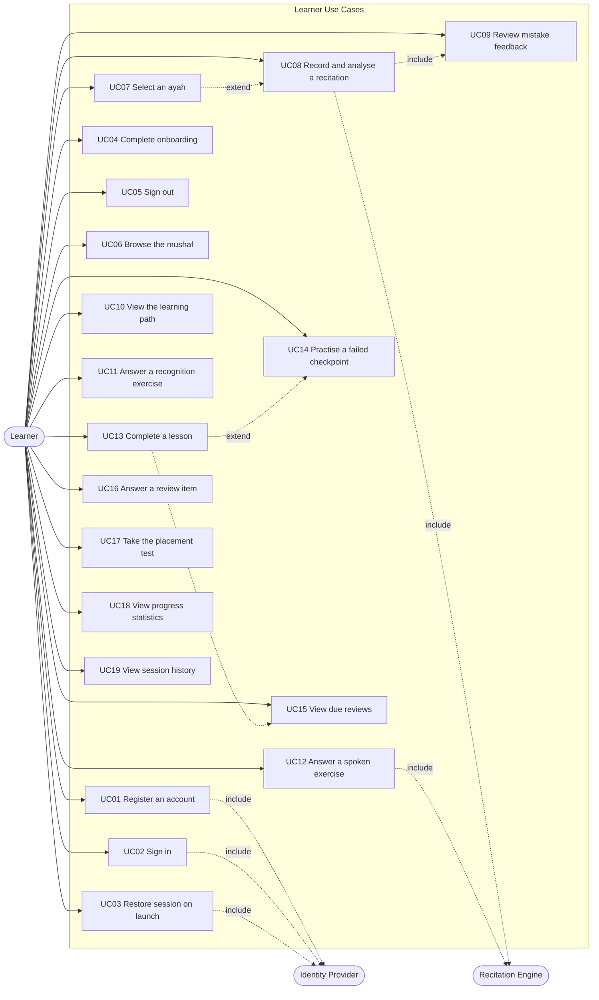
```mermaid
flowchart LR
    L(["Learner"])
    IdP(["Identity Provider"])
    Eng(["Recitation Engine"])

    subgraph UC["Learner Use Cases"]
        direction TB
        UC01["UC01 Register an account"]
        UC02["UC02 Sign in"]
        UC03["UC03 Restore session on launch"]
        UC04["UC04 Complete onboarding"]
        UC05["UC05 Sign out"]
        UC06["UC06 Browse the mushaf"]
        UC07["UC07 Select an ayah"]
        UC08["UC08 Record and analyse a recitation"]
        UC09["UC09 Review mistake feedback"]
        UC10["UC10 View the learning path"]
        UC11["UC11 Answer a recognition exercise"]
        UC12["UC12 Answer a spoken exercise"]
        UC13["UC13 Complete a lesson"]
        UC14["UC14 Practise a failed checkpoint"]
        UC15["UC15 View due reviews"]
        UC16["UC16 Answer a review item"]
        UC17["UC17 Take the placement test"]
        UC18["UC18 View progress statistics"]
        UC19["UC19 View session history"]
    end

    L --> UC01
    L --> UC02
    L --> UC03
    L --> UC04
    L --> UC05
    L --> UC06
    L --> UC07
    L --> UC08
    L --> UC09
    L --> UC10
    L --> UC11
    L --> UC12
    L --> UC13
    L --> UC14
    L --> UC15
    L --> UC16
    L --> UC17
    L --> UC18
    L --> UC19

    UC01 -.include.-> IdP
    UC02 -.include.-> IdP
    UC03 -.include.-> IdP
    UC07 -.extend.-> UC08
    UC08 -.include.-> UC09
    UC08 -.include.-> Eng
    UC12 -.include.-> Eng
    UC13 -.extend.-> UC14
    UC13 -.include.-> UC15
```

`[FIGURE — render from the mermaid source above and insert image]`

**Figure 3.** Learner use case diagram. Dotted edges show the `include` and `extend` relationships: selecting an ayah optionally extends into analysing it, analysing always includes reviewing the feedback, and completing a lesson always seeds the review queue while optionally extending into a checkpoint re-drill.

### 3.1.3 Content Author and System Administrator Use Case Diagram

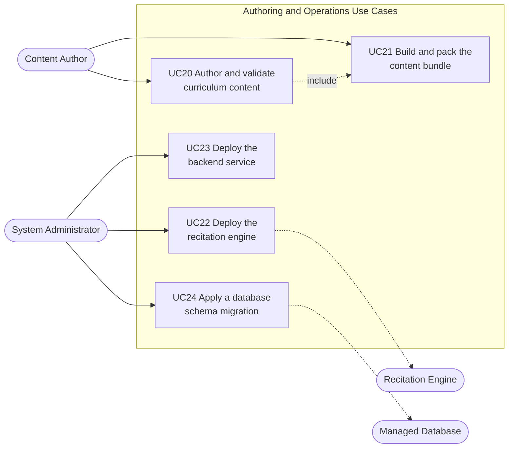
```mermaid
flowchart LR
    A(["Content Author"])
    S(["System Administrator"])
    Eng(["Recitation Engine"])
    DB(["Managed Database"])

    subgraph UC2["Authoring and Operations Use Cases"]
        direction TB
        UC20["UC20 Author and validate<br/>curriculum content"]
        UC21["UC21 Build and pack the<br/>content bundle"]
        UC22["UC22 Deploy the<br/>recitation engine"]
        UC23["UC23 Deploy the<br/>backend service"]
        UC24["UC24 Apply a database<br/>schema migration"]
    end

    A --> UC20
    A --> UC21
    S --> UC22
    S --> UC23
    S --> UC24
    UC20 -.include.-> UC21
    UC22 -.-> Eng
    UC24 -.-> DB
```

`[FIGURE — render from the mermaid source above and insert image]`

**Figure 4.** Content Author and System Administrator use case diagram. Authoring always includes a validation-and-pack step; the pipeline is the gate, not a convenience.

## 3.2 Use Case List

| ID | Use Case Name | Primary Actor | Related Requirements |
|---|---|---|---|
| UC01 | Register an account | Learner | R1.01, R1.02, R1.04 |
| UC02 | Sign in | Learner | R1.03, R1.04, R0.14 |
| UC03 | Restore session on launch | Learner | R1.05, R1.06, R0.14 |
| UC04 | Complete onboarding | Learner | R1.07 |
| UC05 | Sign out | Learner | R1.08 |
| UC06 | Browse the mushaf | Learner | R1.11, R1.12, R1.13 |
| UC07 | Select an ayah | Learner | R1.14, R1.15 |
| UC08 | Record and analyse a recitation | Learner | R1.16–R1.20, R0.08, R0.09 |
| UC09 | Review mistake feedback | Learner | R1.21–R1.27 |
| UC10 | View the learning path | Learner | R1.28, R1.29, R1.54, R0.13 |
| UC11 | Answer a recognition exercise | Learner | R1.30–R1.36 |
| UC12 | Answer a spoken exercise | Learner | R1.37–R1.41 |
| UC13 | Complete a lesson | Learner | R1.42–R1.49 |
| UC14 | Practise a failed checkpoint | Learner | R1.44, NFR5.12 |
| UC15 | View due reviews | Learner | R1.50 |
| UC16 | Answer a review item | Learner | R1.51 |
| UC17 | Take the placement test | Learner | R1.52, R1.53 |
| UC18 | View progress statistics | Learner | R1.55 |
| UC19 | View session history | Learner | R1.56, R1.57, R0.15 |
| UC20 | Author and validate curriculum content | Content Author | R2.01–R2.18 |
| UC21 | Build and pack the content bundle | Content Author | R2.19–R2.22 |
| UC22 | Deploy the recitation engine | System Administrator | R3.05–R3.08 |
| UC23 | Deploy the backend service | System Administrator | R3.01–R3.03 |
| UC24 | Apply a database schema migration | System Administrator | R3.04 |

**Table 1.** Use case list with primary actor and requirement traceability.

## 3.3 Use Case Descriptions

### UC01 — Register an Account

| | |
|---|---|
| **Use Case Name** | Register an account |
| **Description** | A new learner creates a Bayaan account with an email address and a password so that their progress can be stored and restored across sessions and devices. |
| **Participating Actors** | Learner (primary); Identity Provider (external system) |
| **Precondition** | The application is installed and launched. No valid session is present. The learner is on the sign-up screen. The device has a network connection. |
| **Flow of Events** | 1. The learner enters an email address.<br/>2. The learner enters a password.<br/>3. The learner enters the password a second time for confirmation.<br/>4. The learner activates the sign-up control.<br/>5. The system validates the input locally.<br/>  5.1 If the email field is empty or does not contain an at-sign, the system reports the problem and the flow returns to step 1.<br/>  5.2 If the two password fields differ, the system reports the mismatch and the flow returns to step 2.<br/>6. The system enters a submitting state and disables the sign-up control to prevent a duplicate submission.<br/>7. The system requests account creation from the identity provider.<br/>8. The identity provider creates the account.<br/>  8.1 If the provider returns an active session immediately, the system persists the access token, transitions to the signed-in state, and performs a best-effort user-record synchronisation with the backend.<br/>  8.2 If the provider requires email confirmation, the system transitions to a pending-confirmation state and displays instructions to check the inbox. |
| **Postcondition** | Either the learner is signed in with a persisted session and a mirrored user record exists in the application database, or the learner is in a clearly-communicated pending-confirmation state with an account created at the identity provider. |
| **Exceptions** | **E01:** Email already registered — "That email is already registered. Try signing in instead."<br/>**E02:** Password too weak — "Password must be at least 6 characters."<br/>**E03:** No network connection — "Couldn't reach the server. Check your connection and try again."<br/>**E04:** Identity provider unavailable — "Sign-up isn't available right now. Please try again in a moment." |

### UC02 — Sign In

| | |
|---|---|
| **Use Case Name** | Sign in |
| **Description** | A returning learner authenticates with an email address and a password to gain access to the learning track, the analysis loop, and their stored progress. |
| **Participating Actors** | Learner (primary); Identity Provider (external system) |
| **Precondition** | The learner has a confirmed account. No valid session is present. The learner is on the sign-in screen. |
| **Flow of Events** | 1. The learner enters an email address and a password.<br/>2. The learner activates the sign-in control.<br/>3. The system enters a submitting state and disables the control.<br/>4. The system requests authentication from the identity provider.<br/>5. The identity provider verifies the credentials and returns a signed session token.<br/>  5.1 If the credentials are rejected, the flow proceeds to E01.<br/>  5.2 If the account exists but is unconfirmed, the flow proceeds to E02.<br/>6. The system persists the access token to local application preferences.<br/>7. The system transitions the authentication state to signed-in, which causes the navigation graph to replace the authentication destinations with the main application.<br/>8. The system dispatches a best-effort, fire-and-forget user-record synchronisation call to the backend so that a database row exists for this identity.<br/>  8.1 If that call fails or times out, the failure is logged and ignored; it does not affect the signed-in state. |
| **Postcondition** | A valid session token is persisted on the device, the learner is on the Learn tab, and a user record exists — or will exist on the next successful synchronisation — in the application database. |
| **Exceptions** | **E01:** Wrong email or password — "Wrong email or password."<br/>**E02:** Email not confirmed — "Please confirm your email first — check your inbox."<br/>**E03:** No network connection — "Couldn't reach the server. Check your connection and try again."<br/>**E04:** Unexpected provider error — "Couldn't sign you in. Please try again." |

### UC03 — Restore Session on Launch

| | |
|---|---|
| **Use Case Name** | Restore session on launch |
| **Description** | The application determines on launch whether a valid session already exists, so that a returning learner is not asked for credentials again. |
| **Participating Actors** | Learner (primary, passive); Identity Provider (external system) |
| **Precondition** | The application is being launched. |
| **Flow of Events** | 1. The system displays the splash screen and enters the checking state.<br/>2. The system asks the identity provider client for the current locally-stored session.<br/>3. The client returns a session or nothing.<br/>  3.1 If a session is present, the system persists its access token, transitions to the signed-in state, and dispatches the best-effort backend synchronisation.<br/>  3.2 If no session is present, the system checks the first-launch preference.<br/>    3.2.1 If this is the first launch, the system navigates to onboarding (UC04).<br/>    3.2.2 Otherwise the system navigates to the sign-in screen.<br/>4. The navigation graph replaces the splash destination so that the back gesture cannot return to it. |
| **Postcondition** | The learner is on the main application if a session exists, on onboarding if this is a first launch, or on the sign-in screen otherwise. In no case does an unreachable backend cause a signed-in learner to be signed out. |
| **Exceptions** | **E01:** Session store unreadable — "Couldn't restore your session."<br/>**E02:** Backend synchronisation fails — no message is shown; the failure is logged and the signed-in state is preserved. |

### UC04 — Complete Onboarding

| | |
|---|---|
| **Use Case Name** | Complete onboarding |
| **Description** | A first-time learner is shown a short introduction to what the application does before being asked to create an account. |
| **Participating Actors** | Learner (primary) |
| **Precondition** | The application has been launched for the first time and the first-launch preference has not yet been cleared. |
| **Flow of Events** | 1. The system presents the first onboarding page.<br/>2. The learner advances through the pages.<br/>  2.1 The learner may skip directly to the end at any point.<br/>3. On completion or skip, the system writes the first-launch preference to false.<br/>4. The system navigates to the sign-up screen, removing onboarding from the back stack. |
| **Postcondition** | The first-launch preference is false; onboarding will not be shown again on this installation. The learner is on the sign-up screen. |
| **Exceptions** | **E01:** Preference write fails — no message is shown; onboarding may be shown once more on the next launch, which is a benign degradation. |

### UC05 — Sign Out

| | |
|---|---|
| **Use Case Name** | Sign out |
| **Description** | A learner ends their session on the device so that another person using the device cannot access their account or progress. |
| **Participating Actors** | Learner (primary); Identity Provider (external system) |
| **Precondition** | The learner is signed in and is on the Profile or Settings screen. |
| **Flow of Events** | 1. The learner activates the sign-out control.<br/>2. The system requests session termination from the identity provider client.<br/>3. The system clears the persisted access token from local preferences.<br/>4. The system transitions the authentication state to signed-out.<br/>5. The navigation graph replaces the main application destinations with the sign-in screen, clearing the back stack. |
| **Postcondition** | No session token remains on the device and the learner is on the sign-in screen. Locally cached lesson progress remains on the device but is not associated with a signed-in identity until the next sign-in. |
| **Exceptions** | **E01:** Provider unreachable during sign-out — the local token is cleared regardless and the learner is signed out locally; no message is shown. |

### UC06 — Browse the Mushaf

| | |
|---|---|
| **Use Case Name** | Browse the mushaf |
| **Description** | A learner navigates the Qur'an as a page-faithful mushaf, either by paging directly or by selecting a surah from an index. |
| **Participating Actors** | Learner (primary) |
| **Precondition** | The learner is signed in and has selected the Qur'an tab. |
| **Flow of Events** | 1. The system reads the chapter index from the bundled assets and presents all one hundred and fourteen surahs with Arabic name, English name, verse count, and page range.<br/>2. The learner selects a surah.<br/>3. The system opens the mushaf pager at that surah's starting page and hides the bottom navigation bar.<br/>4. The system loads the page description for the current page on a background dispatcher.<br/>  4.1 The system resolves and preloads the glyph fonts referenced by that page, off the main thread.<br/>  4.2 The system caches the parsed page and the resolved font families for the process lifetime.<br/>5. The system renders each line of the page as a sequence of glyph codes in the page's own font, reproducing the printed line breaks exactly.<br/>6. The learner swipes to page.<br/>  6.1 A rightward swipe advances to the next page, because the pager's layout is reversed to match a physical mushaf.<br/>  6.2 The neighbouring page is prepared ahead of the viewport so that the swipe does not stall. |
| **Postcondition** | The requested mushaf page is displayed with page-faithful typography, and its glyph fonts and parsed structure are cached. |
| **Exceptions** | **E01:** Page description missing from the bundle — "This page couldn't be loaded."<br/>**E02:** Glyph font file missing or misnamed — the affected words render with a placeholder glyph rather than crashing; the failure is silent by design so that a single missing font cannot take down the reader. |

### UC07 — Select an Ayah

| | |
|---|---|
| **Use Case Name** | Select an ayah |
| **Description** | A learner chooses a specific ayah on the displayed mushaf page as the target of a recitation attempt. |
| **Participating Actors** | Learner (primary) |
| **Precondition** | A mushaf page is displayed (UC06). |
| **Flow of Events** | 1. The learner taps any word on the page.<br/>2. The system reads the verse key attached to that word.<br/>  2.1 If the tapped element is a page ornament or a verse marker with no verse key, the tap is ignored.<br/>3. The system highlights every word on the page sharing that verse key, so the whole ayah is visually selected.<br/>4. The system presents an action sheet naming the selected ayah and offering the available actions.<br/>5. The learner selects the analysis action.<br/>6. The system navigates to the recitation screen for that surah and ayah, passing both as route arguments. |
| **Postcondition** | The recitation screen is open for the selected surah and ayah, and the corresponding user-interface state for that pair is either freshly initialised or restored from a previous visit. |
| **Exceptions** | **E01:** Word carries no verse key — no message; the tap is a no-op. |

### UC08 — Record and Analyse a Recitation

| | |
|---|---|
| **Use Case Name** | Record and analyse a recitation |
| **Description** | A learner records themselves reciting the selected ayah, the recording is analysed by the recitation engine, and the result is persisted and returned for display. This is the system's core loop. |
| **Participating Actors** | Learner (primary); Recitation Engine (external system) |
| **Precondition** | The recitation screen is open for a specific surah and ayah. The learner is signed in and holds a valid token. |
| **Flow of Events** | 1. The system displays the reference ayah text and a record control.<br/>2. The learner activates the record control.<br/>3. The system requests the microphone permission if it has not already been granted.<br/>  3.1 If permission is denied, the flow proceeds to E01.<br/>4. The system computes the minimum audio buffer size for 16 kHz mono 16-bit capture.<br/>  4.1 If the platform reports an invalid buffer size, the flow proceeds to E02.<br/>5. The system opens the microphone with a buffer four times the reported minimum and starts capture.<br/>  5.1 If the recorder fails to reach the initialised state, the flow proceeds to E02.<br/>6. A background coroutine reads raw PCM frames into an in-memory buffer; a second coroutine updates an elapsed-seconds counter each second.<br/>7. The learner activates the stop control.<br/>8. The system cancels the reader coroutine, stops and releases the microphone, and takes a snapshot of the captured PCM.<br/>  8.1 If the captured buffer is empty, the flow proceeds to E03.<br/>9. The system prepends a forty-four-byte WAV header describing 16 kHz, mono, sixteen bits per sample, producing a complete WAV in memory with no file written.<br/>10. The system transitions to the uploading state.<br/>11. The system reads the persisted token.<br/>  11.1 If no token is present, the flow proceeds to E04.<br/>12. The system posts a multipart request to the analysis endpoint carrying the audio, the surah number, and the ayah number, with the token as a bearer credential and a sixty-second timeout.<br/>13. The service verifies the token signature, issuer, and audience locally against its cached public key set.<br/>  13.1 If verification fails, the service responds 401 and the flow proceeds to E05.<br/>14. The service reads the multipart body.<br/>  14.1 If the audio part is absent or empty, the service responds 400 and the flow proceeds to E06.<br/>  14.2 If the audio exceeds ten megabytes, the service responds 413 and the flow proceeds to E07.<br/>15. The service forwards the audio to the recitation engine as multipart with the surah and ayah as query parameters, waiting up to sixty seconds to absorb a container cold start.<br/>  15.1 If the call throws, the service responds 503 and the flow proceeds to E08.<br/>  15.2 If the engine returns a non-success status, the service passes the engine's own body through unchanged with the engine's status.<br/>16. The engine decodes the upload to 16 kHz mono floating-point samples, retrieves the canonical Uthmani text for the surah and ayah, phonetises it under the Hafs transmission with the configured elongation lengths, runs the model, diffs the reference phoneme sequence against the prediction, and diffs the letter-characteristic attributes.<br/>17. The engine returns the reference text, the phoneme error list with character positions and rule names, the attribute error list with confidences, and an overall correctness flag.<br/>18. The service parses the response.<br/>  18.1 A malformed individual error entry is skipped; valid entries are retained.<br/>  18.2 If the response as a whole cannot be parsed, the service logs and responds 503; the flow proceeds to E08.<br/>19. The service ensures a user record exists, inserts one session row, batch-inserts one mistake row per phoneme error and one attribute-mistake row per attribute error.<br/>  19.1 If persistence throws, the service responds 500 and the flow proceeds to E09.<br/>20. The service returns the engine's response body unchanged to the application.<br/>21. The application parses the body, replaces its local ayah text with the engine's reference text so that character positions align exactly, and transitions to the result state.<br/>22. The flow continues into UC09. |
| **Postcondition** | One session record and its associated mistake and attribute-mistake records are persisted, the learner's result state for this surah and ayah is populated, and no audio remains anywhere in the system. |
| **Exceptions** | **E01:** Microphone permission denied — "Microphone permission is needed to record your recitation."<br/>**E02:** Recorder failed to start — "Couldn't start recording. Try again."<br/>**E03:** Empty recording — "Recording was too short. Try again."<br/>**E04:** No stored token — "Please log in again."<br/>**E05:** Token rejected by the service — "Invalid or expired token."<br/>**E06:** Audio field missing — "missing audio field."<br/>**E07:** Audio over the size cap — "audio exceeds 10MB."<br/>**E08:** Engine unreachable or unparseable — "recitation engine did not respond." The application displays "Couldn't reach the coach. Check your connection and try again."<br/>**E09:** Persistence failure — "failed to save session." |

### UC09 — Review Mistake Feedback

| | |
|---|---|
| **Use Case Name** | Review mistake feedback |
| **Description** | A learner reads the analysis of their recitation, seeing each error marked at its exact position in the Arabic script and classified by kind. |
| **Participating Actors** | Learner (primary) |
| **Precondition** | UC08 has completed successfully and the recitation screen is in the result state. |
| **Flow of Events** | 1. The system renders the engine's reference text in the Uthmani typeface at a size and line height suitable for reading diacritics.<br/>2. For each reported phoneme error, the system applies a span style across the reported character range.<br/>  2.1 An error classified as a tajweed violation is rendered in the terracotta family.<br/>  2.2 An error not attributable to a named rule is rendered in the muted-purple family.<br/>3. For each reported letter-characteristic error, the system adds an entry to a separate section rendered in the calm-blue family, showing the phoneme group, the attribute, the expected value, the produced value, and the engine's confidence where present.<br/>4. For each error the system displays, where the engine supplied them, the tajweed rule name in English and Arabic and the expected versus produced elongation length.<br/>5. If the engine reported no phoneme errors and no attribute errors, the system displays an unambiguous success state instead of the error list.<br/>6. The learner may activate retry, which returns the state for this ayah to ready without discarding the state of any other ayah.<br/>7. The learner may activate next, which advances to the following ayah, rolling over to the next surah at the end of a surah and wrapping to the first surah at the end of the Qur'an. |
| **Postcondition** | The learner has seen a positional, classified error report. Result state is retained per surah-and-ayah pair for the lifetime of the view model. |
| **Exceptions** | **E01:** Engine reported a character range outside the reference text — the affected span is clamped and the remaining highlights render normally; no message is shown. |

### UC10 — View the Learning Path

| | |
|---|---|
| **Use Case Name** | View the learning path |
| **Description** | A learner sees the full curriculum as an ordered path of units and lessons, with each lesson's availability derived by the server, together with their current experience, streak, and outstanding reviews. |
| **Participating Actors** | Learner (primary) |
| **Precondition** | The learner is signed in and has selected the Learn tab. |
| **Flow of Events** | 1. The application requests the learning path from the service with its bearer token.<br/>2. The service ensures a profile record exists for this user, creating one with default values on first contact.<br/>3. The service loads the user's per-lesson progress records and counts the review items due on or before today in UTC.<br/>4. The service walks the static curriculum in file order, maintaining a single global "previous lesson completed" flag.<br/>  4.1 A lesson with a stored status of completed is reported completed.<br/>  4.2 A lesson with a stored status of in progress is reported in progress.<br/>  4.3 A lesson with no stored status is reported available if the immediately preceding lesson across the whole file is completed, and locked otherwise.<br/>  4.4 Because the Tajweed units follow the Arabic units in the file, this single chain gates the entire Tajweed track behind the final Arabic lesson.<br/>5. The service returns a header — Arabic level, experience, streak, daily goal, reviews due — and the unit tree with per-lesson status, best score, and attempt count.<br/>6. The application renders the path as a vertical roadmap of animated lesson nodes, with locked nodes visually distinct.<br/>7. The application renders the header values above the path.<br/>  7.1 If the request fails, the application falls back to the locally bundled curriculum and locally stored progress so the learner can still study offline. |
| **Postcondition** | The learner sees the ordered curriculum with exactly one obvious next lesson, and a profile record exists on the server for this user. |
| **Exceptions** | **E01:** Service unreachable — the path renders from bundled content and local progress; a non-blocking notice indicates that progress will sync later.<br/>**E02:** Token rejected — "Invalid or expired token." The learner is returned to the sign-in screen. |

### UC11 — Answer a Recognition Exercise

| | |
|---|---|
| **Use Case Name** | Answer a recognition exercise |
| **Description** | A learner answers a non-spoken drill item — identifying a letter by its sound, a sound by its letter, discriminating between two similar sounds, or finding the odd one out. |
| **Participating Actors** | Learner (primary) |
| **Precondition** | A lesson is open and the player is in the drill phase on an item of a recognition type. |
| **Flow of Events** | 1. The system presents the item.<br/>  1.1 If the item's task is to identify a sound, the system automatically plays the prompt audio.<br/>  1.2 If the item's task is to identify a written form, the system displays the Arabic prompt text.<br/>2. The learner may activate replay to hear the prompt again.<br/>3. The learner selects an option.<br/>4. The system compares the selection with the item's stored answer.<br/>  4.1 If the selection is correct and no previous option had been disabled on this item, the system records a first-attempt success for experience purposes.<br/>  4.2 If the selection is correct, the system marks the outcome correct, plays the reward sound, triggers a haptic pulse, and applies a scale-pop animation.<br/>  4.3 If the selection is incorrect, the system disables that option, applies a gentle horizontal shake, adds the item to the missed list, and decrements the remaining retries.<br/>    4.3.1 If no retries remain, the system marks the outcome failed.<br/>    4.3.2 Otherwise the item remains open for another attempt.<br/>5. The learner advances.<br/>  5.1 If further items remain, the system resets the retry budget and disabled set and presents the next item.<br/>  5.2 If this was the final item, the flow continues into UC13. |
| **Postcondition** | The item's outcome and first-attempt status are recorded in the in-memory session, and the missed-item list is updated. |
| **Exceptions** | **E01:** Prompt audio file absent from the bundle — the item still renders and remains answerable; no audio plays and no message is shown, so a pending recording cannot block a lesson.<br/>**E02:** Item type unknown to this application version — the item is skipped at parse time and never presented. |

### UC12 — Answer a Spoken Exercise

| | |
|---|---|
| **Use Case Name** | Answer a spoken exercise |
| **Description** | A learner records themselves saying a target syllable, word, or short phrase, and receives a phoneme-level verdict produced by the recitation engine and normalised by the service. |
| **Participating Actors** | Learner (primary); Recitation Engine (external system) |
| **Precondition** | A lesson is open and the player is in the drill phase on an item of type echo or read-aloud. The item carries reference text and a stable item identifier. |
| **Flow of Events** | 1. The system presents the target text and, where present, plays the model pronunciation.<br/>2. The learner activates the record control.<br/>  2.1 If a recording or a grading is already in progress, the activation is ignored.<br/>3. The system opens the microphone at 16 kHz mono and begins buffering PCM.<br/>4. The system starts a four-second timer that will stop the recording automatically.<br/>5. The learner activates stop, or the timer elapses.<br/>6. The system stops the microphone, cancels the reader coroutine, releases the device, and takes the PCM snapshot.<br/>  6.1 If the buffer is empty, the outcome is marked failed and the flow proceeds to E01.<br/>7. The system wraps the PCM in a WAV header in memory.<br/>8. The system enters the grading state, which blocks a second recording and blocks advancing.<br/>9. The system posts a multipart request to the grading endpoint carrying the audio, the item's grading tier, the item's reference text, and the item's identifier.<br/>10. The service validates the request.<br/>  10.1 Missing or empty audio yields 400 and the flow proceeds to E02.<br/>  10.2 Audio above two megabytes yields 413 and the flow proceeds to E03.<br/>  10.3 Missing reference text or missing item identifier yields 400 and the flow proceeds to E02.<br/>  10.4 A tier outside the permitted range yields 400.<br/>11. The service forwards the audio and the reference text to the arbitrary-text inference endpoint.<br/>12. The engine phonetises the arbitrary reference text, runs the model, and returns the same phoneme-error and attribute-error structures used for full ayat.<br/>  12.1 If the engine's decode step raises the known upstream failure on short input, it returns a structured decode-failure body, and the service converts it into a retry verdict with a zero score and no issues — never a server error.<br/>13. The service normalises the engine output:<br/>  13.1 Insertion-type errors positioned at the very start or the very end of the reference text are dropped as breath or noise artefacts.<br/>  13.2 Remaining phoneme errors are classified as a length error, a known minimal-pair consonant swap, a generic consonant swap, or a vowel mismatch, and assigned a stable feedback key.<br/>  13.3 Attribute errors for nasalisation and echo-bounce are mapped to their own issue types; the heavy-versus-light attribute is mapped to a flag-only key.<br/>  13.4 No issues yields a pass verdict with a score of one; exactly one non-length issue yields a retry verdict with a score of 0.62; anything else yields a fail verdict with a score derived from the issue count and capped at 0.45.<br/>14. The service returns the verdict, the score, the issue list, and the item identifier echoed unchanged.<br/>15. The application applies the verdict.<br/>  15.1 For a Tajweed-track lesson, the application overrides the verdict: it passes unless an issue of the specific type that lesson teaches is present.<br/>  15.2 A pass marks the item correct and, if no option had previously been disabled, records a first-attempt success.<br/>  15.3 A retry leaves the item open; advancing clears the outcome so the learner can re-record without losing their place.<br/>  15.4 A fail marks the item failed and adds it to the missed list.<br/>16. The application displays feedback selected by the returned feedback key. |
| **Postcondition** | The item carries a verdict, a score, and a feedback key; the missed-item list is updated; and the recorded audio has been discarded by every component that touched it. |
| **Exceptions** | **E01:** Empty recording — "We didn't hear anything. Tap the mic and try again."<br/>**E02:** Malformed request — "missing audio field" / "missing reference_text."<br/>**E03:** Clip over the size cap — "audio exceeds 2MB."<br/>**E04:** Engine unreachable — "recitation engine did not respond." The application converts this into a retry verdict so that the lesson can continue.<br/>**E05:** Engine decode failure on a short clip — no error is surfaced; the learner sees "Let's try that once more." |

### UC13 — Complete a Lesson

| | |
|---|---|
| **Use Case Name** | Complete a lesson |
| **Description** | A learner finishes the last item of a lesson; the system scores the attempt, awards experience, advances the streak, seeds the review queue with missed items, and presents a summary. |
| **Participating Actors** | Learner (primary) |
| **Precondition** | The learner has answered the final item of a lesson's drill. |
| **Flow of Events** | 1. The system stops any playing audio.<br/>2. The system computes the score as the count of items answered correctly on the first attempt divided by the total item count.<br/>3. The system records the attempt in local storage, applying a pass threshold of 0.80 for an ordinary lesson and 0.85 for a checkpoint.<br/>4. The system dispatches the completion to the service, sending the lesson identifier, the score, and the per-item results.<br/>5. The service looks up the lesson in the static curriculum.<br/>  5.1 If the identifier is unknown, the service responds 404 and the flow proceeds to E01.<br/>6. The service takes the checkpoint flag from the curriculum, ignoring the client's claim.<br/>7. The service clamps the score into the zero-to-one range, appends a row to the append-only attempt log, and updates the per-lesson progress record: the best score is raised if exceeded, the attempt count is incremented, and the status becomes completed if the score meets the threshold.<br/>8. The service computes experience as a base — ten for a lesson, twenty for a checkpoint — plus two for each item answered correctly on the first attempt, records an experience event with a reason code, and adds the amount to the profile.<br/>9. The service updates the streak against the UTC calendar date: a second completion on the same day leaves it unchanged, a completion on the day after the last increments it by one, and a longer gap resets it to one.<br/>10. The service enqueues every item marked incorrect into the review queue, due tomorrow, skipping any item already queued so that its ladder position is preserved.<br/>11. The service returns the updated header snapshot.<br/>12. The application presents the wrap screen: the score ring sweeping from zero to the achieved value, the item tally, the experience awarded, the running total, and the streak.<br/>  12.1 On a pass, the system plays a celebratory particle animation and a success haptic.<br/>  12.2 On a failed checkpoint, the system offers the practice re-drill (UC14). |
| **Postcondition** | An attempt row, an updated progress row, an experience event, an updated profile, and zero or more review items exist on the server; the learner sees a summary and the next lesson is unlocked if the attempt passed. |
| **Exceptions** | **E01:** Unknown lesson identifier — "Unknown lesson_id."<br/>**E02:** Service unreachable — the wrap screen renders from local values and the completion is not recorded server-side; no blocking error is shown. |

### UC14 — Practise a Failed Checkpoint

| | |
|---|---|
| **Use Case Name** | Practise a failed checkpoint |
| **Description** | A learner who fails a checkpoint re-drills only the items they missed, rather than repeating the entire lesson. |
| **Participating Actors** | Learner (primary) |
| **Precondition** | The learner is on the wrap screen of a checkpoint lesson that did not reach the 0.85 threshold. |
| **Flow of Events** | 1. The system offers the practice control.<br/>2. The learner activates it.<br/>3. The system builds a practice item list from the missed items recorded during the attempt.<br/>  3.1 If the missed list is empty — which can occur when the failure came from spoken retries rather than wrong selections — the system falls back to the full item list.<br/>4. The system starts a new drill session over that list, flagged as practice.<br/>5. The learner works through the items as in UC11 and UC12.<br/>6. On completion, the system presents a wrap screen with no experience awarded and no server submission, because a practice run is not a graded attempt. |
| **Postcondition** | The learner has re-drilled their weak items. No progress record, experience event, streak change, or review item is created by the practice run. |
| **Exceptions** | None. A practice run is entirely local and cannot fail on infrastructure. |

### UC15 — View Due Reviews

| | |
|---|---|
| **Use Case Name** | View due reviews |
| **Description** | A learner sees the items that spaced repetition has scheduled for today, so they can refresh material they previously answered incorrectly. |
| **Participating Actors** | Learner (primary) |
| **Precondition** | The learner is signed in. |
| **Flow of Events** | 1. The application requests due reviews from the service, optionally supplying a limit.<br/>2. The service clamps the limit into the range one to one hundred, defaulting to twenty.<br/>3. The service selects the learner's review items whose due date is on or before today in UTC, ordered by due date ascending.<br/>4. The service returns each item's identifier, its stable exercise reference, and its due date.<br/>5. The application presents the count in the learning-path header and the list when the learner opens the review surface.<br/>  5.1 If the list is empty, the application presents a cleared state rather than an empty list. |
| **Postcondition** | The learner knows how many items are due and can begin reviewing them. |
| **Exceptions** | **E01:** Service unreachable — the review count renders as unavailable rather than as zero, so the learner is not misled into thinking they are up to date. |

### UC16 — Answer a Review Item

| | |
|---|---|
| **Use Case Name** | Answer a review item |
| **Description** | A learner answers a scheduled review item; the system re-schedules it along the spaced-repetition ladder according to the outcome. |
| **Participating Actors** | Learner (primary) |
| **Precondition** | At least one review item is due and has been presented to the learner. |
| **Flow of Events** | 1. The learner answers the item.<br/>2. The application submits the outcome to the service against that review item's identifier.<br/>3. The service parses the identifier.<br/>  3.1 If it is not a well-formed identifier, the service responds 404 and the flow proceeds to E01.<br/>4. The service loads the review item scoped to the calling user.<br/>  4.1 If no such item exists, or it belongs to another user, the service responds 404 — deliberately not 403, so that existence is not disclosed.<br/>5. The service re-schedules the item.<br/>  5.1 On a correct answer, the interval advances one rung along the ladder of one, three, seven, and twenty-one days, remaining at twenty-one once the top rung is reached; the lapse count is unchanged.<br/>  5.2 On an incorrect answer, the interval resets to one day and the lapse count is incremented.<br/>  5.3 The new due date is today plus the new interval.<br/>6. On a correct answer the service awards a flat review experience amount and records an experience event.<br/>7. The service returns the new due date and the updated count of items still due. |
| **Postcondition** | The review item's interval, due date, and lapse count reflect the outcome, and the learner's experience total is updated on a correct answer. |
| **Exceptions** | **E01:** Malformed or unknown review identifier — "Review item not found."<br/>**E02:** Review item owned by another user — "Review item not found." (identical message by design). |

### UC17 — Take the Placement Test

| | |
|---|---|
| **Use Case Name** | Take the placement test |
| **Description** | A learner who already has some Arabic reading ability takes a short adaptive test so that the system can set their starting level rather than beginning them at lesson one. |
| **Participating Actors** | Learner (primary) |
| **Precondition** | The learner is signed in and has chosen to take the placement test. |
| **Flow of Events** | 1. The application presents a sequence of items of increasing difficulty.<br/>2. The learner answers each item; the application records the item reference, its difficulty, and the outcome, in presentation order.<br/>3. The application submits the ordered results to the service.<br/>4. The service computes the level deterministically, ignoring any level the client might report.<br/>  4.1 The walk begins at level three.<br/>  4.2 Each correct answer increments a hit counter and clears the miss counter; each incorrect answer increments a miss counter and clears the hit counter.<br/>  4.3 Two consecutive misses lower the level by one, floored at zero, and reset the miss counter.<br/>  4.4 Three consecutive hits raise the level by one, capped at eight, and reset the hit counter.<br/>5. The service records the placement with its full item blob as an audit record and writes the computed level to the profile.<br/>6. The service returns the level and a message key.<br/>7. The application renders the copy associated with that key; no user-facing prose is produced by the service. |
| **Postcondition** | The learner's stored Arabic level reflects the computed placement, and an immutable audit record of the placement attempt exists. |
| **Exceptions** | **E01:** Service unreachable — "Couldn't save your placement. You can retake it from Settings." The learner is started at the default level. |

### UC18 — View Progress Statistics

| | |
|---|---|
| **Use Case Name** | View progress statistics |
| **Description** | A learner sees an aggregate view of their recitation history: how much they have practised, how accurate they have been, and which rules and letter characteristics they most often get wrong. |
| **Participating Actors** | Learner (primary) |
| **Precondition** | The learner is signed in and has selected the Progress tab. |
| **Flow of Events** | 1. The application requests the progress summary from the service.<br/>2. The service counts the learner's total sessions and the subset marked entirely correct.<br/>3. The service groups the learner's mistakes by tajweed rule name, mapping mistakes with no named rule to an "Other" bucket.<br/>4. The service groups the learner's letter-characteristic mistakes by attribute.<br/>5. The service computes overall accuracy as perfect sessions divided by total sessions.<br/>  5.1 If the learner has no sessions, accuracy is reported as zero rather than as an undefined value.<br/>6. The service returns totals, accuracy, and the two breakdowns.<br/>7. The application renders the summary and the two breakdowns as ranked lists. |
| **Postcondition** | The learner has seen an aggregate, per-rule and per-attribute view of their weaknesses. |
| **Exceptions** | **E01:** Service unreachable — "Couldn't load your progress. Pull to refresh."<br/>**E02:** No sessions yet — an empty state invites the learner to record their first ayah rather than showing zeroes. |

### UC19 — View Session History

| | |
|---|---|
| **Use Case Name** | View session history |
| **Description** | A learner browses their past recitation attempts and opens any one of them to see every mistake that was recorded. |
| **Participating Actors** | Learner (primary) |
| **Precondition** | The learner is signed in and has at least one recorded session. |
| **Flow of Events** | 1. The application requests the session list, supplying a limit and an offset.<br/>2. The service clamps the limit into the range one to one hundred, defaulting to twenty, and floors the offset at zero.<br/>3. The service returns sessions ordered most recent first, each with surah, ayah, overall correctness, mistake count, and timestamp, together with the total count for pagination.<br/>4. The learner selects one session.<br/>5. The application requests the session detail by identifier.<br/>6. The service parses the identifier.<br/>  6.1 A malformed identifier yields 404.<br/>7. The service loads the session and checks ownership.<br/>  7.1 If the session does not exist, or belongs to another user, the service responds 404 with an identical message in both cases.<br/>8. The service returns the session with every recorded mistake: character range, error type, speech error type, rule names in both languages, and expected versus produced lengths.<br/>9. The application renders the detail. |
| **Postcondition** | The learner has reviewed a past attempt in full. No cross-user information has been disclosed, including whether a given record exists. |
| **Exceptions** | **E01:** Malformed session identifier — "Session not found."<br/>**E02:** Session belongs to another user — "Session not found." (identical message by design).<br/>**E03:** Service unreachable — "Couldn't load your history." |

### UC20 — Author and Validate Curriculum Content

| | |
|---|---|
| **Use Case Name** | Author and validate curriculum content |
| **Description** | A content author writes or edits curriculum files and runs the validator, which either accepts the content or rejects it with a precise pointer to the offending item. |
| **Participating Actors** | Content Author (primary) |
| **Precondition** | The author has a working copy of the repository and a standard Python interpreter. No third-party package installation is required. |
| **Flow of Events** | 1. The author edits the curriculum file, a lesson file, or both.<br/>2. The author runs the content build command.<br/>3. The validator loads the curriculum file.<br/>  3.1 A version other than the expected one is reported as an error.<br/>  3.2 A missing or duplicated unit or lesson identifier is reported as an error.<br/>  3.3 A track value outside the permitted set is reported as an error.<br/>4. For every lesson referenced by the curriculum, the validator loads the corresponding lesson file.<br/>  4.1 A missing lesson file is always a hard error — a dangling reference is never tolerated.<br/>  4.2 Invalid JSON is reported with the line number and the parser's own message.<br/>  4.3 A lesson identifier or checkpoint flag disagreeing with the curriculum entry is reported as an error.<br/>5. For an authored lesson, the validator requires a non-empty item list and teaching narration; a lesson explicitly marked as a stub must instead have no items.<br/>6. For every item, the validator checks: the identifier is prefixed with the lesson identifier and is unique; the type is one of the six permitted types; the grading tier matches the type's category; a sound-identification item supplies prompt audio; a read-and-pick item supplies Arabic prompt text; a recognition item has at least two options and an answer present among them.<br/>7. For every spoken item, the validator enforces the pause-form convention: the reference text must not end in a bare short vowel, a tanween, or a shadda.<br/>  7.1 A violation is reported with the offending text and a pointer to the decision document that explains why.<br/>8. For every audio reference, the validator rejects absolute paths, parent-directory traversals, and unexpected file extensions, then records the path as required.<br/>9. The validator checks each required audio file's existence.<br/>  9.1 By default a missing file is a warning, because pedagogical audio is a human recording dependency that must not block authoring.<br/>  9.2 Under the strict flag, a missing file is a hard error, which is the release gate.<br/>10. If any error was recorded, the validator prints every error with its location and exits with a failure status, producing no bundle.<br/>11. Otherwise the flow continues into UC21. |
| **Postcondition** | Either the content is proven valid against every structural, pedagogical, and asset rule, or the author has an explicit, located list of everything wrong with it and no bundle was produced. |
| **Exceptions** | **E01:** Curriculum file unreadable — "content/curriculum.json: file not found."<br/>**E02:** Invalid JSON in a lesson — "content/lessons/ar.3.2.json:14: invalid JSON: Expecting ',' delimiter."<br/>**E03:** Pause-form violation — "reference_text 'بَ' is waqf-unsafe (bare short-vowel final); use a madd- or sukoon-final target (grading-tiers.md §1)."<br/>**E04:** Dangling lesson reference — "content/lessons/ar.9.1.json: file not found." |

### UC21 — Build and Pack the Content Bundle

| | |
|---|---|
| **Use Case Name** | Build and pack the content bundle |
| **Description** | The validated curriculum is packed into the bundle the application ships, along with a narration manifest and a deterministic build manifest. |
| **Participating Actors** | Content Author (primary) |
| **Precondition** | Validation (UC20) has completed with no errors. |
| **Flow of Events** | 1. The packer creates the output directory and its lessons subdirectory.<br/>2. The packer copies the curriculum file and every authored and stub lesson file into the bundle.<br/>3. The packer collects every teaching narration line encountered during validation, keyed by a truncated content hash, and writes a narration manifest marking each line present or pending according to whether its generated audio exists.<br/>4. The packer computes a build hash over every JSON file in the bundle except the manifest itself.<br/>5. The packer writes a build manifest listing the authored lessons, the stub lessons, every required audio asset, every pending audio asset, and the build hash.<br/>6. The packer prints a summary: authored count, stub count, required asset count, and pending asset count, followed by any warnings.<br/>7. The author copies the bundle into the application's asset directory for the next build. |
| **Postcondition** | A deterministic content bundle exists. Re-running the packer on unchanged input produces an identical build hash, which is the pipeline's idempotency guarantee. |
| **Exceptions** | **E01:** Output directory not writable — the Python interpreter's own permission error is surfaced; no partial bundle is left in a usable state. |

### UC22 — Deploy the Recitation Engine

| | |
|---|---|
| **Use Case Name** | Deploy the recitation engine |
| **Description** | The administrator deploys or updates the GPU-hosted recitation engine. |
| **Participating Actors** | System Administrator (primary); Recitation Engine platform (external system) |
| **Precondition** | The administrator is authenticated to the serverless GPU platform and the deployment script's dependency pins are current. |
| **Flow of Events** | 1. The administrator stops the running application on the platform.<br/>  1.1 This step is mandatory before verifying a code change, because a plain deploy does not replace a container that is still warm; skipping it causes the administrator to test the previous revision and conclude, incorrectly, that the change did not land.<br/>2. The administrator runs the deploy command against the deployment script.<br/>3. The platform builds the container image from the declarative specification, installing every pinned dependency.<br/>4. The platform registers the two HTTP endpoints and returns their public URLs.<br/>5. The administrator issues one throwaway request to force a cold start on the new revision.<br/>6. The container loads the model onto the GPU and logs the load duration.<br/>7. The administrator verifies the response shape against the endpoint specification.<br/>  7.1 Before a live demonstration, the administrator may additionally pin one container warm, and must release the pin afterwards because a pinned container bills continuously. |
| **Postcondition** | The new engine revision is live, its response shape has been verified, and the container scales to zero after its keep-alive window unless deliberately pinned. |
| **Exceptions** | **E01:** Image build fails on a dependency resolution — the platform's build log names the failing package; the previous revision remains live and serving.<br/>**E02:** Model fails to load onto the GPU — the container crashes on cold start and the platform reports the failure; requests fall through to the caller as an engine failure, which the service converts into "recitation engine did not respond." |

### UC23 — Deploy the Backend Service

| | |
|---|---|
| **Use Case Name** | Deploy the backend service |
| **Description** | The administrator deploys the Ktor service, which is built and released automatically from version control. |
| **Participating Actors** | System Administrator (primary); hosting platform (external system) |
| **Precondition** | The required environment variables — database connection string and identity-provider project reference — are configured on the hosting platform. |
| **Flow of Events** | 1. The administrator pushes to the tracked branch.<br/>2. The platform builds the container from the multi-stage Dockerfile: a JDK stage assembles the fat JAR, and a JRE stage carries only the JAR.<br/>  2.1 Tests are excluded from the image build; the suite runs in the development environment, not in the release path.<br/>3. The platform starts the container.<br/>4. The service reads the identity-provider project reference and constructs the issuer and key-set URLs.<br/>  4.1 If the variable is absent, startup fails immediately with a named error rather than starting in a broken state.<br/>5. The service installs the authentication plugin and content negotiation, and registers the route table with exactly two public routes and the remainder inside the authentication fence.<br/>6. The service does not connect to the database at startup; the connection pool is built lazily on the first database-touching request.<br/>7. The platform polls the liveness endpoint until it succeeds.<br/>8. The administrator verifies that the liveness endpoint responds and that an authenticated endpoint rejects an unauthenticated request. |
| **Postcondition** | The service is live, its public surface is exactly the liveness and surah endpoints, and all other endpoints reject unauthenticated requests. |
| **Exceptions** | **E01:** Required environment variable absent — "SUPABASE_PROJECT_REF env var is required." Startup aborts.<br/>**E02:** Database unreachable on the first database-touching request — the request fails, but the liveness endpoint continues to succeed, so the platform does not restart-loop the container. |

### UC24 — Apply a Database Schema Migration

| | |
|---|---|
| **Use Case Name** | Apply a database schema migration |
| **Description** | The administrator applies the learning-track schema to the managed database. |
| **Participating Actors** | System Administrator (primary); managed database (external system) |
| **Precondition** | The administrator has access to the database's SQL console or an authenticated command-line client. The pre-existing user, session, and mistake tables are present. |
| **Flow of Events** | 1. The administrator opens the migration file.<br/>2. The administrator executes it against the database.<br/>3. Each statement creates a table only if it does not already exist, so the file is safe to re-run.<br/>4. Each new table declares a foreign key to the user table with a cascade-on-delete rule.<br/>5. The review-item table declares a uniqueness constraint over the user and the item reference, so an item cannot be double-queued.<br/>6. The administrator verifies that the pre-existing tables and their data are untouched.<br/>7. The administrator verifies that the column definitions match the typed table declarations in the service. |
| **Postcondition** | The learning-track tables exist with their keys, defaults, and constraints; existing data is unchanged; and the migration can be re-run without effect. |
| **Exceptions** | **E01:** Insufficient privileges — the database's own permission error is surfaced; no partial schema is created because each statement is independently guarded.<br/>**E02:** A table already exists with a divergent shape — the guarded statement silently skips it, so the administrator must verify column-by-column rather than relying on the migration to reconcile a drifted table. This is a known limitation of a create-if-absent migration strategy. |

---

# Chapter 4: System Design

## 4.1 Architecture Design

### 4.1.1 The Three-Box Architecture

Bayaan is deliberately built as three components with hard boundaries between them, plus three rented managed services. The governing principle is stated as a rule the project holds itself to: **the intelligence lives in the rented model, the service is a verifying proxy, and the curriculum is versioned static content.** No component holds responsibility that belongs to another.

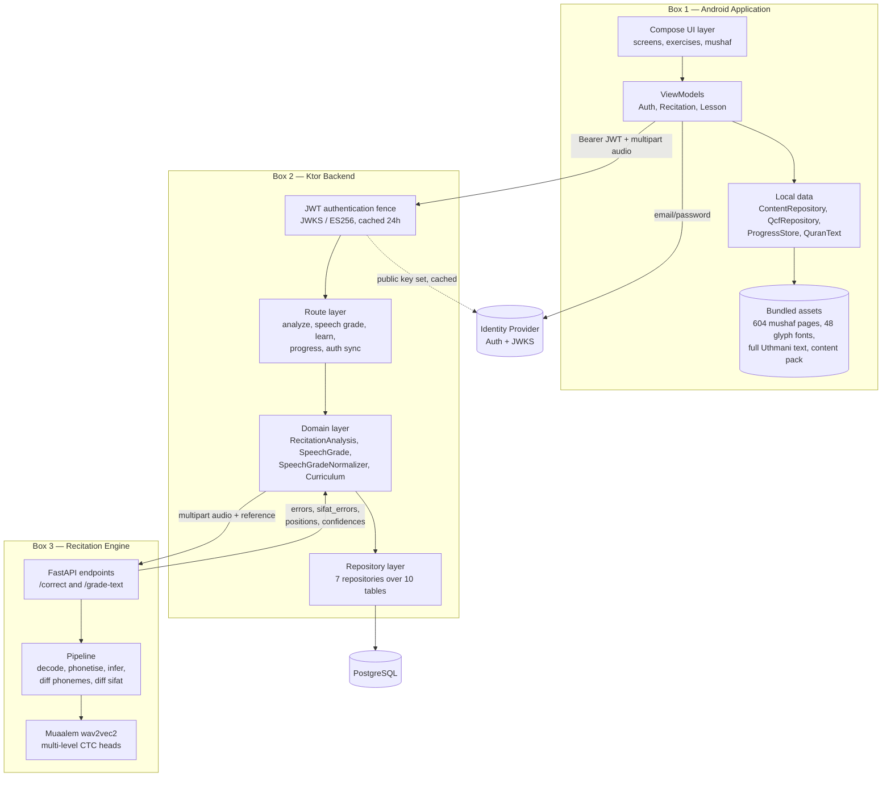
```mermaid
flowchart TB
    subgraph Box1["Box 1 — Android Application"]
        UI["Compose UI layer<br/>screens, exercises, mushaf"]
        VM["ViewModels<br/>Auth, Recitation, Lesson"]
        REPO["Local data<br/>ContentRepository, QcfRepository,<br/>ProgressStore, QuranText"]
        ASSETS[("Bundled assets<br/>604 mushaf pages, 48 glyph fonts,<br/>full Uthmani text, content pack")]
        UI --> VM
        VM --> REPO
        REPO --> ASSETS
    end

    subgraph Box2["Box 2 — Ktor Backend"]
        FENCE["JWT authentication fence<br/>JWKS / ES256, cached 24h"]
        ROUTES["Route layer<br/>analyze, speech grade, learn,<br/>progress, auth sync"]
        LOGIC["Domain layer<br/>RecitationAnalysis, SpeechGrade,<br/>SpeechGradeNormalizer, Curriculum"]
        DATA["Repository layer<br/>7 repositories over 10 tables"]
        FENCE --> ROUTES
        ROUTES --> LOGIC
        LOGIC --> DATA
    end

    subgraph Box3["Box 3 — Recitation Engine"]
        API["FastAPI endpoints<br/>/correct and /grade-text"]
        PIPE["Pipeline<br/>decode, phonetise, infer,<br/>diff phonemes, diff sifat"]
        MODEL["Muaalem wav2vec2<br/>multi-level CTC heads"]
        API --> PIPE
        PIPE --> MODEL
    end

    IDP[("Identity Provider<br/>Auth + JWKS")]
    PG[("PostgreSQL")]

    VM -->|"Bearer JWT + multipart audio"| FENCE
    VM -->|"email/password"| IDP
    FENCE -.->|"public key set, cached"| IDP
    LOGIC -->|"multipart audio + reference"| API
    API -->|"errors, sifat_errors,<br/>positions, confidences"| LOGIC
    DATA --> PG
```

`[FIGURE — render from the mermaid source above and insert image]`

**Figure 5.** The three-box architecture with its layered internals and the two rented managed services. Solid edges are per-request paths; the dotted edge from the authentication fence to the identity provider is traversed only when the cached key set expires.

**Box 1 — the Android application.** Owns capture, rendering, and interaction. It records raw PCM from the microphone, assembles a WAV container in memory, and uploads it. It renders the mushaf from bundled glyph fonts and the curriculum from a bundled content pack, so the entire reading and drilling experience is available without a network round trip for content. It holds no business rules that the server also holds: pass thresholds and experience formulas exist locally only as an optimistic mirror whose values are designed to match the server's, so that the count-up animation does not jump when the server's numbers arrive.

**Box 2 — the Ktor backend.** Owns identity verification, forwarding, normalisation, and persistence. It runs no model. Its largest single piece of logic is the grading normaliser, which is a pure function. Every route that touches user data sits inside one authentication block declared in one file, so the protected surface can be audited in fifteen lines.

**Box 3 — the recitation engine.** Owns inference. It is one Python file deployed to a serverless GPU. It contains no training code, no data collection, and no evaluation harness — those were never part of this project, by decision (§5.8.1).

### 4.1.2 Why the Backend Is Thin

The alternative architectures considered were a fat backend that owns learning logic and a fat client that owns it instead. The thin-proxy shape was chosen for four reasons:

1. **The expensive component is rented and remote.** Any logic placed in the service is logic that must wait behind, or run alongside, a sixty-second-tolerant upstream call. Keeping the service's own work small keeps its latency profile dominated by one clearly-attributable wait.
2. **Server-side authority is required exactly where cheating is possible.** Lesson unlock state, the checkpoint flag, the pass threshold, the experience formula, and the placement level are all computed on the server precisely because a client-supplied value would be untrustworthy. Everything else — animation, sequencing, retry budgets — has no integrity requirement and lives on the client where it is cheaper.
3. **Content must be able to change without a deployment.** Placing curriculum in the service's database would make every content edit a deployment. Placing it in a static resource read at startup, and in a bundled asset on the device, makes content a data change.
4. **The service must be replaceable.** Because the service holds no model and no content, it is roughly three thousand lines of Kotlin. That is a size one person can hold in their head and one person can rewrite.

### 4.1.3 Deployment Topology

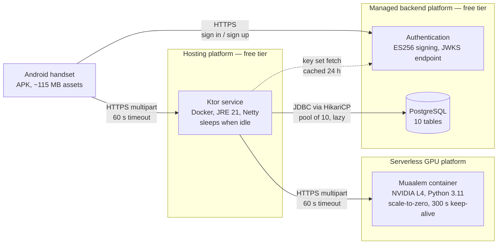
```mermaid
flowchart LR
    Phone["Android handset<br/>APK, ~115 MB assets"]

    subgraph Render["Hosting platform — free tier"]
        Ktor["Ktor service<br/>Docker, JRE 21, Netty<br/>sleeps when idle"]
    end

    subgraph Modal["Serverless GPU platform"]
        GPU["Muaalem container<br/>NVIDIA L4, Python 3.11<br/>scale-to-zero, 300 s keep-alive"]
    end

    subgraph Supa["Managed backend platform — free tier"]
        Auth["Authentication<br/>ES256 signing, JWKS endpoint"]
        DB[("PostgreSQL<br/>10 tables")]
    end

    Phone -->|"HTTPS multipart<br/>60 s timeout"| Ktor
    Phone -->|"HTTPS<br/>sign in / sign up"| Auth
    Ktor -->|"HTTPS multipart<br/>60 s timeout"| GPU
    Ktor -->|"JDBC via HikariCP<br/>pool of 10, lazy"| DB
    Ktor -.->|"key set fetch<br/>cached 24 h"| Auth
```

`[FIGURE — render from the mermaid source above and insert image]`

**Figure 6.** Deployment topology. Each component sits on the platform where it is cheapest to run: a general container host has no affordable GPU, a serverless GPU platform is a poor fit for an always-on REST service, and the managed platform supplies authentication and PostgreSQL at no cost.

The topology has one important operational consequence. Two independent cold starts can stack: the service sleeps on the free tier and takes roughly thirty to sixty seconds to wake, and the inference container scales to zero and takes roughly twenty-four seconds to load the model onto the GPU. A first request after both have been idle can therefore approach sixty seconds end to end. Both the client and the service are configured with sixty-second timeouts specifically to survive this, and the user interface treats the wait as an expected state with an honest progress indication rather than as an error condition.

## 4.2 Class Diagrams

### 4.2.1 Android Client

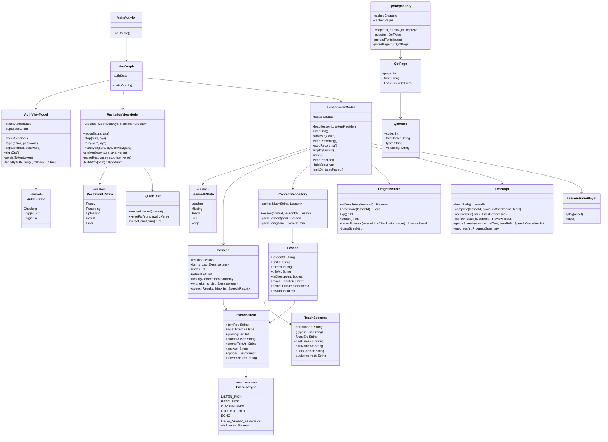
```mermaid
classDiagram
    class MainActivity {
        +onCreate()
    }
    class NavGraph {
        -authState
        +buildGraph()
    }
    class AuthViewModel {
        +state: AuthUiState
        +supabaseClient
        +checkSession()
        +login(email, password)
        +signup(email, password)
        +signOut()
        -persistToken(token)
        -friendlyAuthError(e, fallback) String
    }
    class AuthUiState {
        <<sealed>>
        Checking
        LoggedOut
        LoggedIn
    }
    class RecitationViewModel {
        +uiStates: Map~SuraAya, RecitationUiState~
        +record(sura, aya)
        +stop(sura, aya)
        +retry(sura, aya)
        +nextAyah(sura, aya, onNavigate)
        -analyze(wav, sura, aya, verse)
        -parseResponse(response, verse)
        -buildWav(pcm) ByteArray
    }
    class RecitationUiState {
        <<sealed>>
        Ready
        Recording
        Uploading
        Result
        Error
    }
    class LessonViewModel {
        +state: UiState
        +load(lessonId, tokenProvider)
        +startDrill()
        +answer(option)
        +startRecording()
        +stopRecording()
        +replayPrompt()
        +next()
        +startPractice()
        -finish(session)
        -emitDrill(playPrompt)
    }
    class LessonUiState {
        <<sealed>>
        Loading
        Missing
        Teach
        Drill
        Wrap
    }
    class Session {
        +lesson: Lesson
        +items: List~ExerciseItem~
        +index: Int
        +retriesLeft: Int
        +firstTryCorrect: BooleanArray
        +wrongItems: List~ExerciseItem~
        +speechResults: Map~Int, SpeechResult~
    }
    class LearnApi {
        +learnPath() LearnPath
        +complete(lessonId, score, isCheckpoint, items)
        +reviewsDue(limit) List~ReviewDue~
        +reviewResult(id, correct) ReviewResult
        +gradeSpeech(wav, tier, refText, itemRef) SpeechGradeVerdict
        +progress() ProgressSummary
    }
    class ContentRepository {
        -cache: Map~String, Lesson~
        +lesson(context, lessonId) Lesson
        -parseLesson(json) Lesson
        -parseItem(json) ExerciseItem
    }
    class Lesson {
        +lessonId: String
        +unitId: String
        +titleEn: String
        +titleAr: String
        +isCheckpoint: Boolean
        +teach: TeachSegment
        +items: List~ExerciseItem~
        +isStub: Boolean
    }
    class ExerciseItem {
        +itemRef: String
        +type: ExerciseType
        +gradingTier: Int
        +promptAsset: String
        +promptTextAr: String
        +answer: String
        +options: List~String~
        +referenceText: String
    }
    class ExerciseType {
        <<enumeration>>
        LISTEN_PICK
        READ_PICK
        DISCRIMINATE
        ODD_ONE_OUT
        ECHO
        READ_ALOUD_SYLLABLE
        +isSpoken: Boolean
    }
    class TeachSegment {
        +narrationEn: String
        +glyphs: List~String~
        +focusEn: String
        +ruleNameEn: String
        +ruleNameAr: String
        +audioCorrect: String
        +audioIncorrect: String
    }
    class ProgressStore {
        +isCompleted(lessonId) Boolean
        +bestScore(lessonId) Float
        +xp() Int
        +streak() Int
        +recordAttempt(lessonId, isCheckpoint, score) AttemptResult
        -bumpStreak() Int
    }
    class QcfRepository {
        -cachedChapters
        -cachedPages
        +chapters() List~QcfChapter~
        +page(n) QcfPage
        -preloadFonts(page)
        -parsePage(n) QcfPage
    }
    class QcfPage {
        +page: Int
        +font: String
        +lines: List~QcfLine~
    }
    class QcfWord {
        +code: Int
        +fontName: String
        +type: String
        +verseKey: String
    }
    class QuranText {
        +ensureLoaded(context)
        +verseFor(sura, aya) Verse
        +verseCount(sura) Int
    }
    class LessonAudioPlayer {
        +play(asset)
        +stop()
    }

    MainActivity --> NavGraph
    NavGraph --> AuthViewModel
    NavGraph --> RecitationViewModel
    NavGraph --> LessonViewModel
    AuthViewModel --> AuthUiState
    RecitationViewModel --> RecitationUiState
    RecitationViewModel --> QuranText
    LessonViewModel --> LessonUiState
    LessonViewModel --> Session
    LessonViewModel --> ContentRepository
    LessonViewModel --> ProgressStore
    LessonViewModel --> LearnApi
    LessonViewModel --> LessonAudioPlayer
    ContentRepository --> Lesson
    Lesson --> TeachSegment
    Lesson --> ExerciseItem
    ExerciseItem --> ExerciseType
    Session --> ExerciseItem
    QcfRepository --> QcfPage
    QcfPage --> QcfWord
```

`[FIGURE — render from the mermaid source above and insert image]`

**Figure 7.** Android client class diagram. The three view models are the only stateful objects; every repository is a cache over bundled assets or shared preferences; and every user-interface state is a sealed hierarchy so the renderer can be an exhaustive `when` expression.

Two design properties are visible in the diagram. First, **state is per-target, not global**: `RecitationViewModel` holds a map keyed by surah-and-ayah pair, so navigating between ayat does not destroy results. Second, **the drill session is a private mutable object inside the lesson view model**, and the public `Drill` state is an immutable snapshot emitted from it. The composables never see the mutable session.

### 4.2.2 Backend Domain


```mermaid
classDiagram
    class Application {
        +module()
    }
    class JwtPlugin {
        +configureJwt(issuer)
        -defaultIssuer() String
    }
    class RecitationAnalysis {
        -engine: EngineAdapter
        +analyze(audio, sura, aya, userId) AnalysisResult
    }
    class AnalysisResult {
        <<sealed>>
        Success
        EngineError
        EngineFailed
        PersistenceFailed
    }
    class EngineResponseParser {
        +parse(body) ParsedEngineResponse
    }
    class ParsedEngineResponse {
        +allCorrect: Boolean
        +mistakes: List~MistakeInput~
        +sifatErrors: List~SifatMistakeInput~
    }
    class SpeechGrade {
        -engine: GradeTextEngineAdapter
        +grade(audio, tier, referenceText, itemRef) SpeechGradeResult
    }
    class SpeechGradeResult {
        <<sealed>>
        Success
        EngineError
        EngineFailed
    }
    class SpeechGradeNormalizer {
        +normalize(engineBody, referenceText, itemRef) SpeechGradeResponse
        -mapPhonemeError(obj, referenceText) PhonemeIssue
        -mapSifatError(obj) PhonemeIssue
        -classify(expected, predicted, speechType, expectedLen, predictedLen)
        -pairFeedback(expected, predicted) String
        -isEdgeInsert(start, end, refLen) Boolean
        -isMajor(issue) Boolean
    }
    class SpeechGradeResponse {
        +verdict: String
        +score: Double
        +phoneme_issues: List~PhonemeIssue~
        +item_ref: String
    }
    class PhonemeIssue {
        +uthmani_pos: List~Int~
        +issue_type: String
        +expected_phoneme: String
        +predicted_phoneme: String
        +feedback_key: String
    }
    class Curriculum {
        +file: CurriculumFile
        +lessonOrder: List~String~
    }
    class CurriculumFile {
        +version: Int
        +units: List~CurriculumUnit~
    }
    class DatabaseFactory {
        -dataSource
        +dbQuery(block)
    }
    class UserRepository {
        +upsert(userId) Boolean
    }
    class SessionRepository {
        +insert(userId, sura, aya, allCorrect) UUID
        +findById(sessionId) Session
        +findWithMistakeCounts(userId, limit, offset)
        +countByUser(userId) Long
        +countPerfectByUser(userId) Long
    }
    class MistakeRepository {
        +insertBatch(sessionId, mistakes)
        +findBySession(sessionId) List~Mistake~
        +countByRuleForUser(userId) Map
    }
    class SifatMistakeRepository {
        +insertBatch(sessionId, rows)
        +countByAttributeForUser(userId) Map
    }
    class ProfileRepository {
        +ensure(userId) Profile
        +addXp(userId, amount, reason) Profile
        +bumpStreak(userId) Profile
        +recordPlacement(userId, level, itemsJson) Profile
    }
    class LessonRepository {
        +progressForUser(userId) Map
        +recordAttempt(userId, lessonId, isCheckpoint, score, itemResultsJson) LessonState
    }
    class ReviewRepository {
        -LADDER
        +due(userId, limit) List~ReviewItem~
        +dueCount(userId) Int
        +pushWeak(userId, itemRefs)
        +recordResult(userId, reviewId, correct) ReviewItem
    }

    Application --> JwtPlugin
    Application --> RecitationAnalysis
    Application --> SpeechGrade
    Application --> Curriculum
    RecitationAnalysis --> AnalysisResult
    RecitationAnalysis --> EngineResponseParser
    RecitationAnalysis --> SessionRepository
    RecitationAnalysis --> MistakeRepository
    RecitationAnalysis --> SifatMistakeRepository
    EngineResponseParser --> ParsedEngineResponse
    SpeechGrade --> SpeechGradeResult
    SpeechGrade --> SpeechGradeNormalizer
    SpeechGradeNormalizer --> SpeechGradeResponse
    SpeechGradeResponse --> PhonemeIssue
    Curriculum --> CurriculumFile
    SessionRepository --> DatabaseFactory
    MistakeRepository --> DatabaseFactory
    SifatMistakeRepository --> DatabaseFactory
    ProfileRepository --> DatabaseFactory
    LessonRepository --> DatabaseFactory
    ReviewRepository --> DatabaseFactory
    ProfileRepository --> UserRepository
    SessionRepository --> UserRepository
```

`[FIGURE — render from the mermaid source above and insert image]`

**Figure 8.** Backend domain class diagram. Both engine-calling classes take their upstream as an injected function type, which is what allows every route test to run without a live engine; and both outcome types are sealed, so each case maps to exactly one HTTP status with no fall-through.

The repository boundary follows one rule: **tables that are always written together are owned by the same repository.** An experience change is always a profile change, and a placement is always a level change, so `ProfileRepository` owns the profile, the experience-event log, and the placement audit. A lesson attempt always writes both the append-only attempt log and the per-lesson progress row, so `LessonRepository` owns both.

## 4.3 Sequence Diagrams

### 4.3.1 Sign-In and Session Restore

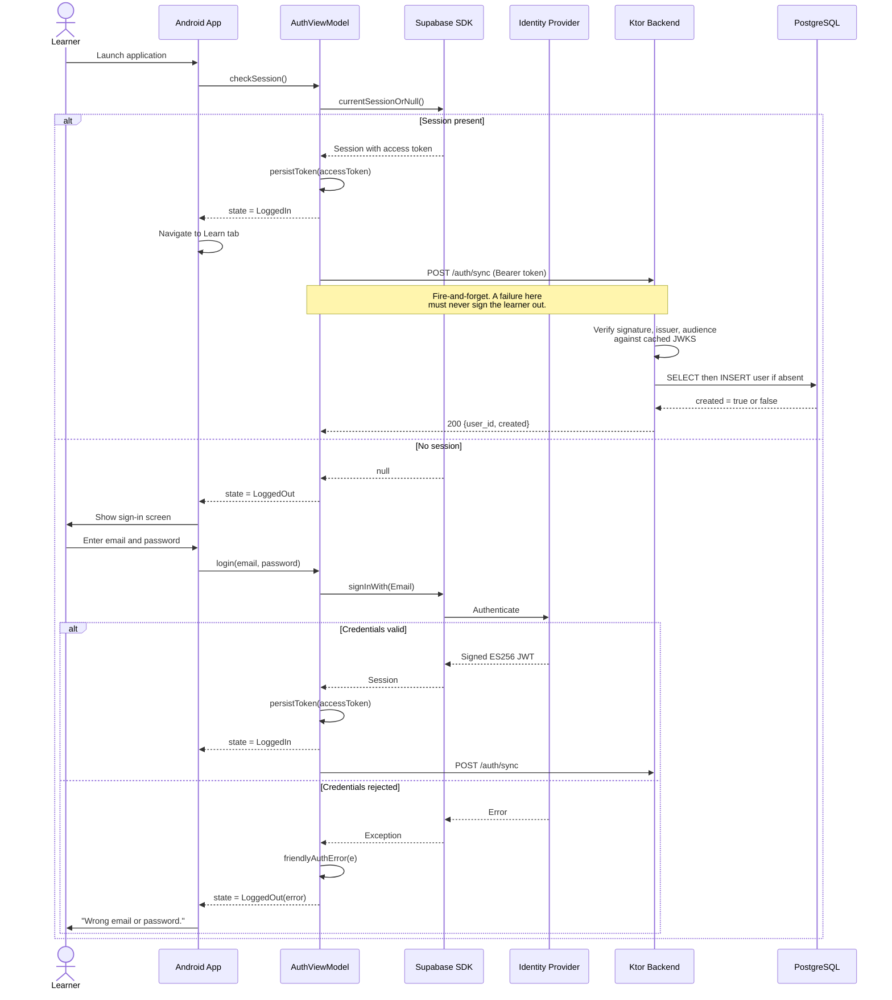
```mermaid
sequenceDiagram
    actor L as Learner
    participant App as Android App
    participant AVM as AuthViewModel
    participant SDK as Supabase SDK
    participant IdP as Identity Provider
    participant BE as Ktor Backend
    participant DB as PostgreSQL

    L->>App: Launch application
    App->>AVM: checkSession()
    AVM->>SDK: currentSessionOrNull()
    alt Session present
        SDK-->>AVM: Session with access token
        AVM->>AVM: persistToken(accessToken)
        AVM-->>App: state = LoggedIn
        App->>App: Navigate to Learn tab
        AVM->>BE: POST /auth/sync (Bearer token)
        Note over AVM,BE: Fire-and-forget. A failure here<br/>must never sign the learner out.
        BE->>BE: Verify signature, issuer, audience<br/>against cached JWKS
        BE->>DB: SELECT then INSERT user if absent
        DB-->>BE: created = true or false
        BE-->>AVM: 200 {user_id, created}
    else No session
        SDK-->>AVM: null
        AVM-->>App: state = LoggedOut
        App->>L: Show sign-in screen
        L->>App: Enter email and password
        App->>AVM: login(email, password)
        AVM->>SDK: signInWith(Email)
        SDK->>IdP: Authenticate
        alt Credentials valid
            IdP-->>SDK: Signed ES256 JWT
            SDK-->>AVM: Session
            AVM->>AVM: persistToken(accessToken)
            AVM-->>App: state = LoggedIn
            AVM->>BE: POST /auth/sync
        else Credentials rejected
            IdP-->>SDK: Error
            SDK-->>AVM: Exception
            AVM->>AVM: friendlyAuthError(e)
            AVM-->>App: state = LoggedOut(error)
            App->>L: "Wrong email or password."
        end
    end
```

`[FIGURE — render from the mermaid source above and insert image]`

**Figure 9.** Sign-in and session restore (UC02, UC03). The key design point is the note on the synchronisation call: the local session is the sole authority for signed-in state, so a cold or unreachable backend cannot log the learner out. This replaced an earlier defect where every application launch demanded the password again.

### 4.3.2 Full-Ayah Recitation Analysis

```mermaid
sequenceDiagram
    actor L as Learner
    participant UI as RecitationScreen
    participant VM as RecitationViewModel
    participant AR as AudioRecord
    participant BE as Ktor Backend
    participant EN as Muaalem Engine
    participant DB as PostgreSQL

    L->>UI: Tap record
    UI->>VM: record(sura, aya)
    VM->>AR: getMinBufferSize / new AudioRecord(16 kHz mono PCM16)
    AR-->>VM: STATE_INITIALIZED
    VM->>AR: startRecording()
    loop While recording
        AR-->>VM: PCM frames appended to in-memory buffer
        VM-->>UI: Recording(verse, elapsedSeconds)
    end
    L->>UI: Tap stop
    UI->>VM: stop(sura, aya)
    VM->>AR: stop() then release()
    VM->>VM: buildWav(pcm) — 44-byte header, no file written
    VM-->>UI: Uploading(verse)
    VM->>BE: POST /audio/analyze<br/>multipart audio + sura + aya<br/>Authorization Bearer
    BE->>BE: Verify JWT locally (JWKS / ES256, cached)
    BE->>BE: Validate audio present and under 10 MB
    BE->>EN: POST /correct?sura=&aya=<br/>multipart audio, 60 s timeout
    EN->>EN: Decode to 16 kHz mono float32
    EN->>EN: Aya(sura, aya).uthmani — canonical reference
    EN->>EN: quran_phonetizer(uthmani, MoshafAttributes hafs)
    EN->>EN: model([wave], [ref]) — phonemes + 10 sifat heads
    EN->>EN: explain_error(...) then expalin_sifat(...)
    EN-->>BE: 200 {uthmani, errors[], sifat_errors[],<br/>error_count, all_correct, audio_secs, infer_secs}
    BE->>BE: EngineResponseParser.parse(body)
    Note over BE: Malformed individual entries are skipped;<br/>valid entries retained.
    BE->>DB: UserRepository.upsert(userId)
    BE->>DB: INSERT session
    BE->>DB: batchInsert mistakes
    BE->>DB: batchInsert sifat_mistakes
    DB-->>BE: OK
    BE-->>VM: 200 — engine body passed through unchanged
    VM->>VM: Replace local verse text with engine `uthmani`
    VM-->>UI: Result(verse, mistakes, sifatErrors, allCorrect)
    UI->>L: Character-range highlights + sifat cards
```

`[FIGURE — render from the mermaid source above and insert image]`

**Figure 10.** Full-ayah recitation analysis (UC08). Note the substitution near the end: the application discards its own copy of the ayah text in favour of the string the engine measured against, guaranteeing that reported character positions index the same string being rendered.

### 4.3.3 Spoken Echo Exercise Grading

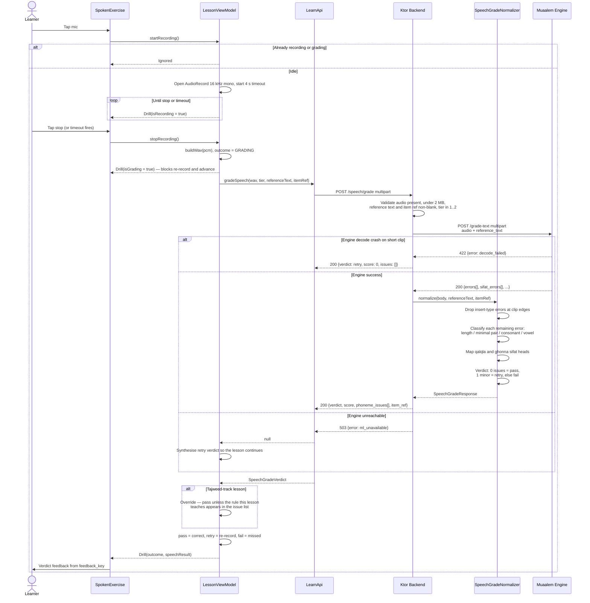
```mermaid
sequenceDiagram
    actor L as Learner
    participant UI as SpokenExercise
    participant VM as LessonViewModel
    participant API as LearnApi
    participant BE as Ktor Backend
    participant NORM as SpeechGradeNormalizer
    participant EN as Muaalem Engine

    L->>UI: Tap mic
    UI->>VM: startRecording()
    alt Already recording or grading
        VM-->>UI: Ignored
    else Idle
        VM->>VM: Open AudioRecord 16 kHz mono, start 4 s timeout
        loop Until stop or timeout
            VM-->>UI: Drill(isRecording = true)
        end
        L->>UI: Tap stop (or timeout fires)
        UI->>VM: stopRecording()
        VM->>VM: buildWav(pcm), outcome = GRADING
        VM-->>UI: Drill(isGrading = true) — blocks re-record and advance
        VM->>API: gradeSpeech(wav, tier, referenceText, itemRef)
        API->>BE: POST /speech/grade multipart
        BE->>BE: Validate audio present, under 2 MB,<br/>reference text and item ref non-blank, tier in 1..2
        BE->>EN: POST /grade-text multipart<br/>audio + reference_text
        alt Engine decode crash on short clip
            EN-->>BE: 422 {error: decode_failed}
            BE-->>API: 200 {verdict: retry, score: 0, issues: []}
        else Engine success
            EN-->>BE: 200 {errors[], sifat_errors[], ...}
            BE->>NORM: normalize(body, referenceText, itemRef)
            NORM->>NORM: Drop insert-type errors at clip edges
            NORM->>NORM: Classify each remaining error:<br/>length / minimal pair / consonant / vowel
            NORM->>NORM: Map qalqla and ghonna sifat heads
            NORM->>NORM: Verdict: 0 issues = pass,<br/>1 minor = retry, else fail
            NORM-->>BE: SpeechGradeResponse
            BE-->>API: 200 {verdict, score, phoneme_issues[], item_ref}
        else Engine unreachable
            BE-->>API: 503 {error: ml_unavailable}
            API-->>VM: null
            VM->>VM: Synthesise retry verdict so the lesson continues
        end
        API-->>VM: SpeechGradeVerdict
        alt Tajweed-track lesson
            VM->>VM: Override — pass unless the rule this lesson<br/>teaches appears in the issue list
        end
        VM->>VM: pass = correct, retry = re-record, fail = missed
        VM-->>UI: Drill(outcome, speechResult)
        UI->>L: Verdict feedback from feedback_key
    end
```

`[FIGURE — render from the mermaid source above and insert image]`

**Figure 11.** Spoken echo exercise grading (UC12). Three separate failure paths — a decode crash, an unreachable engine, and a genuine mispronunciation — all terminate in a state the learner can act on. None of them terminates the lesson.

### 4.3.4 Lesson Completion, Experience, and Review Seeding

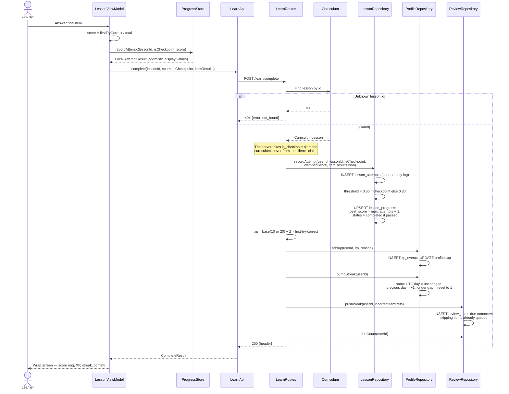
```mermaid
sequenceDiagram
    actor L as Learner
    participant VM as LessonViewModel
    participant PS as ProgressStore
    participant API as LearnApi
    participant BE as LearnRoutes
    participant CUR as Curriculum
    participant LR as LessonRepository
    participant PR as ProfileRepository
    participant RR as ReviewRepository

    L->>VM: Answer final item
    VM->>VM: score = firstTryCorrect / total
    VM->>PS: recordAttempt(lessonId, isCheckpoint, score)
    PS-->>VM: Local AttemptResult (optimistic display values)
    VM->>API: complete(lessonId, score, isCheckpoint, itemResults)
    API->>BE: POST /learn/complete
    BE->>CUR: Find lesson by id
    alt Unknown lesson id
        CUR-->>BE: null
        BE-->>API: 404 {error: not_found}
    else Found
        CUR-->>BE: CurriculumLesson
        Note over BE: The server takes is_checkpoint from the<br/>curriculum, never from the client's claim.
        BE->>LR: recordAttempt(userId, lessonId, isCheckpoint,<br/>clampedScore, itemResultsJson)
        LR->>LR: INSERT lesson_attempts (append-only log)
        LR->>LR: threshold = 0.85 if checkpoint else 0.80
        LR->>LR: UPSERT lesson_progress:<br/>best_score = max, attempts + 1,<br/>status = completed if passed
        BE->>BE: xp = base(10 or 20) + 2 × first-try-correct
        BE->>PR: addXp(userId, xp, reason)
        PR->>PR: INSERT xp_events, UPDATE profiles.xp
        BE->>PR: bumpStreak(userId)
        PR->>PR: same UTC day = unchanged,<br/>previous day = +1, longer gap = reset to 1
        BE->>RR: pushWeak(userId, incorrectItemRefs)
        RR->>RR: INSERT review_items due tomorrow,<br/>skipping items already queued
        BE->>RR: dueCount(userId)
        BE-->>API: 200 {header}
    end
    API-->>VM: CompleteResult
    VM-->>L: Wrap screen — score ring, XP, streak, confetti
```

`[FIGURE — render from the mermaid source above and insert image]`

**Figure 12.** Lesson completion (UC13). The local progress store is written first and optimistically, so the wrap screen animates immediately; the server call is dispatched in parallel and is authoritative for anything that matters.

### 4.3.5 Learning Path Retrieval and Unlock Derivation

```mermaid
sequenceDiagram
    actor L as Learner
    participant UI as LearnScreen
    participant API as LearnApi
    participant BE as LearnRoutes
    participant PR as ProfileRepository
    participant LR as LessonRepository
    participant RR as ReviewRepository
    participant CUR as Curriculum

    L->>UI: Open Learn tab
    UI->>API: learnPath()
    API->>BE: GET /learn/path (Bearer)
    BE->>PR: ensure(userId)
    PR->>PR: UPSERT users, INSERT profiles if absent
    PR-->>BE: Profile {arabicLevel, xp, streak, dailyGoal}
    BE->>LR: progressForUser(userId)
    LR-->>BE: Map lessonId to {status, bestScore, attempts}
    BE->>RR: dueCount(userId)
    RR-->>BE: Count of items due on or before today (UTC)
    BE->>CUR: file.units (static resource, parsed once, cached)
    CUR-->>BE: Ordered units and lessons
    loop For each lesson in global file order
        alt Stored status is completed
            BE->>BE: status = completed; prevCompleted = true
        else Stored status is in_progress
            BE->>BE: status = in_progress; prevCompleted = false
        else No stored status and prevCompleted
            BE->>BE: status = available; prevCompleted = false
        else No stored status and not prevCompleted
            BE->>BE: status = locked; prevCompleted = false
        end
    end
    Note over BE: One global chain across the whole file.<br/>Tajweed units follow the Arabic units, so<br/>graduation from Arabic unlocks Tajweed.
    BE-->>API: 200 {header, units[]}
    API-->>UI: LearnPath
    UI->>L: Roadmap with exactly one available node
```

`[FIGURE — render from the mermaid source above and insert image]`

**Figure 13.** Learning path retrieval (UC10). Unlock status is derived per request rather than stored, so a change to curriculum order immediately changes the gating with no data migration.

### 4.3.6 Content Authoring, Validation, and Packing

```mermaid
sequenceDiagram
    actor A as Content Author
    participant CLI as build_content.py
    participant CUR as content/curriculum.json
    participant LES as content/lessons/*.json
    participant AUD as content/audio/
    participant OUT as content/dist/
    participant APP as android assets/content/

    A->>CLI: python scripts/build_content.py
    CLI->>CUR: Load and validate
    alt Version mismatch or duplicate ids
        CLI-->>A: FAIL with located errors, exit 1, no bundle
    end
    CUR-->>CLI: Flat list of {lesson_id, is_checkpoint, path}
    loop For each referenced lesson
        CLI->>LES: Load lesson file
        alt File missing
            CLI->>CLI: Hard error — dangling reference
        else Invalid JSON
            CLI->>CLI: Error with line number and parser message
        else Valid
            CLI->>CLI: Check id and checkpoint flag agree with curriculum
            CLI->>CLI: Require teach.narration_en; hash and collect it
            loop For each item
                CLI->>CLI: item_ref prefixed and unique
                CLI->>CLI: type in the six permitted values
                CLI->>CLI: grading_tier matches the type category
                CLI->>CLI: recognition items: options and answer valid
                CLI->>CLI: spoken items: reference_text is waqf-safe
                CLI->>CLI: register every audio path after path checks
            end
        end
    end
    CLI->>AUD: Check existence of every required asset
    alt Strict mode
        CLI->>CLI: Missing asset is a hard error
    else Default
        CLI->>CLI: Missing asset is a warning
    end
    alt Any error recorded
        CLI-->>A: FAIL — every error listed with location, exit 1
    else Clean
        CLI->>OUT: Copy curriculum and every lesson
        CLI->>OUT: Write tts_manifest.json — narrations by content hash
        CLI->>CLI: SHA-256 over all packed JSON
        CLI->>OUT: Write build_manifest.json with the hash
        CLI-->>A: OK — 44 authored, 0 stubs, 91 required, 91 pending
        A->>APP: Copy bundle into the application assets
    end
```

`[FIGURE — render from the mermaid source above and insert image]`

**Figure 14.** Content authoring, validation, and packing (UC20, UC21). The pipeline is a gate, not a convenience: no bundle is produced when any rule fails, and the pause-form rule discovered by the grading spike is enforced here rather than being left to the author's memory.

## 4.4 Entity-Relationship Diagram and Database Schema

### 4.4.1 Entity-Relationship Diagram

```mermaid
erDiagram
    USERS ||--o{ SESSIONS : records
    USERS ||--o| PROFILES : has
    USERS ||--o{ PLACEMENT_RESULTS : takes
    USERS ||--o{ LESSON_PROGRESS : tracks
    USERS ||--o{ LESSON_ATTEMPTS : logs
    USERS ||--o{ REVIEW_ITEMS : queues
    USERS ||--o{ XP_EVENTS : earns
    SESSIONS ||--o{ MISTAKES : contains
    SESSIONS ||--o{ SIFAT_MISTAKES : contains

    USERS {
        uuid id PK "same UUID as the identity provider subject"
        text email "nullable"
        timestamptz created_at
    }
    PROFILES {
        uuid user_id PK_FK
        int arabic_level "default 0"
        int xp "default 0"
        int streak_count "default 0"
        date streak_updated_on "nullable"
        int daily_goal_minutes "default 10"
        timestamptz created_at
        timestamptz updated_at
    }
    SESSIONS {
        uuid id PK
        uuid user_id FK "cascade delete"
        int sura
        int aya
        bool all_correct
        timestamptz created_at
    }
    MISTAKES {
        uuid id PK
        uuid session_id FK "cascade delete"
        int char_start "highlight range start"
        int char_end "highlight range end"
        text error_type
        text speech_error_type "nullable"
        text rule_name_en "nullable"
        text rule_name_ar "nullable"
        int expected_len "nullable"
        int predicted_len "nullable"
        timestamptz created_at
    }
    SIFAT_MISTAKES {
        uuid id PK
        uuid session_id FK "cascade delete"
        text phonemes_group
        text attribute "one of 10 sifat heads"
        text predicted
        text expected
        numeric confidence "nullable"
        timestamptz created_at
    }
    LESSON_PROGRESS {
        uuid user_id PK_FK
        text lesson_id PK
        text status "in_progress or completed"
        numeric best_score "default 0"
        int attempts "default 0"
        timestamptz completed_at "nullable"
    }
    LESSON_ATTEMPTS {
        uuid id PK
        uuid user_id FK "cascade delete"
        text lesson_id
        numeric score
        text item_results "JSON as text"
        text coach_summary "reserved, unused in MVP"
        timestamptz created_at
    }
    REVIEW_ITEMS {
        uuid id PK
        uuid user_id FK "cascade delete"
        text item_ref "unique with user_id"
        numeric ease "reserved, unused by the MVP ladder"
        int interval_days "default 1"
        date due_on
        int lapses "default 0"
    }
    PLACEMENT_RESULTS {
        uuid id PK
        uuid user_id FK "cascade delete"
        int level
        text items "JSON audit blob, never queried"
        timestamptz created_at
    }
    XP_EVENTS {
        uuid id PK
        uuid user_id FK "cascade delete"
        int amount
        text reason "lesson_complete, checkpoint_complete, review_correct"
        timestamptz created_at
    }
```

`[FIGURE — render from the mermaid source above and insert image]`

**Figure 15.** Entity-relationship diagram. Ten tables, all rooted at `users`, all cascading on user deletion.

### 4.4.2 Schema Design Notes

| Design choice | Rationale |
|---|---|
| The `users.id` primary key is the identity provider's subject UUID, not a generated key | The identity provider owns the account table; this table exists only so that user-owned rows have a foreign key target. Reusing the subject makes the join implicit and removes an identity mapping table. |
| Every user-owned table cascades on delete | Deleting a user deletes every derived record in one operation, which is what makes the data-minimisation commitment in NFR8.08 enforceable at the database level rather than in application code. |
| `lesson_progress` uses a composite primary key of user and lesson | There is exactly one progress row per learner per lesson. A surrogate key would permit duplicates that the application would then have to reconcile. |
| `lesson_attempts` is append-only and separate from `lesson_progress` | Progress is a projection; attempts are the audit log. Keeping them separate means a scoring formula change can be recomputed from history rather than losing it. |
| `review_items` has a uniqueness constraint over user and item reference | An item cannot be queued twice. The seeding logic depends on this: re-failing an already-queued item must not reset its ladder position. |
| `item_results` and `items` are stored as JSON-in-text | These blobs are written for audit and never queried by their internal structure. A JSON column type would imply queryability the system does not use, and indexing them would cost writes for no read benefit. |
| `ease` on `review_items` and `coach_summary` on `lesson_attempts` are declared but unused | Both are reserved columns for capabilities deliberately deferred: a full SM-2 ease factor and a generated coaching summary. Declaring them now means adding those capabilities later is a code change, not a migration. Both are documented as reserved in the migration and in the table declarations. |
| Locked and available lesson states are **not** stored | They are derived per request from the curriculum order and the stored completions. Storing them would require a rewrite of every learner's rows whenever the curriculum order changed. |
| The migration is create-if-absent throughout | It is safe to re-run, which matters because it is applied by hand through a database console rather than by a migration framework. The accepted limitation is that it will not reconcile a table that already exists with a divergent shape. |

### 4.4.3 Table Ownership by Repository

| Repository | Tables owned | Reason for the grouping |
|---|---|---|
| `UserRepository` | `users` | Single-purpose idempotent upsert |
| `SessionRepository` | `sessions` (reads `mistakes` for counts) | One session is one recitation attempt |
| `MistakeRepository` | `mistakes` | Written only as a batch under a session |
| `SifatMistakeRepository` | `sifat_mistakes` | Mirrors `MistakeRepository` exactly |
| `ProfileRepository` | `profiles`, `xp_events`, `placement_results` | An experience change is always a profile change; a placement is always a level change |
| `LessonRepository` | `lesson_progress`, `lesson_attempts` | Always written together in one transaction |
| `ReviewRepository` | `review_items` | Owns the interval ladder |

**Table 2.** Repository-to-table ownership map.

## 4.5 Lesson Player State Machine

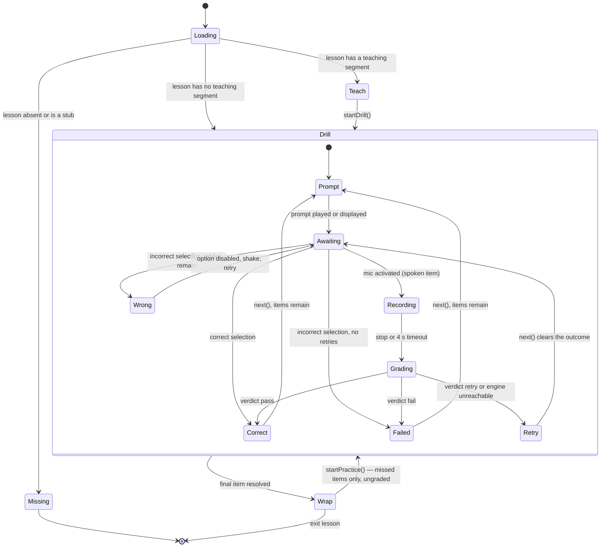
```mermaid
stateDiagram-v2
    [*] --> Loading
    Loading --> Missing : lesson absent or is a stub
    Loading --> Teach : lesson has a teaching segment
    Loading --> Drill : lesson has no teaching segment
    Missing --> [*]

    Teach --> Drill : startDrill()

    state Drill {
        [*] --> Prompt
        Prompt --> Awaiting : prompt played or displayed
        Awaiting --> Correct : correct selection
        Awaiting --> Wrong : incorrect selection, retries remain
        Awaiting --> Failed : incorrect selection, no retries
        Awaiting --> Recording : mic activated (spoken item)
        Wrong --> Awaiting : option disabled, shake, retry
        Recording --> Grading : stop or 4 s timeout
        Grading --> Correct : verdict pass
        Grading --> Retry : verdict retry or engine unreachable
        Grading --> Failed : verdict fail
        Retry --> Awaiting : next() clears the outcome
        Correct --> Prompt : next(), items remain
        Failed --> Prompt : next(), items remain
    }

    Drill --> Wrap : final item resolved
    Wrap --> Drill : startPractice() — missed items only, ungraded
    Wrap --> [*] : exit lesson
```

`[FIGURE — render from the mermaid source above and insert image]`

**Figure 16.** Lesson player state machine. The `Retry` state is what distinguishes a spoken item from a recognition item: a recognition mistake consumes a retry from a fixed budget, whereas a spoken retry verdict returns the learner to an open attempt without penalty, because the retry verdict exists precisely to absorb grading uncertainty rather than to report a learner error.

Two guards are enforced in this machine and are visible in the implementation. First, `next()` is a no-op while the outcome is `Grading`, so a learner cannot skip past an in-flight grade. Second, `startRecording()` is a no-op while either recording or grading is in progress, so concurrent microphone sessions are impossible.

## 4.6 Speech-Grade Normaliser Pipeline

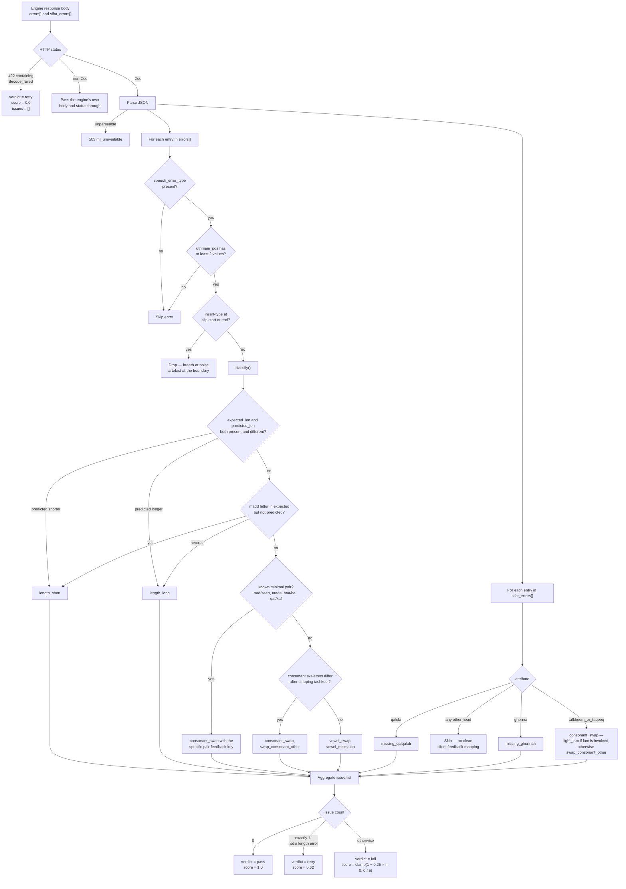
```mermaid
flowchart TD
    IN["Engine response body<br/>errors[] and sifat_errors[]"] --> P1{"HTTP status"}
    P1 -->|"422 containing<br/>decode_failed"| RETRY["verdict = retry<br/>score = 0.0<br/>issues = []"]
    P1 -->|"non-2xx"| PASSTHRU["Pass the engine's own<br/>body and status through"]
    P1 -->|"2xx"| P2["Parse JSON"]
    P2 -->|"unparseable"| FAILED["503 ml_unavailable"]
    P2 --> P3["For each entry in errors[]"]
    P3 --> E1{"speech_error_type<br/>present?"}
    E1 -->|no| SKIP1["Skip entry"]
    E1 -->|yes| E2{"uthmani_pos has<br/>at least 2 values?"}
    E2 -->|no| SKIP1
    E2 -->|yes| E3{"insert-type at<br/>clip start or end?"}
    E3 -->|yes| SKIP2["Drop — breath or noise<br/>artefact at the boundary"]
    E3 -->|no| CLS["classify()"]
    CLS --> C1{"expected_len and predicted_len<br/>both present and different?"}
    C1 -->|"predicted shorter"| L1["length_short"]
    C1 -->|"predicted longer"| L2["length_long"]
    C1 -->|no| C2{"madd letter in expected<br/>but not predicted?"}
    C2 -->|yes| L1
    C2 -->|"reverse"| L2
    C2 -->|no| C3{"known minimal pair?<br/>sad/seen, taa/ta, haa/ha, qaf/kaf"}
    C3 -->|yes| M1["consonant_swap with the<br/>specific pair feedback key"]
    C3 -->|no| C4{"consonant skeletons differ<br/>after stripping tashkeel?"}
    C4 -->|yes| M2["consonant_swap,<br/>swap_consonant_other"]
    C4 -->|no| M3["vowel_swap,<br/>vowel_mismatch"]

    P2 --> S1["For each entry in sifat_errors[]"]
    S1 --> S2{"attribute"}
    S2 -->|"qalqla"| SQ["missing_qalqalah"]
    S2 -->|"ghonna"| SG["missing_ghunnah"]
    S2 -->|"tafkheem_or_taqeeq"| ST["consonant_swap —<br/>light_lam if lam is involved,<br/>otherwise swap_consonant_other"]
    S2 -->|"any other head"| SKIP3["Skip — no clean<br/>client feedback mapping"]

    L1 --> AGG["Aggregate issue list"]
    L2 --> AGG
    M1 --> AGG
    M2 --> AGG
    M3 --> AGG
    SQ --> AGG
    SG --> AGG
    ST --> AGG

    AGG --> V{"Issue count"}
    V -->|"0"| VP["verdict = pass<br/>score = 1.0"]
    V -->|"exactly 1,<br/>not a length error"| VR["verdict = retry<br/>score = 0.62"]
    V -->|"otherwise"| VF["verdict = fail<br/>score = clamp(1 − 0.25 × n, 0, 0.45)"]
```

`[FIGURE — render from the mermaid source above and insert image]`

**Figure 17.** The speech-grade normaliser decision pipeline. Every branch in this diagram traces to a specific empirical finding from the grading spike (§6.4) rather than to a guess; the edge-insertion drop, the single-minor-to-retry rule, and the decode-crash-to-retry rule are the three tolerance mechanisms that spike prescribed.

## 4.7 Navigation and Screen Map

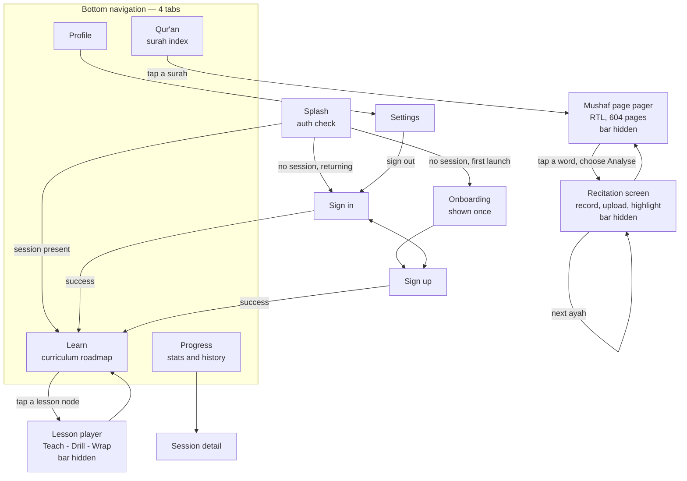
```mermaid
flowchart TD
    SPLASH["Splash<br/>auth check"]
    SPLASH -->|"no session, first launch"| ONB["Onboarding<br/>shown once"]
    SPLASH -->|"no session, returning"| LOGIN["Sign in"]
    SPLASH -->|"session present"| LEARN

    ONB --> SIGNUP["Sign up"]
    LOGIN <--> SIGNUP
    LOGIN -->|"success"| LEARN
    SIGNUP -->|"success"| LEARN

    subgraph TABS["Bottom navigation — 4 tabs"]
        LEARN["Learn<br/>curriculum roadmap"]
        MUSHAF["Qur'an<br/>surah index"]
        PROGRESS["Progress<br/>stats and history"]
        PROFILE["Profile"]
    end

    LEARN -->|"tap a lesson node"| LESSON["Lesson player<br/>Teach - Drill - Wrap<br/>bar hidden"]
    LESSON --> LEARN

    MUSHAF -->|"tap a surah"| PAGE["Mushaf page pager<br/>RTL, 604 pages<br/>bar hidden"]
    PAGE -->|"tap a word, choose Analyse"| RECITE["Recitation screen<br/>record, upload, highlight<br/>bar hidden"]
    RECITE -->|"next ayah"| RECITE
    RECITE --> PAGE

    PROGRESS --> DETAIL["Session detail"]
    PROFILE --> SETTINGS["Settings"]
    SETTINGS -->|"sign out"| LOGIN
```

`[FIGURE — render from the mermaid source above and insert image]`

**Figure 18.** Navigation graph and screen map. All destinations live in a single navigation host inside a single activity; the authentication gate is one conditional over the authentication state, and the bottom bar is hidden on every drill-in destination.

## 4.8 Theme and Colour Scheme

### 4.8.1 Design Intent

The visual design has one governing constraint that is unusual for a learning application: **the subject matter is sacred, so the interface must not be playful in the way a language-learning game is playful.** Concretely, this ruled out saturated reds for errors, cartoon mascots, aggressive failure states, and celebratory noise on every interaction. What remains is a calm, reverent palette of greens and sands, an error vocabulary in muted terracotta rather than alarm red, and a motion vocabulary that rewards without shouting.

### 4.8.2 Palette

| Role | Light theme | Dark theme | Purpose |
|---|---|---|---|
| Primary | `#2C5E43` | `#639D7E` | Deep green — primary actions, active navigation, progress fills |
| Secondary | `#8D9965` | `#A5B284` | Olive — secondary emphasis, supporting chrome |
| Background | `#FCFBF7` | `#111814` | Warm sand / near-black green, avoiding pure white and pure black |
| Surface | `#F6F4EB` | `#1A231E` | Cream / raised dark green for cards and sheets |
| Text | `#1E2922` | `#E3EAE6` | Dark green-black / soft off-white |

**Table 3.** Core theme palette.

### 4.8.3 Mistake-Highlight Families

Three separate colour families are used so that the learner can distinguish, at a glance and without reading, *what kind* of mistake was made.

| Family | Foreground | Light background | Dark background | Applied to |
|---|---|---|---|---|
| Tajweed violation | `#D95A3B` terracotta | `#FEEFEA` | `#3B1E19` | Errors carrying a named tajweed rule |
| Plain misreading | `#C084FC` muted purple | `#F3E8FF` | `#2E1C3F` | Phoneme errors with no named rule |
| Letter characteristic | `#2B7AB3` calm blue | `#E8F2FA` | `#0E1E2D` | Sifat attribute mismatches |

**Table 4.** Mistake-highlight colour families.

The deliberate choice of terracotta over red is documented in the source itself as "muted terracotta instead of alarmist red". A learner correcting their recitation of the Qur'an should feel guided, not scolded.

### 4.8.4 Gamification and Teaching Accents

| Token | Value | Purpose |
|---|---|---|
| Streak flame | `#E8863C` | The streak indicator, warm in both themes |
| Experience gold | `#D9A441` | The experience counter and the score ring sweep |
| Locked node | `#D8D3C4` light / `#39413A` dark | Lessons not yet unlocked on the roadmap |
| Fatha accent | `#CB6D51` | The short vowel *a*, everywhere it is taught |
| Kasra accent | `#4E86A8` | The short vowel *i*, everywhere it is taught |
| Damma accent | `#7C9A54` | The short vowel *u*, everywhere it is taught |

**Table 5.** Gamification and harakat teaching accents.

The three harakat accents implement a specific pedagogical device: a beginner must learn to bind a written mark to a sound, so each of the three short vowels carries one consistent colour wherever it appears in the application. The colour is a redundant channel alongside the glyph and the audio.

### 4.8.5 Typography

| Style | Family | Size | Line height | Use |
|---|---|---|---|---|
| Display large | System default, bold | 32 sp | 40 sp | Screen titles |
| Headline medium | System default, semi-bold | 24 sp | 32 sp | Section headings |
| Title large | System default, semi-bold | 20 sp | 28 sp | Card titles |
| Body large | System default | 16 sp | 24 sp | Primary body copy |
| Body medium | System default | 14 sp | 20 sp | Secondary copy |
| Label large | System default, medium | 14 sp | 20 sp | Buttons and labels |
| **Qur'an text** | **Amiri Quran** | **36 sp** | **56 sp** | **All Uthmani text outside the mushaf renderer** |
| **Mushaf page** | **QCF v4, per-page font** | Fitted to line | Fitted to page | The page-faithful mushaf |

**Table 6.** Typographic scale. The Qur'anic style is deliberately far larger than any other text in the application: a beginner must be able to distinguish a fatha from a damma, and diacritic marks at body-text size are not legible enough to teach from.

### 4.8.6 Motion Vocabulary

| Token | Duration | Curve | Applied to |
|---|---|---|---|
| Fast | 120 ms | Fast-out-slow-in | The scale-pop on a correct answer |
| Standard | 250 ms | Fast-out-slow-in | General state transitions |
| Maximum | 400 ms | — | The hard ceiling; nothing in the application animates longer |
| Entrance | Spring, medium bounce, low stiffness | — | Staggered entrance of lesson nodes on the roadmap |
| Wrong-answer shake | Six steps of 45 ms, ±3 px | Fast-out-slow-in | The gentle nudge on an incorrect selection |
| Score ring sweep | 700 ms | — | The wrap-screen score animating from zero to the achieved value |

**Table 7.** Motion vocabulary. The rules are that every state change animates, one easing curve is used throughout, nothing exceeds 400 ms, and a wrong answer produces a three-pixel shake rather than a flash — the same "guide, do not scold" principle that governs the colour choice.

Both the confetti burst on lesson completion and the score ring are drawn on Compose's canvas with the framework's own animation primitives. No animation library is a dependency of this project.

---

# Chapter 5: Implementation

## 5.1 Overview and Repository Structure

The system is implemented across three deployed components and one build-time pipeline, all in a single repository.

```
bayaan/
├── android/          Android application — single Gradle module `:app`
├── backend/          Ktor service — routes, domain, repositories, tests, migration
├── ml/               Recitation engine deployment script (one file)
├── content/          Curriculum source: curriculum.json, lessons/, schema/, dist/
├── scripts/          build_content.py, generate_ayah_tags.py, build_report.py
├── spike/            Evaluation harness, manifests, and raw spike results
├── docs/             Architecture, API specification, decisions, workstreams
└── AGENTS.md         Binding instruction set for every contributor, human or agent
```

### 5.1.1 Measured Size

All figures below were measured directly from the working tree rather than estimated.

| Component | Measure | Value |
|---|---|---|
| Android application | Kotlin source files | 48 |
| Android application | Lines of Kotlin | 7,241 |
| Backend — production | Lines of Kotlin | 1,941 |
| Backend — tests | Lines of Kotlin | 1,194 |
| Backend — total | Lines of Kotlin | 3,135 |
| Backend | Test classes / harness classes | 7 / 2 |
| Backend | Executable test methods | 60 |
| Recitation engine | Lines of Python | 302 (single file) |
| Content pipeline | Lines of Python | 327 (zero third-party dependencies) |
| Curriculum | Authored lesson files | 44 |
| Curriculum | Stub lesson files | 0 |
| Curriculum | Exercise items | 292 |
| Curriculum | Distinct audio assets referenced | 91 |
| Android assets | Total bundled size | ~115 MB |
| Android assets | QCF glyph fonts | 48 files, ~113 MB |
| Android assets | Full Uthmani Qur'an text | ~1.4 MB |
| Android assets | Content pack | ~604 KB |
| Database | Tables | 10 |
| Backend | HTTP endpoints | 13 |

**Table 8.** Measured implementation size.

### 5.1.2 Architectural Correction to Earlier Documentation

Several planning documents written earlier in the project describe an architecture that was never built. This report describes the system as it exists, and the discrepancies are recorded here because they are material to anyone reading those older documents:

- **The Android module is plain, single-module Android — not Kotlin Multiplatform.** `android/settings.gradle.kts` includes exactly one module, `:app`. There is no `shared/` directory in the working tree. An earlier draft of the Android instruction file planned for a multiplatform structure and a WebSocket audio-streaming path; neither exists.
- **Authentication is Supabase, not Firebase.** The session token is stored under the shared-preferences file `supabase_session`, and the backend verifies it via JWKS/ES256.
- **State is held in `mutableStateOf` and `mutableStateMapOf`, not in `StateFlow`.** There is no `Flow` in the application's state layer.
- **The backend persists letter-characteristic errors.** An earlier note stated that the engine response parser discarded them; it no longer does. `EngineResponseParser` returns a three-field result, and `SifatMistakeRepository` persists the third field.
- **The curriculum is complete.** An earlier report draft described three authored units and seventeen lessons with units four to eight listed as future work. The working tree contains forty-four authored lessons and zero stubs.

## 5.2 Android Application

### 5.2.1 Component Inventory

| File | Lines | Responsibility |
|---|---|---|
| `ui/screens/RecitationScreen.kt` | 729 | The record → upload → highlight surface, including the result rendering and the sifat card list |
| `ui/screens/MushafPagerScreen.kt` | 611 | Page-faithful mushaf pager, word tap handling, ayah selection sheet |
| `ui/viewmodel/LessonViewModel.kt` | 417 | Lesson phase machine, drill session, microphone capture for spoken items, grading dispatch |
| `ui/screens/VersePickerScreen.kt` | 322 | The legacy verse-picking path, superseded by the mushaf |
| `ui/viewmodel/RecitationViewModel.kt` | 308 | Per-ayah recitation state, PCM capture, in-memory WAV assembly, response parsing |
| `ui/screens/LearnScreen.kt` | 291 | Curriculum roadmap with animated, staggered lesson nodes |
| `ui/navigation/NavGraph.kt` | 290 | Single navigation host, authentication gate, four-tab bottom bar, drill-in routes |
| `ui/screens/LessonScreen.kt` | 283 | Lesson player rendering: teach card, drill dispatch by exercise type, wrap |
| `ui/lesson/LearnApi.kt` | 230 | Client for all learn, grade, and progress endpoints |
| `ui/screens/SignupScreen.kt` | 214 | Registration form with local validation |
| `ui/viewmodel/AuthViewModel.kt` | 191 | Supabase client, session state machine, token persistence, error humanisation |
| `ui/screens/OnboardingScreen.kt` | 186 | First-launch introduction |
| `ui/screens/LoginScreen.kt` | 173 | Sign-in form |
| `ui/lesson/exercises/SpokenExercise.kt` | 170 | Echo and read-aloud item rendering, mic control, verdict feedback |
| `ui/screens/ProgressScreen.kt` | 170 | Aggregate statistics and breakdowns |
| `ui/screens/ProfileScreen.kt` | 168 | Account surface |
| `ui/screens/SettingsScreen.kt` | 163 | Preferences and sign-out |
| `ui/screens/SurahIndexScreen.kt` | 154 | All 114 surahs with page ranges |
| `ui/screens/HomeScreen.kt` | 139 | Home surface |
| `ui/mushaf/QcfRepository.kt` | 131 | Page description parsing, glyph font resolution and preloading, caching |
| `ui/lesson/exercises/ExerciseScaffold.kt` | 130 | Shared drill chrome: progress bar, prompt area, feedback banner |
| `ui/model/Models.kt` | 117 | `Verse`, `Mistake`, `SifatError`, `RecitationUiState` |
| `ui/lesson/WrapScreen.kt` | 101 | Lesson summary with score ring and celebration |
| `ui/components/Confetti.kt` | 98 | Canvas particle system, no library |
| `ui/components/ScoreRing.kt` | 85 | Animated sweep from zero to the achieved score |
| `ui/components/StreakXpHeader.kt` | 82 | Streak and experience header |
| `ui/lesson/ContentRepository.kt` | 81 | Content pack loading, parsing, per-lesson caching |
| `MainActivity.kt` | 73 | Single activity host |
| `ui/lesson/exercises/ReadPickExercise.kt` | 73 | See a letter, pick its sound |
| `ui/lesson/ProgressStore.kt` | 69 | Local progress mirror over shared preferences |
| `ui/components/VerseText.kt` | 69 | Character-range highlighting over `AnnotatedString` |
| `ui/theme/Type.kt` | 66 | Typographic scale and the Qur'an text style |
| `ui/feedback/SoundEffects.kt` | 64 | Interaction sounds |
| `ui/theme/Theme.kt` | 61 | Light and dark colour schemes |
| `ui/screens/SplashScreen.kt` | 61 | Authentication check destination |
| `ui/motion/Motion.kt` | 59 | Motion tokens, `correctPop`, `gentleShake` |
| `ui/components/BayaanHeader.kt` | 56 | Shared header |
| `ui/lesson/exercises/ListenPickExercise.kt` | 55 | Hear a sound, pick the letter |
| `ui/lesson/exercises/DiscriminateExercise.kt` | 55 | Hear a sound, choose between two |
| `ui/lesson/exercises/OddOneOutExercise.kt` | 53 | Pick the letter that does not belong |
| `ui/model/QuranText.kt` | 48 | Loads all 6,236 Uthmani ayat once from assets |
| `ui/lesson/model/LessonModels.kt` | 47 | On-device shape of the content pack |
| `ui/theme/Color.kt` | 42 | Palette tokens |
| `ui/lesson/LessonAudioPlayer.kt` | 42 | Prompt playback |
| `ui/mushaf/QcfModels.kt` | 39 | Page, line, word, chapter types |
| `ui/feedback/Haptics.kt` | 36 | Haptic feedback wrapper |

**Table 9.** Android component inventory (48 files, 7,241 lines). Two further files — `ConnectExercise.kt` (64 lines) and `BuildWordExercise.kt` (75 lines) — are present in the exercises package but are **not reachable**: neither `CONNECT` nor `BUILD_WORD` appears in the `ExerciseType` enumeration, neither is dispatched by the lesson player, and no authored lesson references them. They are speculative composables from an earlier design of Unit 4 and are recorded here as dead code rather than presented as shipped features.

### 5.2.2 State Management

The application uses Compose state primitives directly rather than reactive streams. `AuthViewModel` exposes a single `mutableStateOf<AuthUiState>`; `RecitationViewModel` exposes a `mutableStateMapOf<Pair<Int,Int>, RecitationUiState>`; `LessonViewModel` exposes a single `mutableStateOf<UiState>` with a private setter.

This is a deliberate choice recorded in the module's instruction file. The rationale is that the application has no multi-consumer state, no state that must survive process death, and no operators — combination, debouncing, flat-mapping — that a `Flow` would provide. Adding `StateFlow` would have introduced a second state idiom and a `collectAsState` boundary at every screen for no capability the application uses. The cost accepted is that if the application later needs to combine state from multiple asynchronous sources, that migration must be made deliberately rather than being available for free.

The per-ayah state map is worth noting on its own: it means the recitation result for surah 1 ayah 5 survives the learner navigating to a different ayah and back, without any persistence, because the view model outlives the composable.

### 5.2.3 Audio Capture

Both recording paths — the full-ayah recitation and the spoken lesson item — use the same technique, implemented independently in the two view models:

1. Query the platform for the minimum buffer size at 16 kHz, mono, 16-bit PCM. A non-positive result means the configuration is unsupported and the flow aborts with a user-facing message.
2. Construct an `AudioRecord` on the microphone source with a buffer four times the reported minimum, to absorb scheduling jitter.
3. Verify the recorder reached the initialised state; release and abort if not.
4. Start recording and launch a coroutine on the IO dispatcher that reads frames into a `ByteArrayOutputStream` until cancelled.
5. On stop: cancel the reader and join it, stop and release the recorder, and snapshot the buffer.
6. Prepend a forty-four-byte canonical WAV header — RIFF/WAVE, PCM format tag, one channel, 16,000 samples per second, byte rate of 32,000, block align of two, sixteen bits per sample — and the data chunk length.

The design constraint driving this is that **the model requires 16 kHz mono and the backend must remain thin.** Recording at the model's native rate on the device means no component ever transcodes audio: the phone produces exactly what the model consumes, the service forwards bytes, and the engine decodes once. It also means no file is ever written — the entire recording exists as a byte array in the view model and is discarded when the request completes.

The lesson path adds a four-second automatic stop, because lesson clips are single syllables or short words and an over-long clip both wastes GPU time and increases the chance of the breath-noise artefacts that the grading normaliser must then discard.

### 5.2.4 The Page-Faithful Mushaf Renderer

This is the most technically unusual component in the application. Ordinary Arabic text rendering will not reproduce a printed mushaf: line breaks fall in different places, ligatures differ, and the justification of each line to the page margin is lost. The Madani mushaf's typography is a property of the printed page, not of the text.

The QCF v4 approach solves this by giving **every page its own font**. A page's words are described not as Unicode Arabic characters but as integer glyph codes in the Private Use Area, and the page's font maps those codes to the exact ligature shapes printed on that physical page. Rendering page *N* means loading font *N* and drawing its codes.

The implementation consequences are specific:

- **Forty-eight font files cover all six hundred and four pages**, at roughly two megabytes each — approximately 113 MB, which is the overwhelming majority of the application's 115 MB asset payload.
- **A font must be parsed before its page can be measured or drawn.** A two-megabyte typeface parse on the main thread during a page swipe would drop frames. `QcfRepository.page(n)` therefore performs asset reading, JSON parsing, and font resolution inside `withContext(ioDispatcher)`, and explicitly calls the font family resolver's preload so that the typeface is warm before any `Text` composable measures it.
- **The font cache is shared, not per-component.** A single module-level map keyed by font name is consulted by both the repository's preloader and the renderer, so a font is parsed at most once per process rather than once per consumer.
- **Parsed pages are cached in a concurrent map**, because the pager can have two page slots loading simultaneously — the current page and the neighbour prepared beyond the viewport.
- **A missing or misnamed font degrades silently.** The loader expects a specific filename convention; a mismatch yields a placeholder glyph rather than a crash. This is a deliberate resilience choice: one missing font should not take down the reader.
- **The pager is reversed** so that a rightward swipe advances the page, matching the physical reading direction of a mushaf.
- **Each word carries its verse key**, which is what makes tap-to-select-ayah possible: tapping any word highlights every word sharing that key.

### 5.2.5 Lesson Player and the Exercise Taxonomy

The lesson player is a two-level state machine (Figure 16): an outer phase machine of Loading → Teach → Drill → Wrap, and an inner per-item machine of Prompt → Awaiting → outcome.

The exercise taxonomy is fixed by the content schema and implemented by the enumeration in `LessonModels.kt`:

| Type | Grading tier | Task | Graded by |
|---|---|---|---|
| `LISTEN_PICK` | 0 | A sound plays; tap the letter that makes it | Exact option comparison on device |
| `READ_PICK` | 0 | A letter is shown; tap the audio option that matches | Exact option comparison on device |
| `DISCRIMINATE` | 0 | A sound plays; choose between two similar letters | Exact option comparison on device |
| `ODD_ONE_OUT` | 0 | Tap the item that does not belong to the set | Exact option comparison on device |
| `ECHO` | 1 or 2 | A model pronunciation plays; say it back | The recitation engine via `/speech/grade` |
| `READ_ALOUD_SYLLABLE` | 1 or 2 | Read the displayed target aloud with no model to copy | The recitation engine via `/speech/grade` |

**Table 10.** The exercise-type taxonomy. Tier 0 is graded entirely on the device with no network call; tiers 1 and 2 are graded by the engine. Tier 1 is a syllable or word; tier 2 is real Qur'anic text.

The distribution across the authored curriculum, measured from the content source:

| Exercise type | Item count | Share |
|---|---|---|
| `READ_ALOUD_SYLLABLE` | 102 | 34.9% |
| `LISTEN_PICK` | 58 | 19.9% |
| `ECHO` | 57 | 19.5% |
| `ODD_ONE_OUT` | 41 | 14.0% |
| `DISCRIMINATE` | 27 | 9.2% |
| `READ_PICK` | 7 | 2.4% |
| **Total** | **292** | **100%** |

**Table 11.** Exercise items by type across all 44 authored lessons.

| Grading tier | Item count | Meaning |
|---|---|---|
| 0 — recognition | 133 | Graded on device, no network |
| 1 — spoken, non-Qur'anic target | 134 | Engine-graded syllable or word |
| 2 — spoken, Qur'anic target | 25 | Engine-graded real Qur'anic text |

**Table 12.** Exercise items by grading tier. Note that 159 of 292 items — more than half the curriculum — require the speech-grading path, which is why the feasibility of grading arbitrary text was the project's single load-bearing assumption.

Retry semantics differ by kind, and the difference is pedagogically motivated. A recognition mistake consumes one of a fixed retry budget and disables the chosen option, because the learner has demonstrably not recognised the letter. A spoken `retry` verdict, by contrast, does not consume the budget and returns the item to an open state, because the retry verdict exists to absorb *grading uncertainty* — a single minor phoneme discrepancy that may be the learner's error or may be the model's. Punishing the learner for the model's uncertainty would be unjust, and the tolerance policy exists precisely to avoid it.

### 5.2.6 Authentication on the Client

`AuthViewModel` owns the Supabase client and a three-state machine: `Checking`, `LoggedOut`, `LoggedIn`. Three implementation details matter:

**The session is the sole authority.** `checkSession()` asks the SDK for the locally-stored session. If one exists, the state becomes `LoggedIn` immediately and the backend synchronisation call is dispatched afterwards as fire-and-forget. This ordering fixed a real defect: an earlier implementation gated the signed-in state on the backend call succeeding, which meant that a cold backend — routinely thirty to sixty seconds on the free tier — signed the learner out and demanded their password on every launch.

**Errors are humanised at the boundary.** `friendlyAuthError()` maps the third-party SDK's verbose exception text onto short messages: wrong credentials, unconfirmed email, weak password, network failure. Raw exception text is never displayed.

**Token storage is plain shared preferences, deliberately.** The file is named `supabase_session`. The source carries an inline note recording that this is not encrypted storage, that application backup is disabled so the file is not extractable through a platform backup, and that the upgrade path — an encrypted preferences implementation — is available if the threat model changes to include a rooted device.

## 5.3 Backend Service

### 5.3.1 Endpoint Surface

| Method | Path | Auth | Purpose |
|---|---|---|---|
| GET | `/health` | No | Liveness; touches no database |
| GET | `/surahs` | No | A hardcoded two-surah list, legacy to the superseded verse picker |
| POST | `/auth/sync` | Yes | Idempotent upsert of the caller into `users` |
| POST | `/audio/analyze` | Yes | Full-ayah analysis: forward, parse, persist, pass through |
| POST | `/speech/grade` | Yes | Arbitrary-text grading: forward, normalise, return a verdict |
| GET | `/learn/path` | Yes | Curriculum tree with per-lesson status derived server-side |
| POST | `/learn/complete` | Yes | Record an attempt, award experience, bump the streak, seed reviews |
| GET | `/learn/reviews` | Yes | Items due today or earlier |
| POST | `/learn/reviews/{id}/result` | Yes | Grade a review and re-schedule it on the ladder |
| POST | `/learn/placement` | Yes | Compute and store the placement level server-side |
| GET | `/progress` | Yes | Aggregate statistics and two breakdowns |
| GET | `/progress/sessions` | Yes | Paginated session history |
| GET | `/progress/sessions/{id}` | Yes | One session with all its mistakes |

**Table 13.** The complete HTTP surface — thirteen endpoints, eleven of them authenticated.

The entire authentication fence is eleven lines in `Application.kt`: two public route registrations, then an `authenticate("auth-jwt")` block containing the other five route groups. This is the property that makes the protected surface auditable at a glance rather than by inspecting per-route annotations.

### 5.3.2 JWT Verification

Verification uses the identity provider's asymmetric signing key. The plugin builds a JWK provider against the project's key-set URL with a cache of ten keys for twenty-four hours and a rate limit of ten fetches per minute, then configures the Ktor JWT authentication with issuer and audience checks. The token's subject is the user's UUID; a blank subject fails validation. A failed challenge returns a fixed JSON body with HTTP 401.

The issuer is a function parameter with an environment-derived default. That single design choice is what makes the test suite meaningful: the tests stand up a real JWKS document over a loopback HTTP server backed by a throwaway elliptic-curve key pair and point verification at it, so the suite exercises the actual signature-verification path rather than mocking around it. An earlier version of the suite self-signed symmetric tokens against a local secret and continued to pass after the production code had migrated to asymmetric verification — five tests were failing with 401 for reasons unrelated to what they claimed to test. The loopback-key-server harness closed that gap.

`call.userId()` is a one-line extension that reads the subject from the principal. It uses a non-null assertion, which is safe only because it is called exclusively inside the authentication block where Ktor guarantees the principal exists — a constraint documented at the call site.

### 5.3.3 `POST /audio/analyze`

**Request** — `multipart/form-data`:

| Field | Type | Required | Notes |
|---|---|---|---|
| `audio` | file | Yes | 16 kHz mono WAV produced on the device |
| `sura` | string (int) | No | Defaults to 1 |
| `aya` | string (int) | No | Defaults to 1 |

**Response 200** — the engine's own body, unchanged:

```json
{
  "sura": 1,
  "aya": 1,
  "uthmani": "بِسْمِ ٱللَّهِ ٱلرَّحْمَٰنِ ٱلرَّحِيمِ",
  "errors": [
    {
      "uthmani_pos": [10, 14],
      "error_type": "tajweed",
      "speech_error_type": "replace",
      "ref_tajweed_rules": [
        { "name": { "en": "Aared Madd", "ar": "المد العارض للسكون" } }
      ],
      "expected_len": 4,
      "predicted_len": 2
    }
  ],
  "sifat_errors": [
    {
      "phonemes_group": "قَ",
      "attribute": "qalqla",
      "predicted": "not_moqalqal",
      "expected": "moqalqal",
      "confidence": 0.94
    }
  ],
  "error_count": 1,
  "all_correct": false,
  "audio_secs": 6.12,
  "infer_secs": 1.703
}
```

**Error responses:**

| Status | `error` code | Condition |
|---|---|---|
| 400 | `bad_request` | The `audio` part is absent or empty |
| 413 | `payload_too_large` | Audio exceeds 10 MB |
| 401 | `unauthorized` | Token missing, malformed, expired, or wrongly issued |
| 503 | `ml_unavailable` | The engine threw, timed out, or returned a body that could not be parsed |
| 500 | `persistence_error` | The engine succeeded but the database write failed |
| other | — | The engine's own status and body, forwarded unchanged |

The route delegates to `RecitationAnalysis`, a class whose entire logic is a four-case state machine returning `Success`, `EngineError`, `EngineFailed`, or `PersistenceFailed`. Each case maps to exactly one HTTP status in the route, with no shared branch. The engine call itself is an injected function type, so every test of this route runs against a stub adapter.

One resilience detail is worth stating explicitly. `SessionRepository.insert` upserts the user record before inserting the session, even though `/auth/sync` should already have created it. The reason is recorded in the source: if `/auth/sync` silently failed against a cold backend, the session insert would violate its foreign key, `analyze` would return `PersistenceFailed`, and a real, already-computed, GPU-cost-incurring inference result would be discarded because of a bookkeeping ordering problem. Upserting at the point of use removes the ordering dependency entirely.

The size cap carries an inline note recording a known limitation: it is checked *after* the multipart body has been read into memory, so a multi-gigabyte upload would buffer before being rejected. The correct fix is a streaming limit at the multipart reader. The limitation is accepted while the application is the only client, and the upgrade path is named at the site.

### 5.3.4 `POST /speech/grade`

**Request** — `multipart/form-data`:

| Field | Type | Required | Notes |
|---|---|---|---|
| `audio` | file | Yes | 16 kHz mono WAV, ≤ 4 s, ≤ 2 MB |
| `tier` | string (int) | Yes | 1 = syllable or word; 2 = real Qur'anic text |
| `reference_text` | string | Yes | Uthmani text the learner was asked to say; must be pause-form-safe |
| `item_ref` | string | Yes | Stable exercise identifier, echoed back unchanged |

**Response 200:**

```json
{
  "verdict": "retry",
  "score": 0.62,
  "phoneme_issues": [
    {
      "uthmani_pos": [0, 1],
      "issue_type": "consonant_swap",
      "expected_phoneme": "صَ",
      "predicted_phoneme": "سَ",
      "feedback_key": "swap_sad_seen"
    }
  ],
  "item_ref": "ar.3.2.echo.ba_kasra"
}
```

The `verdict` field is authoritative. The client renders retry, pass, or fail directly from it and never re-derives a verdict from the issue list — a contract point stated in the API specification, because a client that re-derived would silently diverge from the server's tolerance policy.

The `feedback_key` vocabulary is a closed enumeration grounded in what the grading spike actually tested: `swap_sad_seen`, `swap_taa_ta`, `swap_haa_ha`, `swap_qaf_kaf`, `swap_consonant_other`, `vowel_mismatch`, `length_short`, `length_long`, `light_lam`, and `missing_ghunnah` / `missing_qalqalah` from the attribute heads. Every learner-facing feedback string in the application is looked up from one of these keys. This is the mechanism by which the system delivers specific, targeted feedback with no language model in the loop (§5.8.3).

### 5.3.5 Learn Endpoints

**`GET /learn/path`** returns a header and the unit tree. Its notable property is that unlock status is *derived*, not stored: a single boolean walks the flattened lesson list in curriculum file order, and a lesson is available exactly when its predecessor is completed. Because the three Tajweed units follow the eight Arabic units in the file, this one loop implements the product rule "graduation from the Arabic track unlocks the Tajweed track" with no special case.

**`POST /learn/complete`** takes the lesson identifier, the score, and the per-item results. Server-authoritative behaviour:

| Value | Source of truth | Rationale |
|---|---|---|
| `is_checkpoint` | The curriculum file, never the request body | The client's field is documented as informational only |
| Pass threshold | 0.80 lesson, 0.85 checkpoint, in the repository | A client-side threshold could be lowered |
| Experience awarded | `base + 2 × first-try-correct`, base 10 or 20 | Prevents fabricated experience |
| Streak | UTC calendar date arithmetic on the stored last-update date | Prevents a device-clock exploit |
| Review seeding | Every item marked incorrect, skipping already-queued items | Preserves ladder position |

**Table 14.** Server-authoritative values in lesson completion.

**`GET /learn/reviews`** clamps the limit into one to one hundred and returns items whose due date is on or before today, soonest first.

**`POST /learn/reviews/{id}/result`** advances or resets the interval on the ladder `[1, 3, 7, 21]`. A correct answer moves one rung and stays at twenty-one once there; an incorrect answer resets to one day and increments the lapse counter. A malformed identifier and a foreign-owned item both return 404 with the identical message.

**`POST /learn/placement`** replays the ordered item results deterministically on the server: start at level three, two consecutive misses drop a level with a floor of zero, three consecutive hits raise a level with a ceiling of eight. The full item list is stored as an audit blob. The response carries a message key rather than prose, because no user-facing copy lives in the service.

### 5.3.6 Progress Endpoints

`GET /progress` returns total sessions, perfect sessions, overall accuracy, total mistakes, a breakdown of mistakes grouped by tajweed rule name (with unnamed rules collected under "Other"), and a breakdown of letter-characteristic mistakes grouped by attribute. Accuracy is guarded against division by zero: a learner with no sessions receives 0.0, not a non-numeric value — a case the test suite asserts explicitly.

`GET /progress/sessions` paginates with a clamped limit and a floored offset, joining mistake counts in one grouped query rather than issuing one count per session.

`GET /progress/sessions/{id}` checks ownership after loading and returns 404 — not 403 — when the session belongs to another user, so that record existence is not disclosed. The test suite asserts this specific behaviour.

### 5.3.7 Persistence Layer

Exposed provides typed table objects; each table is declared once as a Kotlin object with typed columns, foreign keys with explicit cascade rules, defaults, and where applicable a composite primary key or a unique index. `DatabaseFactory` owns a lazily-constructed HikariCP pool of ten connections with autocommit disabled and read-committed isolation, and exposes a single `dbQuery` helper that runs a suspending transaction on the IO dispatcher.

The pool's laziness is load-bearing: because it is built on first use rather than at startup, the service boots and serves `/health` and `/surahs` even with no database configuration present, which is what allows the hosting platform's health check to succeed during a partial outage rather than restart-looping the container.

## 5.4 The Recitation Engine

### 5.4.1 Deployment Shape

The engine is a single Python file defining one container image, one application, and one class with two HTTP endpoints. The image is declared in code: a slim Debian base with Python 3.11, two system packages for audio handling, and seven pinned Python packages. A named persistent volume caches the model weights so that a cold start does not re-download them.

The class is annotated with the GPU type, the volume mount, a ten-minute request timeout, and a five-minute scale-down window. The model is loaded once per container in an enter-hook that logs its own duration — this is the cost a cold request pays, and logging it separates cold-start time from inference time in the request record.

### 5.4.2 The Inference Pipeline

`_grade_against_text(wav_bytes, uthmani, madd)` is the core, shared by both endpoints:

1. **Decode.** Read the upload with `soundfile`, average to mono if multi-channel, resample with `librosa` to 16 kHz if necessary. Produces a float32 array.
2. **Configure the transmission.** Build a moshaf-attributes object with `rewaya="hafs"` and four configurable elongation lengths: separated madd, connected madd, connected madd at a stop, and the presented madd. These default to 2, 4, 4, and 4 counts, and are request parameters, so a lesson can grade against a different elongation convention without a code change.
3. **Phonetise the reference.** `quran_phonetizer(uthmani, moshaf, remove_spaces=True)` converts the Uthmani text into the expected phoneme string, the expected attribute set, and a mapping back to character positions in the original text.
4. **Infer.** Run the model over the waveform and the reference, obtaining the predicted phoneme string and the ten attribute heads. The wall time of this call alone is measured and returned.
5. **Diff phonemes.** `explain_error(uthmani, ref.phonemes, predicted, ref.mappings)` produces the structured error list, each carrying a character range into the Uthmani text, an error type, a speech error type, any applicable tajweed rule with names in both languages, and expected versus predicted lengths.
6. **Diff attributes.** A separate routine diffs the predicted attribute table against the reference: it runs a character-level diff between the reference and predicted phoneme strings, passes it to the upstream attribute explanation function, then walks the resulting table over the ten attribute keys, skipping insertions and skipping any key where the prediction is empty, matches the expectation, or has no expectation. Each surviving mismatch is emitted with its phoneme group, the attribute, the predicted and expected values, and the model's confidence for that head rounded to three decimals.
7. **Return** the reference text, both phoneme strings, both error lists, their counts, an all-correct flag, the audio duration, and the inference duration.

The ten attribute heads are: breath versus voice, plosive strength, heavy versus light, tongue elevation, whistling, echo-bounce, trill, spreading, tongue elongation, and nasalisation.

### 5.4.3 The Two Endpoints

**`POST /correct`** takes audio plus a surah and ayah, looks up the canonical Uthmani text through the transcript library, and delegates to the core. It validates surah and ayah bounds before the lookup, because an out-of-range reference would otherwise raise inside the library and produce an unhandled server error with a non-JSON body the caller could not parse. Any other pipeline exception is converted into a structured 422.

**`POST /grade-text`** is the endpoint built for this project and is the novel contribution. It takes audio plus **arbitrary Uthmani text** — a syllable, a letter with a vowel, a word, or a short phrase — and runs the identical pipeline. It exists because the Arabic learning track needs to grade a beginner saying `بَا`, and no lookup-based endpoint can do that: `بَا` is not an ayah.

Its guards are: empty audio yields 422; empty reference text yields 400; reference text over sixty-four characters yields 400, bounding the endpoint to lesson-sized targets; and — critically — a `RuntimeError` from the decode step is caught separately from every other exception and returned as a structured `decode_failed` body. That specific catch exists because the grading spike observed exactly one such crash in forty-three clips, a negative-dimension tensor error inside the upstream greedy decoder on a short input. Rather than leaking a server error to a learner mid-lesson, the engine reports it in a form the service recognises and converts into a retry verdict.

The endpoint deliberately does **not** re-validate the pause-form convention on its reference text. That rule is enforced once, at content build time, by the pipeline — the engine trusts its caller, and the report of where that trust is placed is written into the endpoint's own documentation.

### 5.4.4 Why the Upstream Server Stack Is Not Used

The upstream project ships a two-process deployment: a model server on one port and an application server on another, communicating over HTTP. Bayaan imports the two pure explanation functions directly and runs the model in the same process. This collapses two containers into one, removes an internal network hop from every request, and removes an entire failure mode — a half-started stack where one process is up and the other is not. The cost is that Bayaan is coupled to two internal function signatures rather than to a published HTTP contract, which is precisely why those two packages are version-pinned.

## 5.5 The Speech-Grading Normaliser

The normaliser is a pure Kotlin object with no input or output of its own, which is what makes its policy unit-testable in isolation. It is the component that turns a research model's raw diff into a product contract.

### 5.5.1 Stage 1 — Transport-Level Handling

Before normalisation runs, `SpeechGrade.grade` handles three transport conditions:

- **Tier out of range or empty reference text** → a 400 with a structured body, without contacting the engine.
- **Engine call throws** → `EngineFailed`, which the route converts into a 503.
- **Engine returns 422 whose body contains `decode_failed`** → a synthesised success with verdict `retry`, score 0.0, and an empty issue list. The learner sees "let's try that once more"; they never see a server error.
- **Engine returns any other non-2xx** → the engine's own status and body are passed through unchanged.
- **Response is unparseable** → logged and converted to `EngineFailed`.

### 5.5.2 Stage 2 — Edge-Insertion Rejection

For each phoneme error, the normaliser requires a `speech_error_type` and a position array of at least two values; anything else is skipped. It then applies the **edge-insertion rule**: an error whose type is `insert` and whose position is at the clip boundary is dropped entirely, before scoring.

An error is at the boundary when the start index is at or before zero, or at or beyond the reference length, or when the start equals the end and the end is at or beyond the reference length. A zero-length reference is treated as entirely boundary.

This rule exists because of a measured phenomenon, not a hypothesis. In the grading spike, six or more errors across the corpus were leading `ayn` or `qaf` phonemes and trailing `ha` or long-vowel phonemes transcribed from the speaker's breath at the start and end of the clip. They were not pronunciation errors; they were microphone artefacts. Without this rule, a correct beginner utterance is routinely marked wrong for breathing.

### 5.5.3 Stage 3 — Error Classification

Each surviving error is classified in a fixed order of precedence:

1. **Explicit length mismatch.** If both `expected_len` and `predicted_len` are present and differ, the error is `length_short` when the prediction is shorter and `length_long` when longer. This is the *only* path by which a madd error is recognised — the classifier does not key on the tajweed rule name at all.
2. **Implicit length cue.** If no explicit lengths were supplied, the classifier checks whether a madd letter (alif, waw, ya, or the superscript forms) appears in the expected phoneme but not in the prediction, or the reverse, and classifies accordingly.
3. **Known minimal pair.** Four confusion pairs — ص/س, ط/ت, ح/ه, ق/ك — are checked. If one member of a pair appears in the expected phoneme and the other in the prediction, the error is a consonant swap with that pair's specific feedback key. These four pairs are exactly the ones the spike planted and measured; the vocabulary is grounded in evidence rather than in an exhaustive theoretical list.
4. **Generic consonant swap.** If the consonantal skeletons differ after stripping diacritics, the error is a consonant swap with the generic key.
5. **Vowel mismatch.** If the skeletons match but the strings differ, the difference is in the diacritics, so the error is a vowel swap.

### 5.5.4 Stage 4 — Attribute Mapping

Only three of the engine's ten attribute heads are mapped to client-facing issues:

| Engine attribute | Issue type | Feedback key |
|---|---|---|
| `qalqla` | `missing_qalqalah` | `missing_qalqalah` |
| `ghonna` | `missing_ghunnah` | `missing_ghunnah` |
| `tafkheem_or_taqeeq` | `consonant_swap` | `light_lam` when *lam* is involved, otherwise `swap_consonant_other` |

**Table 15.** Attribute-head mapping. The remaining seven heads are deliberately dropped.

The seven dropped heads are not mapped because they have no clean, learner-actionable feedback string at this stage of the curriculum. Surfacing "your tongue elongation on the *daad* was classified as non-elongated" to a beginner learning their fourth letter is noise, not teaching. They remain persisted in the database and surface in the aggregate progress breakdown, but they do not affect a lesson verdict.

The special case for *lam* implements a direct finding from the spike: the heaviness of the *lam* in the divine name was flagged both times it was tested, but messily — through phoneme and breath deltas rather than through a clean heavy-versus-light attribute error on the *lam* itself. The spike's conclusion was recorded as an instruction: *do not build a lesson that depends on cleanly isolating lam heaviness at tier one.* The normaliser therefore maps it to a flag-only key rather than to a hard failure.

### 5.5.5 Stage 5 — Verdict and Score

| Condition | Verdict | Score |
|---|---|---|
| No issues survive | `pass` | 1.0 |
| Exactly one issue, and it is not a length error | `retry` | 0.62 |
| Anything else | `fail` | `clamp(1 − 0.25 × n, 0.0, 0.45)` |

**Table 16.** Verdict and score derivation. A length error is classified as major because elongation duration is objectively measurable and unambiguous — unlike a single consonant substitution, which may reflect either learner error or model uncertainty.

The score is explicitly documented as informational: it drives the wrap-screen ring, and the verdict alone is authoritative for pass and fail.

### 5.5.6 Rule-Name Reconciliation for the Tajweed Track

A specific integration risk was identified and resolved: the Tajweed track's three lessons decide pass or fail by looking for a *particular* rule violation in the issue list, so the string the client looks for must exactly match the string the pipeline produces.

The reconciliation was verified statically at code level:

- **Ghunnah.** The engine's attribute key is `ghonna`, defined in the ten-key attribute tuple in `ml/muaalem_modal.py:113`. The normaliser matches that exact literal in `backend/src/main/kotlin/com/bayaan/SpeechGrade.kt:232` and maps it to the issue type `missing_ghunnah`. The client's Tajweed override looks for `missing_ghunnah`. **Exact string match confirmed.**
- **Qalqalah.** The engine's attribute key is `qalqla` — note the upstream spelling, which omits the vowel — in the same tuple at `ml/muaalem_modal.py:113`. The normaliser matches that exact literal in `backend/src/main/kotlin/com/bayaan/SpeechGrade.kt:231` and maps it to `missing_qalqalah`. **Exact string match confirmed.**
- **Madd.** The madd lesson does **not** key on a rule name at all. Length errors are detected structurally, from the numeric comparison of `expected_len` against `predicted_len` in the classifier at `backend/src/main/kotlin/com/bayaan/SpeechGrade.kt:259`, and surface as `length_short` or `length_long`. The client's madd lesson looks for either of those two issue types. **No name reconciliation is required, because no name is involved.**

This is recorded in detail because it is exactly the class of defect that survives to production undetected: three string literals across two languages and two repositories, where a mismatch produces not a crash but a lesson that silently always passes.

## 5.6 The Content Pipeline

### 5.6.1 Design Principle

The pipeline's stated principle is: **a bad lesson file fails on the author's machine, with a precise pointer, and never becomes a silent gap on a learner's device.** It has zero third-party dependencies, so it runs on any standard Python interpreter with no environment setup.

### 5.6.2 Validation Rules

| Category | Rule |
|---|---|
| Curriculum | The version must be the expected value |
| Curriculum | Unit and lesson identifiers must be present and unique |
| Curriculum | The track must be `arabic` or `tajweed` |
| Lesson file | A referenced lesson file must exist — a dangling reference is always a hard error |
| Lesson file | JSON must parse; failure reports the line number and the parser's own message |
| Lesson file | The lesson identifier and checkpoint flag must agree with the curriculum entry |
| Lesson file | `unit_id`, `title_en`, and `title_ar` must be present |
| Lesson file | An authored lesson must have a non-empty item list and teaching narration; a stub must have no items |
| Item | The identifier must be prefixed with the lesson identifier and be unique within the lesson |
| Item | The type must be one of the six permitted values |
| Item | The grading tier must be 0 for recognition types, and 1 or 2 for spoken types |
| Item | A sound-identification item must supply prompt audio |
| Item | A read-and-pick item must supply Arabic prompt text and register every option as an audio asset |
| Item | A recognition item must have at least two options and an answer present among them |
| Item | **A spoken item's reference text must not end in a bare short vowel, a tanween, or a shadda** |
| Asset | A path must not be absolute, must not contain a parent-directory traversal, and must carry the expected extension |
| Asset | A missing file is a warning by default and a hard error under the strict flag |

**Table 17.** Content validation rules.

### 5.6.3 The Pause-Form Rule

The single most consequential rule in the table is the pause-form (*waqf*) constraint, and it deserves its own explanation because it is a pedagogical rule enforced by a build script.

The reference phonetiser applies **stop rules** to word-final position, because that is how Qur'anic recitation works: when a reciter stops at the end of a phrase, the final short vowel is dropped and, on a qalqalah letter, an echo-bounce is added. So the phonetiser's expectation for the word `بِسْمِ` in isolation is *bism* — with no final *i* — and its expectation for a bare `بَ` includes a qalqalah bounce.

A beginner, told by the tutor to say `بِسْمِ`, says *bismi*. They are not wrong; they said what they were asked to say. But the reference says *bism*, so the final *i* is reported as an **inserted phoneme**, and a correct learner is marked wrong. This occurred across three takes and both speakers in the grading spike. The bare `بَ` probe was flagged on all four of its takes for the missing bounce.

The fix is not in the model, not in the tolerance policy, and not in the client. It is a **content rule**: reference text for a spoken exercise must end in a long vowel or a sukoon, never in a bare short vowel. The validator enforces it mechanically by rejecting a reference string whose last character is fatha, kasra, damma, any of the three tanween marks, or a shadda.

This is why the graduation surahs in Unit 8 are authored in pause form: `قُلْ هُوَ ٱللَّهُ أَحَدْ` carries a sukoon on the final letter rather than the running-text case ending. The reference text matches what the tutor actually instructs the learner to say.

### 5.6.4 Packing and Determinism

After validation passes, the packer copies the curriculum and every lesson into the output bundle, writes a narration manifest keyed by a truncated content hash of each teaching line with a present-or-pending status, computes a SHA-256 hash over every packed JSON file except the manifest itself, and writes a build manifest containing the authored list, the stub list, the required asset list, the pending asset list, and that hash.

The hash is the determinism guarantee: unchanged input produces an identical build hash, which means a content build can be verified reproducible rather than trusted.

### 5.6.5 Measured Content State

Running the pipeline against the current content source produces:

```
OK — 44 authored lesson(s), 0 stub(s), 91 asset(s) required (91 pending).
  ⚠ 91 audio asset(s) not yet recorded/generated
Packed → content/dist
```

| Metric | Value |
|---|---|
| Authored lessons | 44 |
| Stub lessons | 0 |
| Exercise items | 292 |
| Teaching segments | 44 |
| Distinct narration lines collected | 25 |
| Distinct audio assets required | 91 |
| — letter and syllable clips | 56 |
| — Qur'anic ayah clips | 25 |
| — whole-word clips | 10 |
| Audio assets present | 0 (all 91 pending) |

**Table 18.** Measured content pipeline output, 2026-07-29.

Two observations follow. First, the curriculum is **complete**: forty-four lessons, zero stubs. Second, the remaining content work is entirely **audio recording**, not authoring.

A third observation is an operational finding recorded here rather than hidden: the content bundle currently committed into the Android assets directory is **stale relative to the content source**. Its build manifest reports twenty-five authored lessons, nineteen stubs, and fifty-five required assets — the state of the curriculum at an earlier build. The forty-nine placeholder clips in that bundle are development tones, not recordings. Re-running the packer and copying its output into the assets directory is a one-command step that must be performed before the submission build.

The whole-word clip category exists because some pedagogically essential words do not decompose into the letter matrix. The divine name, `Rabb`, and `Bismillah` are the clearest cases: they are taught as units with their own heaviness and elongation behaviour, and drilling them letter by letter would teach the wrong thing.

## 5.7 The Learning Track

### 5.7.1 Arabic Track Structure

| Unit | Title (English) | Title (Arabic) | Lessons | Items | Checkpoint |
|---|---|---|---|---|---|
| ar.1 | The Letters | الحروف | 6 | 45 | ar.1.6 |
| ar.2 | Hearing the difference | تمييز الأصوات | 5 | 36 | ar.2.5 |
| ar.3 | Short vowels | الحركات | 6 | 40 | ar.3.6 |
| ar.4 | Letters join up | اتصال الحروف | 5 | 37 | ar.4.5 |
| ar.5 | Sukoon, shadda, tanween | السكون والشدة والتنوين | 4 | 28 | ar.5.4 |
| ar.6 | Long vowels | حروف المد | 4 | 30 | ar.6.4 |
| ar.7 | Reading real words | قراءة الكلمات | 6 | 45 | ar.7.6 |
| ar.8 | First ayat | أول الآيات | 5 | 25 | ar.8.5 |
| **Total** | | | **41** | **286** | **8** |

**Table 19.** The Arabic track, measured from the curriculum and lesson files.

The pedagogical progression is deliberate and follows the sequence a traditional *qa'idah* primer uses: shape recognition before sound discrimination, sound discrimination before vowelling, vowelling before joining, joining before the diacritics that modify syllable structure, and only then real words and real ayat.

| Unit | Lesson | Focus |
|---|---|---|
| 1 | ar.1.1 Dotted family | ب ت ث ن ي — five letters sharing one skeleton, distinguished only by dots |
| 1 | ar.1.2 Throat letters | ج ح خ |
| 1 | ar.1.3 Non-connectors | د ذ ر ز و — letters that never join to the left |
| 1 | ar.1.4 Whistling and heavy | س ش ص ض |
| 1 | ar.1.5 Deep-throat and heavy | ط ظ ع غ ف ق |
| 1 | ar.1.6 Hamza and checkpoint | ك ل م هـ ء أ — completes the alphabet |
| 2 | ar.2.1–ar.2.5 | Minimal-pair discrimination: ه/ح/خ, س/ص + ت/ط + د/ض, ذ/ظ/ز + ث/س, ك/ق + أ/ع, then a mixed gauntlet |
| 3 | ar.3.1–ar.3.6 | Fatha, kasra, damma individually; mixed consonant-vowel drills; two-syllable chains; a read-aloud checkpoint |
| 4 | ar.4.1–ar.4.5 | Letter forms by position; two-letter joins; three-letter words; non-connectors inside words |
| 5 | ar.5.1–ar.5.4 | Sukoon, shadda, tanween, and a vowelled-word checkpoint |
| 6 | ar.6.1–ar.6.4 | Alif madd; ya and waw madd; long versus short contrast; a rhythm checkpoint |
| 7 | ar.7.1–ar.7.6 | Sacred words; the definite article; special endings; hamzat al-wasl; Uthmani script conventions |
| 8 | ar.8.1–ar.8.5 | Al-Ikhlas, Al-Kawthar, An-Nas, Al-Falaq, and Al-Fatihah as the graduation checkpoint |

**Table 20.** Lesson-level curriculum map.

Unit 7 is where the curriculum crosses from generic Arabic literacy into specifically Qur'anic literacy: hamzat al-wasl, the superscript alif, the alif maqsura, and the Uthmani script's divergences from ordinary Arabic orthography are all taught there, immediately before the learner meets real ayat in Unit 8.

Unit 8's five lessons are the five short surahs a beginner conventionally graduates on. Every reference text in them is authored in pause form for the reason given in §5.6.3.

### 5.7.2 Tajweed Track Structure

| Unit | Title | Lessons | Items | Teaching content |
|---|---|---|---|---|
| tj.ghunnah | Ghunnah — الغُنّة | 1 | 2 | Nasal resonance held for two counts on doubled *noon* and *meem*; graded against An-Nas 1 and 2 |
| tj.qalqalah | Qalqalah — القَلقَلة | 1 | 2 | Echo-bounce on the five qalqalah letters in a closed syllable |
| tj.madd | Madd — المَدّ | 1 | 2 | Elongation duration; graded structurally on expected versus produced length |

**Table 21.** The Tajweed track as scoped for this release.

Each Tajweed lesson has a distinct shape from an Arabic-track lesson: a rule-introduction card carrying the rule name in both languages and a correct/incorrect audio contrast pair, followed directly by recitation of fixed curated ayat. There is no recognition drill, because the rule is auditory and productive rather than visual.

The client applies a **rule-focused verdict override** for these lessons: rather than passing only on a globally clean recitation, the lesson passes unless the specific rule it teaches is violated. A learner practising ghunnah is not failed for an unrelated vowel imprecision.

### 5.7.3 Gamification Mechanics

| Mechanic | Rule | Where it is authoritative |
|---|---|---|
| Experience — lesson | 10 base + 2 per first-try-correct item | Server |
| Experience — checkpoint | 20 base + 2 per first-try-correct item | Server |
| Experience — review | 5 flat per correct review | Server |
| Pass threshold — lesson | score ≥ 0.80 | Server |
| Pass threshold — checkpoint | score ≥ 0.85 | Server |
| Score definition | first-try-correct items ÷ total items | Client, submitted and clamped server-side |
| Streak | +1 on the day after the last completion; unchanged on a same-day repeat; reset to 1 after a gap; UTC calendar boundary | Server |
| Unlock | The immediately preceding lesson in global curriculum order is completed | Server, derived per request |
| Review interval ladder | `[1, 3, 7, 21]` days | Server |
| Retry budget (recognition) | Fixed per item; each wrong option is disabled | Client |
| Placement start level | 3, floor 0, ceiling 8 | Server |

**Table 22.** Gamification mechanics and where each is authoritative.

The UTC-day streak boundary carries an inline note in the source recording the trade: per-user timezone tracking is real complexity for a cosmetic feature, and the upgrade path is to revisit only if learners report a streak break at the wrong local midnight.

### 5.7.4 The Spaced-Repetition Ladder

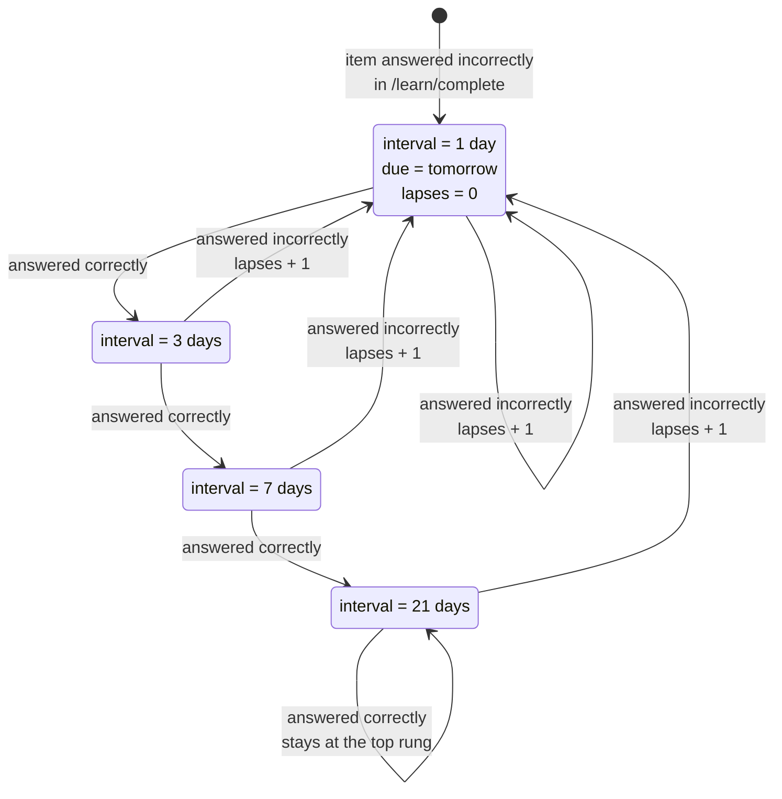
```mermaid
stateDiagram-v2
    [*] --> Queued : item answered incorrectly<br/>in /learn/complete
    Queued : interval = 1 day<br/>due = tomorrow<br/>lapses = 0
    Queued --> Rung3 : answered correctly
    Rung3 : interval = 3 days
    Rung3 --> Rung7 : answered correctly
    Rung7 : interval = 7 days
    Rung7 --> Rung21 : answered correctly
    Rung21 : interval = 21 days
    Rung21 --> Rung21 : answered correctly<br/>stays at the top rung
    Rung3 --> Queued : answered incorrectly<br/>lapses + 1
    Rung7 --> Queued : answered incorrectly<br/>lapses + 1
    Rung21 --> Queued : answered incorrectly<br/>lapses + 1
    Queued --> Queued : answered incorrectly<br/>lapses + 1
```

`[FIGURE — render from the mermaid source above and insert image]`

**Figure 19.** The spaced-repetition ladder. This is an SM-2-lite scheme: it keeps SM-2's expanding-interval principle but replaces its per-item ease factor with a fixed four-rung ladder. An `ease` column exists in the table, declared and unused, so that a full SM-2 implementation is a code change rather than a migration.

The simplification is deliberate. A full SM-2 ease factor requires a graded recall quality — the learner rating how well they remembered — which does not exist in this product: a drill item is right or wrong. With a binary signal, an ease factor has almost nothing to compute from, and a fixed ladder produces near-identical scheduling with a fraction of the state.

A second design point: re-failing an already-queued item does **not** re-seed it. The seeding routine checks for existence first and skips. Without that check, a learner who repeatedly fails the same item would have its ladder position silently reset by the seeding path as well as by the review path, and the item would never graduate past one day.

## 5.8 Design Decisions and Rationale

This section is the project's decision record. Each entry states the options that were genuinely considered, what was measured or reasoned, what was chosen, and — importantly — what was given up.

### 5.8.1 Rent the Recitation Model Rather Than Train One

**Options considered.** (A) Collect a Qur'anic recitation corpus, fine-tune a wav2vec2 model on phoneme and attribute labels, export to a mobile-friendly format, and run inference on device or on a self-hosted server. (B) Deploy a pretrained, permissively-licensed recitation model as a service and build the product around it.

**What was assessed.** Option A requires labelled data with phoneme-level and attribute-level annotation of Qur'anic recitation, which is not casually obtainable; it requires GPU training time, which the development hardware cannot provide; and it requires an evaluation methodology and a domain expert to validate the labels. Realistically this is a research project of several months on its own, and it would still, at the end, produce a model no better than the pretrained one already available under MIT licence. Option B costs an integration effort measured in days and inherits a model that already predicts both phonemes and ten letter-characteristic attributes.

**Chosen.** Option B. The repository's machine-learning directory contains no training code, no data collection, and no evaluation harness, and this absence is deliberate and documented.

**What was given up.** Control over the model. Bayaan cannot improve grading accuracy by training; it can only improve it by policy — tolerance rules, reference conventions, and verdict thresholds. It also inherits the upstream's defects, one of which (the decode crash) had to be worked around rather than fixed. And it inherits a schema dependency on a single-maintainer package, which is why every inference dependency is version-pinned with an explicit note explaining that an unpinned upgrade could silently reshape the response the parser depends on.

**Why this is the right trade for this project.** The project's thesis is that a complete recitation-coaching product can be assembled on a smartphone. It is not a thesis about model architecture. Spending the available time on model training would have produced a weaker product and a weaker demonstration of the actual claim.

### 5.8.2 Path A over Path B for Speech Grading

**The question.** Tier-1 exercises need to grade a learner saying an isolated syllable — plainly spoken, not recited, and not drawn from the Qur'an at all. Two architectures could serve this.

**Option A — Muaalem grades arbitrary text.** Extend the existing engine with an endpoint that phonetises arbitrary Uthmani text and runs the same model and the same diff functions against it.

**Option B — a second ASR deployment.** Deploy a general Arabic speech-to-text model (a Whisper-class system, possibly a Qur'an-fine-tuned variant), transcribe the learner's utterance, and compare the transcript string against the expected string.

**What was measured.** Spike S1 (§6.4) — forty-three clips, two speakers, correct and deliberately-wrong takes of syllables, minimal pairs, real words, and pause-form probes, with pass criteria fixed before the run.

**The decisive finding.** Every flagged wrong clip localised the error to the exact planted phoneme, in both speakers. A *saad* said as a *seen* produced `expected: صَ, predicted: سَ`, plus a corroborating heaviness attribute error on the following alif. A non-Arabic /g/ substituted for *qaf* was mapped to *kaf* and flagged as a *qaf* replacement — a foreign phoneme handled sanely. A deliberately short elongation produced a madd deletion at the alif position on both takes.

**Why Option B could not do this.** A transcript is a string of words. String comparison can report that a word differs; it cannot report *which phoneme within the word* differs, and it structurally cannot report an elongation duration error at all, because duration is not represented in a transcript. Roughly a third of the tajweed errors the product exists to teach are duration errors.

**Chosen.** Option A, with three conditions attached: the content pipeline must enforce the pause-form reference convention; the grading endpoint must implement the tolerance policy; and a beginner retest must be run.

**What was given up.** A general Arabic ASR capability that would have been useful for features outside the Qur'anic script — free-form spoken interaction, for instance. Also given up: a second, independent signal that could have been used to cross-check the first. And the third condition — the beginner retest — was subsequently deferred rather than met; this is stated honestly in §6.4.5 rather than quietly dropped.

### 5.8.3 No Large Language Model in This Release

**Options considered.** (A) Integrate a language model for dynamic in-lesson feedback, "explain this" help when a learner is stuck, a post-lesson coaching summary, and a natural-language placement result. This was the original plan and was specified in detail. (B) Deliver all feedback from a closed set of templated feedback keys.

**What was assessed.** Option A introduces four costs simultaneously: a per-request monetary cost that scales with usage and requires per-user caps and a kill switch to be safe; a latency cost on a path that is already waiting on GPU inference; a correctness risk, because a model generating religious-instructional text about tajweed can be confidently wrong in a domain where being wrong matters more than usual; and a non-trivial amount of prompt, caching, and safety engineering. Against those, Option B delivers specific feedback — "make the *saad* heavier", "hold the madd longer" — because the grading pipeline already identifies *exactly which* error occurred and emits a stable key for it. The specificity the language model was wanted for is already present in the phoneme diff.

**Chosen.** Option B. The decision is recorded as: no language model in this release; feedback is one hundred percent templated via `feedback_key`. The placement test remains in scope but produces a message key rather than a generated blurb. Two database columns — `coach_summary` on the attempt log and the narration hooks in the content schema — are reserved for the deferred capability so that adding it later is a code change.

**What was given up.** Open-ended "explain why this is wrong" help; adaptive encouragement tuned to a learner's history; and a generated coaching narrative that would have been a strong demonstration moment. These re-enter as the first item of post-release work, layered over the templated baseline rather than replacing it.

**Why this is the right trade.** The thesis of the project is that phoneme-level machine listening can coach recitation. A language model would have made the product feel more sophisticated without making that claim any more true, while adding an unbounded cost line and a religious-accuracy risk to a submission with a fixed deadline.

### 5.8.4 Tajweed Track Scoped to Three Modules

**Options considered.** (A) The full seven-module design: ghunnah, the *noon sakinah* and tanween family, qalqalah, the madd family, heavy-versus-light articulation, sifat mastery, and stopping rules. (B) Three modules with one lesson each.

**What was assessed.** Each Tajweed module requires curated ayat that isolate its rule, verified teaching copy, correct-and-incorrect audio contrast pairs, and — critically — confidence that the engine's signal for that rule is clean enough to grade on. That last condition is not uniformly met. The spike found the heaviness attribute to be messily signalled for *lam* specifically, and recorded an explicit instruction not to build a tier-one lesson depending on isolating it. The *noon sakinah* family is contextual: whether a *noon* is concealed, merged, or converted depends on the following letter, and the engine's per-phoneme output does not directly expose that determination.

**Chosen.** Option B: ghunnah, qalqalah, and madd. These three were chosen because each maps to a signal the pipeline demonstrably produces — two dedicated attribute heads and the structural length comparison — and each is audible and verifiable by a learner without a teacher.

**What was given up.** Coverage. Four of the seven planned modules are deferred, and the Tajweed track as shipped is a demonstration of the mechanism rather than a complete tajweed course. Adaptive lesson selection by weak-rule overlap was also dropped as unnecessary with only three fixed lessons.

### 5.8.5 Audio Sourcing Policy

**The question.** The curriculum needs three categories of audio: Qur'anic recitation, isolated non-Qur'anic teaching sounds, and tutor narration. Which of these may be synthesised?

**The rule adopted.** The dividing line is Qur'anic versus non-Qur'anic.

| Category | Source | Rationale |
|---|---|---|
| Qur'anic recitation — ayat, and any word quoted from the Qur'an | **A licensed human reciter. Never synthesised.** | Recitation is an act of worship with a transmitted oral chain. A synthesised approximation is not recitation, and presenting one as a model to imitate is both religiously improper and pedagogically wrong. See §5.11. |
| Isolated letters, vowel marks, syllables — non-Qur'anic teaching sounds | Synthesis is permitted **only** if it passes an articulation-point acceptance test; otherwise human-recorded | These are phonetic exemplars, not scripture. But a beginner imitating a blurred articulation point learns the wrong sound permanently, so synthesis must be proven adequate before it is used. |
| Tutor narration — instructional lines in the teaching segments | Synthesis | Ordinary instructional speech carrying no liturgical weight. Pre-generated at content build time and shipped as assets, so it costs nothing at runtime. |

**Table 23.** Audio sourcing policy.

**The acceptance test.** The articulation-point gate is a specific, designed battery, not a subjective impression. A native Arabic speaker judges generated clips of the six throat and pharyngeal letters, and of five emphatic-versus-light pairs — ص/س, ض/د, ط/ت, ظ/ذ/ز, ق/ك — plus the three short vowels and three elongations on a neutral letter, and the heaviness of the *lam* in the divine name. The rule is a hard one: the test passes only if **every** emphatic remains clearly distinct from its light counterpart and every throat letter is unambiguous. Any blurred emphatic, or any *ayn* or *haa* that sounds vowel-like, fails the battery and moves that entire category to human recording.

**Current status.** The synthesis provider decision is the single open content decision in the project. Until it is resolved, narration lines pack as pending and the application degrades gracefully by simply not playing them.

**What was given up.** Speed. Human recording of ninety-one clips is a scheduling dependency with a real lead time, and it is the reason the current build ships placeholder audio.

### 5.8.6 Thin Proxy Backend Rather Than Business Logic on the Device

Covered in §4.1.2. Summarised here for the decision record: the service owns exactly the things that must be trustworthy (identity, unlock state, thresholds, experience, placement) and nothing else. The cost accepted is that a learner with no connection cannot record a graded attempt at all — there is no offline grading, because the grader is a GPU model. Recognition exercises do work offline, because they are graded on device against bundled content.

### 5.8.7 Bundle All Mushaf Fonts Rather Than Fetch Them

**Options considered.** (A) Bundle all forty-eight glyph fonts — roughly 113 MB — in the application package. (B) Subset the fonts to the pages a learner actually opens. (C) Download fonts on demand and cache them.

**What was assessed.** Option C makes every first visit to a page a network fetch of about two megabytes, on a connection that in the target environment is frequently poor, for a reading experience that should feel instantaneous. Option B requires either building a subsetting pipeline or predicting reading behaviour; the fonts are also not straightforwardly subsettable, because a page font *is* a subset already — it contains exactly that page's ligatures.

**Chosen.** Option A. The application is a sideloaded academic artefact, not a store listing, so the package-size limits that would make 113 MB unacceptable do not apply.

**What was given up.** Store distribution without further work. A public release would exceed the standard package size limit and would require either an asset-delivery mechanism or on-demand fetching, which is recorded as a known pre-release task alongside the font licensing blocker.

### 5.8.8 Native Android Rather Than a Cross-Platform Runtime

Covered in full, with a costed feasibility study, in §7.3. Summarised here: a browser target was audited in detail after the system was built, costed at fifty-five to seventy hours realistically with two unbounded risks, and **rejected** for this release. The alternative adopted — screen mirroring from a physical handset — costs ten minutes of setup and provides a real microphone and real Arabic text rendering, which is what the demonstration actually needs.

## 5.9 Deployment and Infrastructure

| Component | Platform | Tier | Characteristics |
|---|---|---|---|
| Backend service | Container hosting platform | Free, Docker | Auto-deploys on push; sleeps when idle; ~30–60 s cold start |
| Database and authentication | Managed backend platform | Free | PostgreSQL with ten tables; ES256 token issuance; published key set |
| Recitation engine | Serverless GPU platform | Pay-per-second, NVIDIA L4 | Scale-to-zero, $0 idle; ~24 s cold start; ~1.7 s warm; 300 s keep-alive |
| Application | Sideloaded package | — | ~115 MB of assets; no store distribution |

**Table 24.** Deployment summary.

**Operational notes carried in the project's own documentation:**

- **Two cold starts stack.** Before any live demonstration, both the service and the inference container must be warmed — a liveness ping followed by one throwaway analysis. Otherwise the first real request approaches sixty seconds.
- **A plain engine deploy does not replace a warm container.** The keep-alive window is reset by every request, so an administrator verifying a code change must stop the application first and then deploy, or they will test the previous revision and conclude the change did not land. This is documented as the single most common operational mistake in the project.
- **One container can be pinned warm for a demonstration**, at the cost of continuous billing, and must be released afterwards.
- **The engine logs its own timing** — model load duration, audio duration, and inference duration — so a slow request can be attributed to cold start rather than computation without guessing.

## 5.10 Security and Privacy Implementation

| Control | Implementation |
|---|---|
| Authentication | Supabase-issued ES256 tokens, verified locally against the published key set with issuer and audience checks; key set cached 24 h, retrieval rate-limited |
| No shared secret | Asymmetric verification means no signing key exists in the service environment; the previously-used symmetric secret variable was removed entirely |
| Authorisation fence | One `authenticate` block in one file wraps every user-data route |
| Identity source | The verified token subject only; never a request field |
| Cross-user access | Returns 404, not 403, so record existence is not disclosed; asserted by test |
| Audio retention | None. Processed in memory, discarded at end of request, never written to disk, never logged, never persisted |
| Data minimisation | Only derived mistake and progress records persist — character ranges, rule names, scores, counts |
| Deletion | Every user-owned table cascades on user delete |
| Upload bounds | 10 MB on the analysis path, 2 MB on the lesson path, 64 characters on the arbitrary-text reference |
| Input validation at the boundary | Surah and ayah bounds checked before library lookup; asset paths rejected for absoluteness and traversal at content build time |
| Secrets handling | Environment variables only; the environment file is excluded from version control; a template with empty values is committed; a staged-diff secret grep is a documented pre-commit step |
| Session storage | Plain shared preferences with application backup disabled; the limitation and its upgrade path are documented inline |
| Server-authoritative values | Checkpoint flag, pass thresholds, experience formula, streak arithmetic, placement level, and unlock state |
| Row-level security | The migration creates tables with row-level security enabled and no policies, so the managed platform's public interface cannot read them; all access is through the service's pooled connection |

**Table 25.** Security and privacy controls.

## 5.11 Ethical and Religious-Sensitivity Considerations

A system that teaches Qur'anic recitation carries obligations that a general language-learning application does not. These were treated as design constraints, not as an afterthought.

### 5.11.1 Qur'anic Audio Must Be Human

The most consequential of these constraints is the prohibition on synthesising Qur'anic recitation, stated as requirement NFR8.04 and as the top line of the audio policy in §5.8.5.

The reasoning is threefold.

**Religiously.** Recitation of the Qur'an is an act of worship transmitted through an unbroken oral chain — *talaqqi*, reception directly from a qualified reciter, is how the recitation has been preserved for fourteen centuries. A synthesised voice is not part of that chain. Presenting a machine-generated approximation of Qur'anic recitation as a model for a learner to imitate misrepresents what recitation is, and would be understood as improper by the community the application serves.

**Pedagogically.** The model clip is what the learner imitates. Every deviation in the model is copied and reinforced. Text-to-speech systems are trained on ordinary speech and do not reliably reproduce tajweed at all: elongation durations are wrong, nasalisation is absent, echo-bounce does not occur, and heavy letters collapse toward their light counterparts. A learner who imitates such a clip learns errors that a teacher must later undo.

**Practically.** The application's entire value proposition is that it detects deviation from correct recitation. It would be incoherent for the reference the learner is asked to imitate to itself be a deviation.

**What this constrains.** It makes human recording a hard dependency on the critical path — the twenty-five Qur'anic ayah clips and the ten whole-word clips cannot be generated, only recorded. It introduces a licensing question, resolved by using an established licensed reciter recording. And it means that a shortcut that would have unblocked the content pipeline immediately was rejected on principle.

### 5.11.2 The Non-Qur'anic Boundary and Its Own Gate

Isolated letters and vowel marks are *not* Qur'anic text — `بَ` is a phonetic exemplar, not scripture — so the prohibition does not apply to them. But a second concern does: articulation points. The distinctions between ص and س, ط and ت, ض and د, ظ and ذ and ز, and ق and ك are the foundation of correct Arabic pronunciation, and a system that blurs any of them teaches a beginner a wrong sound at the exact moment they are forming the habit. This is why synthesis for this category is gated behind an explicit acceptance battery judged by a native speaker, with a hard pass rule, rather than being permitted by default.

### 5.11.3 Not Claiming to Replace a Teacher

The application is positioned as practice and correction support, not as a substitute for qualified instruction. This is not merely a disclaimer: it shapes the product. There is no certification, no *ijazah* claim, and no assertion that a passed checkpoint constitutes verified competence. The system reports what it measured.

### 5.11.4 Feedback Tone

The interface's refusal of alarm-red error highlighting, its use of a gentle shake rather than a punitive flash, and its retry verdict that absorbs grading uncertainty rather than blaming the learner are all expressions of one position: a learner correcting their recitation is engaged in an act of devotion, and the tool should be a patient teacher rather than a strict examiner. This is why the retry verdict exists at all — a system confident enough to fail a learner on a single ambiguous phoneme would be overstating its own certainty.

### 5.11.5 Voice Data

Learner audio is a biometric identifier. The system's answer is not to secure it but to not have it: audio is processed in memory and discarded, is never written to disk on the device or the service, is never logged, and is never persisted. Only derived numbers survive. This eliminates an entire category of privacy risk rather than mitigating it, and it also happens to be the cheapest possible design.

### 5.11.6 Attribution and Licensing

The upstream model, the transcript library, and the mushaf page data are all used under their stated licences, and every one is recorded with its licence in the project's documentation. The mushaf attribution file is bundled with the application and marked as not to be removed. The font licensing limitation is documented as an explicit release blocker rather than being deferred quietly — the application will not be published until permission is obtained.

---

# Chapter 6: Testing and Verification

## 6.1 Verification Strategy

Bayaan's verification strategy is shaped by an asymmetry: the parts of the system that are cheap to test automatically are not the parts that carry the most risk. Routing, persistence, and scoring arithmetic are deterministic and fully testable in process. The single riskiest component — whether a pretrained model can usefully grade a beginner's spoken syllable — is not testable by assertion at all. It required an empirical study with a corpus, a fixed pass criterion, and an honest reading of the result.

The strategy therefore has four layers:

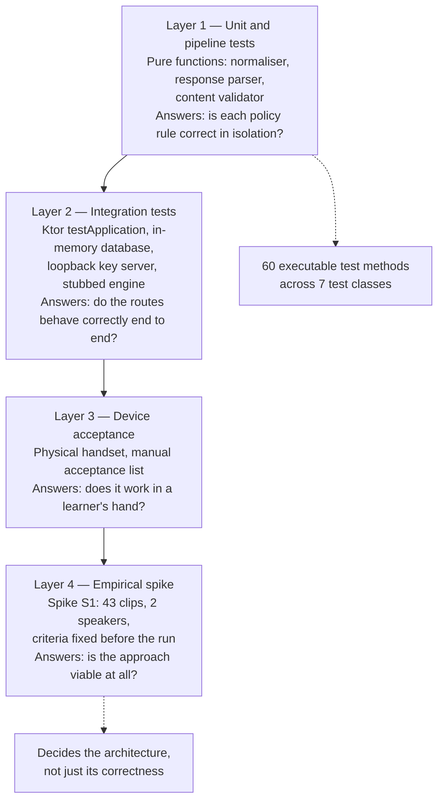
```mermaid
flowchart TD
    L4["Layer 4 — Empirical spike<br/>Spike S1: 43 clips, 2 speakers,<br/>criteria fixed before the run<br/>Answers: is the approach viable at all?"]
    L3["Layer 3 — Device acceptance<br/>Physical handset, manual acceptance list<br/>Answers: does it work in a learner's hand?"]
    L2["Layer 2 — Integration tests<br/>Ktor testApplication, in-memory database,<br/>loopback key server, stubbed engine<br/>Answers: do the routes behave correctly end to end?"]
    L1["Layer 1 — Unit and pipeline tests<br/>Pure functions: normaliser, response parser,<br/>content validator<br/>Answers: is each policy rule correct in isolation?"]

    L1 --> L2 --> L3 --> L4
    L1 -.-> N1["60 executable test methods<br/>across 7 test classes"]
    L4 -.-> N2["Decides the architecture,<br/>not just its correctness"]
```

`[FIGURE — render from the mermaid source above and insert image]`

**Figure 20.** The four-layer verification strategy. Layer 4 is unusual in that its output was an architectural decision rather than a defect list.

An explicit non-goal: there is **no automated Android test suite**. The application module declares the standard unit and instrumentation test dependencies but contains no meaningful tests. This is a real gap and is stated as such rather than glossed. Its cause is the hardware constraint — the development machine cannot run an emulator, so instrumentation tests could only run on the single physical handset, and the cost of maintaining a device-tethered suite exceeded its value within the project timeframe. Compose preview composables and manual device acceptance carried the load instead. The remedy is recorded in §7.4.

## 6.2 Backend Test Suite

The suite comprises seven test classes containing **sixty executable test methods**, plus two harness classes containing none. All counts below were obtained by counting test annotations in the source rather than estimated.

| Test class | Lines | Test methods | What it covers |
|---|---|---|---|
| `LearnRoutesTest` | 297 | 17 | The entire learn surface: unlock chain, experience arithmetic, checkpoint authority, streak day boundaries, review ladder, placement walk |
| `EngineResponseParserTest` | 192 | 12 | Engine response parsing: correctness flag defaults, field nullability, malformed-entry skipping, attribute-error parsing, backward-compatible destructuring |
| `ProgressRoutesTest` | 179 | 12 | Progress aggregation, cross-user isolation, pagination clamping, malformed-identifier handling |
| `SpeechGradeNormalizerTest` | 82 | 6 | The grading policy in isolation: edge insertions, minimal-pair mapping, major-versus-minor verdicts |
| `ServerTest` | 67 | 5 | Liveness, and that every protected route rejects an unauthenticated request |
| `AnalyzeRouteTest` | 130 | 4 | The analysis route's four failure paths |
| `SpeechGradeRouteTest` | 121 | 4 | The grading route's transport behaviour including the decode-crash path |
| `TestDatabase` (harness) | 57 | 0 | In-memory database with PostgreSQL compatibility, schema creation, per-test isolation |
| `TestJwks` (harness) | 69 | 0 | A loopback HTTP server publishing a real key set backed by a throwaway elliptic-curve key pair |
| **Total** | **1,194** | **60** | |

**Table 26.** Backend test suite, measured 2026-07-29.

### 6.2.1 `LearnRoutesTest` — 17 tests

The largest single class, and the one carrying the most product logic. Its cases:

| # | Behaviour asserted |
|---|---|
| 1 | A fresh account has exactly one lesson available — the first |
| 2 | Passing a lesson awards the base experience plus the first-try bonus and marks the lesson completed |
| 3 | Passing a lesson unlocks the next one while later lessons remain locked |
| 4 | A checkpoint uses the higher experience base regardless of what the client claims |
| 5 | A failing score still awards experience and bumps the streak but does not complete the lesson |
| 6 | An unknown lesson identifier returns 404 |
| 7 | Missed items are queued for review due tomorrow, not today |
| 8 | Re-completing a lesson the same day does not double-bump the streak |
| 9 | Completing on the day after the last completion bumps the streak by exactly one |
| 10 | A multi-day gap resets the streak to one |
| 11 | A review becomes due once its date arrives |
| 12 | A correct review answer advances the ladder to the next rung |
| 13 | A wrong review answer resets to the first rung and records a lapse |
| 14 | An unknown review identifier returns 404 |
| 15 | Three correct answers in a row raise the placement level |
| 16 | Two wrong answers in a row lower the placement level |
| 17 | The placement level is clamped to the range zero to eight |

**Table 27.** `LearnRoutesTest` cases.

Cases 8, 9, and 10 are worth singling out: streak arithmetic across a calendar boundary is exactly the kind of logic that is easy to write and easy to get wrong in three different ways, and the three cases pin down the three transitions independently.

### 6.2.2 `EngineResponseParserTest` — 12 tests

| # | Behaviour asserted |
|---|---|
| 1 | An all-correct response with an empty error array yields an empty mistake list |
| 2 | A false correctness flag is preserved |
| 3 | A missing correctness flag defaults to true |
| 4 | A missing error key yields an empty list rather than a failure |
| 5 | A single mistake with every field populated parses correctly |
| 6 | Optional fields are null when absent |
| 7 | A JSON null in the speech-error-type field is treated as absent, not as the string "null" |
| 8 | A malformed entry is skipped while valid entries in the same array are kept |
| 9 | Attribute errors parse into the attribute-mistake list |
| 10 | A missing attribute-error key yields an empty list |
| 11 | A malformed attribute entry is skipped while valid ones are kept |
| 12 | The legacy two-value destructuring still works alongside the added third field |

**Table 28.** `EngineResponseParserTest` cases.

Cases 8 and 11 encode a deliberate resilience policy: a single malformed entry in an engine response must not discard the whole analysis. Case 12 exists because the parser's return type gained a third field for attribute errors after the initial implementation, and existing call sites destructured it as a pair; the test pins the source compatibility rather than trusting it.

### 6.2.3 `ProgressRoutesTest` — 12 tests

| # | Behaviour asserted |
|---|---|
| 1 | A fresh user has zero accuracy, not a non-numeric value, with no sessions |
| 2 | Accuracy is the ratio of perfect to total sessions |
| 3 | The mistake breakdown counts only the caller's own sessions |
| 4 | Session detail for another user's session returns not-found rather than leaking |
| 5 | Session detail for one's own session returns its mistakes |
| 6 | A malformed session identifier returns 404, not a server error |
| 7 | An unknown but well-formed identifier returns 404 |
| 8 | The session list returns only the caller's own sessions |
| 9 | A limit above one hundred is clamped to one hundred |
| 10 | A limit below one is clamped to one |
| 11 | A non-numeric limit falls back to the default of twenty |
| 12 | A negative offset is clamped to zero |

**Table 29.** `ProgressRoutesTest` cases.

Cases 3, 4, and 8 are the authorisation tests. They assert cross-user isolation at the data level rather than only at the authentication level — that is, they verify that a *validly authenticated* user cannot read another user's records, which is a different property from verifying that an unauthenticated request is rejected.

### 6.2.4 `SpeechGradeNormalizerTest` — 6 tests

| # | Behaviour asserted |
|---|---|
| 1 | A clean engine payload yields a pass verdict |
| 2 | An insertion at the start of the clip is dropped, so the result passes if it was the only issue |
| 3 | An insertion at the end of the reference is dropped |
| 4 | A *saad*-to-*seen* substitution maps to the specific pair feedback key, and a single such issue yields retry |
| 5 | A length mismatch is treated as major, so a single length issue yields fail |
| 6 | Two issues yield fail |

**Table 30.** `SpeechGradeNormalizerTest` cases.

These six cases are the direct executable expression of the tolerance policy the grading spike prescribed. Cases 2 and 3 are the breath-artefact rule; case 4 is the minimal-pair vocabulary; case 5 is the major-versus-minor distinction that makes an elongation error non-forgivable while a single consonant substitution is.

### 6.2.5 `AnalyzeRouteTest` and `SpeechGradeRouteTest` — 4 tests each

| Class | # | Behaviour asserted |
|---|---|---|
| `AnalyzeRouteTest` | 1 | A non-success engine status is forwarded unchanged, body and all |
| `AnalyzeRouteTest` | 2 | An unparseable engine response yields 503 with the engine-unavailable code |
| `AnalyzeRouteTest` | 3 | An engine exception yields 503 with the engine-unavailable code |
| `AnalyzeRouteTest` | 4 | A missing audio field yields 400 with the bad-request code |
| `SpeechGradeRouteTest` | 1 | Missing audio yields 400 |
| `SpeechGradeRouteTest` | 2 | **A decode crash from the engine becomes a retry verdict with HTTP 200** |
| `SpeechGradeRouteTest` | 3 | The happy path normalises to a pass verdict |
| `SpeechGradeRouteTest` | 4 | An unreachable engine yields 503 |

**Table 31.** Route-level integration tests.

`SpeechGradeRouteTest` case 2 is the regression test for the upstream defect found in the spike. It asserts that the one observed crash mode cannot reach a learner as a server error.

### 6.2.6 `ServerTest` — 5 tests

Liveness returns success; analysis without audio is a bad request; and the progress summary, the session list, and the session detail each require authentication. The last three are the fence tests: they assert that the authentication block actually encloses the routes it appears to enclose.

### 6.2.7 The Test Harnesses

**`TestDatabase`** stands up an in-memory database in PostgreSQL compatibility mode, creates the schema from the same typed table declarations the production code uses, and isolates each test. Because the schema comes from the production declarations rather than from a hand-written fixture, a column added in production is automatically present in tests — the two cannot drift.

**`TestJwks`** is the more interesting one. It generates a throwaway elliptic-curve key pair, publishes a real key set document over a loopback HTTP server built from the standard library — adding no dependency — and signs test tokens with the private half. Because the plugin's issuer is a parameter, tests point verification at the loopback server, and the suite exercises the real signature-verification code path.

This harness exists because of a genuine defect it uncovered. When the production code migrated from symmetric to asymmetric verification, two test classes continued to self-sign symmetric tokens against a local secret. Five tests began failing with unauthorised responses regardless of the scenario they claimed to test. Replacing the mock with a real key server fixed all five and, more importantly, converted the authentication tests from tests of a mock into tests of the system.

### 6.2.8 Content Pipeline Tests

A separate test file exercises the content pipeline against a deliberately-broken copy of the content tree, using an environment variable that redirects the pipeline's content root so that the real tree is never modified. Determinism is verified by the build hash: packing unchanged content twice must produce an identical hash.

## 6.3 Content Validation Results

Running the pipeline against the current content source:

```
OK — 44 authored lesson(s), 0 stub(s), 91 asset(s) required (91 pending).
  ⚠ 91 audio asset(s) not yet recorded/generated (see docs/content/letter-audio-checklist.md)
Packed → content/dist
```

| Check | Result |
|---|---|
| Curriculum structure | Pass — no missing or duplicate identifiers, valid tracks |
| Lesson file existence | Pass — 44 of 44 referenced files present, no dangling references |
| Lesson/curriculum agreement | Pass — every identifier and checkpoint flag agrees |
| Teaching narration present | Pass — 44 of 44 authored lessons carry narration |
| Item structural validity | Pass — all 292 items |
| Item identifier prefixing and uniqueness | Pass — all 292 items |
| Grading tier / type agreement | Pass — 133 tier-0 recognition, 159 tier-1/2 spoken |
| Recognition option and answer validity | Pass |
| **Pause-form reference safety** | **Pass — all 159 spoken items** |
| Asset path safety | Pass — all 91 references |
| Asset presence | 0 of 91 present; 91 pending (warning, not error, by design) |
| Build determinism | Pass — identical hash on repeat |

**Table 32.** Content validation results, 2026-07-29.

The pause-form line is the significant one: it demonstrates that the finding from the grading spike has been enforced mechanically across the entire curriculum, not merely remembered by the author.

## 6.4 Spike S1 — Empirical Validation of Arbitrary-Text Grading

### 6.4.1 Question and Method

**Question.** Can the phonetiser and the deployed model grade **arbitrary short Uthmani text** — isolated syllables and single words — spoken plainly by a learner, rather than recited, and not drawn from the Qur'anic database? A positive answer gives the entire Arabic track phoneme-level grading with no new model training. A negative answer forces a second ASR deployment.

**Method.**

| Parameter | Value |
|---|---|
| Corpus | 43 clips |
| Speakers | 2 |
| Format | 16 kHz mono WAV, phone microphone, approximately 1–3 s each |
| Targets | Consonant-vowel-plus-elongation syllables (بَا, بِي, بُو); the four minimal pairs (ص/س, ط/ت, ح/ه, ق/ك); real words (بِسْمِ, قُلْ, ٱللَّهُ); pause-form probes (bare بَ) |
| Design | Each target recorded twice: a correct take and a deliberately-wrong take with a planted error — wrong consonant, wrong vowel, wrong length, or wrong heaviness |
| Runner | A standalone harness using the same pinned container image as production, with attribute-error extraction added |
| Pass criteria, **fixed before the run** | ≥ 80% of correct clips graded clean; ≥ 80% of wrong clips flagged; zero crashes |

**Table 33.** Spike S1 method.

Fixing the pass criteria before the run matters methodologically: it removes the possibility of adjusting the bar to the result after the fact.

### 6.4.2 Raw Results

Under strict scoring — a clip counts as clean only if the engine reported exactly zero errors of any kind:

| Metric | Speaker A | Speaker B |
|---|---|---|
| Correct clips graded clean | 6 / 13 | 3 / 12 |
| Wrong clips flagged | **8 / 8** | **8 / 9** |
| Crashes | 0 | 1 |

**Table 34.** Spike S1 raw results under strict scoring.

**On the stated criteria, the strict run fails.** The wrong-clip detection criterion is comfortably met at sixteen of seventeen. The correct-clip criterion is not: forty-six percent and twenty-five percent are far below the eighty percent bar.

The decision therefore turned on *why* the correct clips were flagged.

### 6.4.3 The Decisive Finding — Errors Are Localised

Every flagged wrong clip localised the planted error to the exact phoneme, in both speakers:

- **ص → س.** Reported as `expected: صَ, predicted: سَ`, with a corroborating heaviness attribute error on the following alif. The same pattern held for ط→ت, ح→ه, and ق→ك.
- **A non-Arabic /g/ substituted for قُلْ.** The model mapped the foreign phoneme to *kaf* and flagged the *qaf* replacement — a phoneme outside the language's inventory handled sanely rather than producing garbage.
- **Wrong vowel** (*basmi* or *basmu* for بِسْمِ). Reported as an exact diacritic replacement at the correct position.
- **Wrong length** (a short بَا). Reported as an elongation deletion or replacement at the alif position, on both takes.
- **The single miss** was speaker B's "short bii", predicted as full-length. The take itself may not actually have been short; this was not verified by ear.

This is the capability the alternative architecture structurally cannot provide. A transcript-comparison approach can report that a word was wrong; it cannot report *which phoneme* and it cannot report elongation duration at all. And, critically, this localisation worked on **plainly-spoken, non-recited audio** — which is exactly the domain the Arabic track needs.

### 6.4.4 False-Positive Taxonomy — All Three Causes Are Non-Model

Every correct clip that was flagged fell into one of three categories, and none of them is a model accuracy failure:

**Cause 1 — Reference convention mismatch (pause rules).** The phonetiser applies stop rules to word-final position: the final short vowel is dropped and a qalqalah bounce is added on a qalqalah letter. A human then pronounces the final vowel, so `bismi` is reported as an inserted final diacritic — three takes across both speakers. Or the human omits the bounce that the reference expects, so the bare بَ probe is flagged on all four of its takes. **The fix is a content rule** (§5.6.3), enforced by the build pipeline: reference text must be elongation-final or sukoon-final, never a bare short vowel.

**Cause 2 — Edge insertions from breath and noise.** Leading *ayn* or *qaf*, and trailing *ha* or a long vowel, transcribed from the speaker's breath at the clip boundaries — six or more rows across the corpus. **The fix is a grading-policy rule** (§5.5.2): drop insertion-type errors positioned at the clip start or end, and trim clips client-side.

**Cause 3 — Possibly-real catches mislabelled "correct".** One "bii" take that may genuinely have been short, given that its twin take passed cleanly; speaker B's "qul" with a fatha-quality vowel; and one poor "buu" clip in which the model heard entirely different letters. These require ear verification, and some are likely the engine being *right* about an imperfect take that was labelled correct by assumption rather than by listening.

**Attribute-head behaviour.** The attribute heads were quiet on correct clips — mostly zero errors — so attribute noise is not a blocker. One exception was recorded: the heaviness of the *lam* in the divine name was flagged both times, but messily, through phoneme and breath deltas rather than a clean heaviness error on the *lam* itself. The spike's recorded instruction was explicit: **do not build a lesson that depends on cleanly isolating lam heaviness at tier one.** That instruction is honoured by the normaliser's flag-only mapping (§5.5.4).

### 6.4.5 The Crash and Its Handling

One clip in forty-three crashed inference with a negative-dimension tensor error inside the upstream greedy decoder — a defect in the upstream library triggered by certain short inputs.

Three responses were taken. The engine catches that specific exception type separately and returns a structured decode-failure body rather than an unhandled server error. The service recognises that body and converts it into a retry verdict with a zero score, never a 500. And a regression test asserts that behaviour (`SpeechGradeRouteTest` case 2). Reporting the defect upstream with the triggering clip remains an open item.

### 6.4.6 Decision and Its Honest Caveat

**Decision: Path A.** The recitation engine grades tier-one echo exercises. Three conditions were attached:

1. The content pipeline must author spoken reference text under the pause-form convention. **Met** — enforced mechanically, verified across all 159 spoken items (§6.3).
2. The grading endpoint must implement the tolerance policy: drop edge insertions, map a single minor error to retry, wrap the decode crash. **Met** — implemented in the normaliser and covered by six unit tests and one route test.
3. A genuine non-native beginner retest must be run. **Not met — deferred.**

With conditions 1 and 2 applied retroactively to the spike data, the correct-clip clean rate rises to approximately ten or eleven of thirteen for speaker A and approximately eight to ten of twelve for speaker B — above the eighty percent bar — while wrong-clip detection remains at sixteen of seventeen with exact localisation.

**The caveat, stated plainly.** Both spike speakers were confirmed to be **native Arabic speakers**. The value of this grading approach is precisely that it grades a *learner's* imperfect speech, and native-only data does not demonstrate that. A fourteen-clip beginner retest was fully specified — speaker criteria, exact filenames, target list, recording instructions, runner command, and scoring criteria — and it was subsequently **deferred to post-release by owner decision** rather than executed before this submission.

The consequence must be stated without softening: **the spike proves the mechanism, not the beginner-audio domain.** The tolerance thresholds in the normaliser are tuned against native-speaker data, and they may need widening once real beginner audio exists. It is possible that a genuine beginner's accented-but-honest attempt is flagged more often than a native speaker's, and the current policy would then be over-punishing exactly the user the product is for. No claim of accuracy on beginner audio is made anywhere in this report, and none should be inferred from the numbers above.

## 6.5 Device Verification

Manual acceptance was performed on the physical handset, since no emulator was available.

| Area | Verification | Result |
|---|---|---|
| Build and install | Debug package built and installed over the debug bridge | Pass |
| Launch | Application launches to the splash screen without a crash | Pass |
| Session restore | An existing session is restored; no credential prompt on relaunch | Pass |
| Sign-in | Sign-in and sign-up flows complete; provider errors display as short messages | Pass |
| Navigation | Four-tab bottom bar; the bar hides on the mushaf page, the recitation screen, and the lesson player | Pass |
| Curriculum load | The learning path renders from bundled assets on the Learn tab | Pass |
| Lesson player | All six exercise types render and are answerable | Pass, with placeholder audio |
| Mushaf | Pages render page-faithfully; right-to-left paging behaves as a physical mushaf | Pass |
| Word selection | Tapping a word highlights the whole ayah and opens the action sheet | Pass |
| Recording | Microphone permission flow; recording starts immediately; elapsed timer runs | Pass |
| Analysis round trip | Upload, wait, and character-range highlighting on the returned reference text | Pass |
| Cold-start behaviour | A first request after idle takes up to approximately sixty seconds and is represented as a progress state, not an error | Pass, as designed |
| Automated UI tests | — | **Absent — see §6.1** |

**Table 35.** Device verification on a Xiaomi Redmi Note 10 Pro.

## 6.6 Requirements Traceability

| Requirement group | Verified by |
|---|---|
| R0.01–R0.15 (system-wide) | `ServerTest` (fence and liveness), `ProgressRoutesTest` (cross-user isolation, error envelope), `AnalyzeRouteTest` (engine pass-through), code inspection (audio non-retention, lazy pool) |
| R1.01–R1.10 (account, session, navigation) | Device verification |
| R1.11–R1.27 (mushaf, recording, analysis, feedback) | Device verification, `AnalyzeRouteTest`, `EngineResponseParserTest` |
| R1.28–R1.29, R1.54 (path, header, unlock) | `LearnRoutesTest` cases 1, 3 |
| R1.30–R1.44 (lesson player, exercises, spoken grading) | Device verification, `SpeechGradeRouteTest`, `SpeechGradeNormalizerTest` |
| R1.45–R1.49 (completion, experience, streak, review seeding) | `LearnRoutesTest` cases 2, 4, 5, 7, 8, 9, 10 |
| R1.50–R1.51 (reviews and the ladder) | `LearnRoutesTest` cases 11, 12, 13, 14 |
| R1.52–R1.53 (placement) | `LearnRoutesTest` cases 15, 16, 17 |
| R1.55–R1.57 (progress and history) | `ProgressRoutesTest` cases 1–12 |
| R1.58–R1.60 (feedback and error handling) | Device verification |
| R2.01–R2.24 (content authoring) | Content pipeline execution and its dedicated test file (§6.3) |
| R3.01–R3.13 (operations) | Deployment execution, engine boundary validation, code inspection |
| NFR1 (performance) | Engine self-reported timings, device observation, code inspection of the off-main-thread font path |
| NFR2 (scalability) | Code inspection: bounded pool, pagination clamps, static curriculum, scale-to-zero configuration |
| NFR3 (reliability) | `AnalyzeRouteTest` 1–4, `SpeechGradeRouteTest` 2 and 4, `EngineResponseParserTest` 8 and 11 |
| NFR4 (security) | `ServerTest` 3–5, `ProgressRoutesTest` 3, 4, 8, `TestJwks` harness, code inspection |
| NFR5 (usability) | Device verification, design-token inspection |
| NFR6 (compatibility) | Build configuration inspection, successful device install |
| NFR7 (maintainability) | Code inspection: injected adapters, pure normaliser, sealed result types, inline limitation notes |
| NFR8 (legal and compliance) | Documentation review, licence audit, audio-policy decision record |

**Table 36.** Requirements traceability matrix.

## 6.7 Known Defects and Open Risks

Stated openly rather than omitted.

| # | Issue | Severity | Status |
|---|---|---|---|
| 1 | The grading policy is tuned on native-speaker data; beginner fairness is unproven | **High** | Retest fully specified, deferred to post-release |
| 2 | Ninety-one pedagogical audio clips are unrecorded; the current build plays placeholders | **High** | Recording specification complete; session outstanding |
| 3 | The content bundle in the Android assets directory is stale relative to the content source (25 authored / 19 stubs versus 44 / 0) | **High** | One-command re-pack and copy before the submission build |
| 4 | The synthesis provider for tutor narration is undecided | Medium | The only open content decision; acceptance battery designed |
| 5 | No automated Android test suite exists | Medium | Accepted for this release; remedy in §7.4 |
| 6 | An upstream decode crash occurs on some short clips (1 in 43 observed) | Medium | Handled as a retry verdict, regression-tested; upstream report outstanding |
| 7 | The ten-megabyte upload cap is applied after buffering rather than during streaming | Low | Documented inline with its upgrade path; acceptable while the application is the only client |
| 8 | Two exercise composables are unreachable dead code | Low | Documented in §5.2.1; removal is trivial |
| 9 | The surah listing endpoint is hardcoded to two surahs | Low | Superseded by the mushaf browser; unused by the current client |
| 10 | The migration cannot reconcile a pre-existing table with a divergent shape | Low | Documented in UC24 exception E02; verification is manual |
| 11 | The streak boundary is UTC rather than per-user local time | Low | Documented inline with rationale; cosmetic |
| 12 | Session tokens are stored in unencrypted preferences with application backup disabled | Low | Documented inline with upgrade path |

**Table 37.** Known defects and open risks.

---

# Chapter 7: Conclusion and Future Work

## 7.1 Summary of Achievement

Bayaan set out to answer a specific question: can a commodity smartphone deliver the correction loop that Qur'anic recitation has historically required a qualified teacher to provide? The system built answers it affirmatively, with qualifications that this report has been careful to state.

**What was delivered against the objectives of §1.3:**

| # | Objective | Outcome |
|---|---|---|
| 1 | End-to-end recitation loop on a physical device | **Delivered.** Microphone → in-memory WAV → authenticated upload → GPU inference → positional highlights, verified on hardware |
| 2 | Page-faithful mushaf | **Delivered.** All 604 pages via 48 per-page glyph fonts, right-to-left paging, word-level ayah selection |
| 3 | Character-level positional feedback | **Delivered.** Three distinct error families rendered as character-range spans on the engine's own reference string |
| 4 | Phoneme-level grading of arbitrary short text | **Delivered.** The `/grade-text` endpoint and its normaliser — the project's novel technical contribution |
| 5 | Complete validated beginner curriculum | **Delivered.** 44 lessons, 292 items, 0 stubs, machine-validated including the pause-form rule |
| 6 | Retention mechanics | **Delivered.** Experience, UTC streaks, a four-rung review ladder, server-derived unlocking, placement |
| 7 | Near-zero idle cost | **Delivered.** Scale-to-zero inference and free-tier hosting; the cost is a documented cold start |
| 8 | Independently verifiable layers | **Partially delivered.** 60 backend tests and a gating content pipeline; **no automated Android suite** |
| 9 | Recorded decision rationale | **Delivered.** Eight decisions in §5.8 with alternatives and costs, plus a costed rejection in §7.3 |

**Table 38.** Objectives against outcomes.

### 7.1.1 The Technical Contribution

The project's genuinely novel piece is small and specific, and it is worth naming precisely rather than overstating.

The pretrained engine, as published, grades a recitation of a **known ayah**: it looks the ayah up in a Qur'anic database, phonetises the canonical text, and diffs the learner's audio against it. That is sufficient for a recitation checker and insufficient for a teaching application, because a beginner's first thousand exercises are not ayat — they are syllables.

The `/grade-text` endpoint takes the same phonetiser, the same model, and the same two explanation functions, and points them at **arbitrary Uthmani text**. `بَا` is not in any Qur'anic database, but it phonetises perfectly well, and the model produces the same phoneme diff and the same ten attribute heads against it. One endpoint, roughly fifty lines, and the entire Arabic learning track gains phoneme-level grading with zero new model training.

Two things had to be added around it before it was usable as a product:

- **A reference convention.** The phonetiser applies pause rules word-finally, so naively-authored reference text systematically false-flags correct learners. The fix lives in the content pipeline as a mechanically-enforced authoring rule, not in the model.
- **A tolerance policy.** Breath at clip boundaries is transcribed as inserted phonemes; a single ambiguous phoneme should not fail a learner; a known upstream decoder defect must not become a server error. All three are handled in a pure, unit-tested normaliser that converts a research model's raw diff into a three-valued product contract.

The general lesson is that the distance between a capable research model and a usable product was not model quality. It was reference convention, error tolerance, and failure handling.

### 7.1.2 The Engineering Contribution

Beyond the endpoint, three engineering positions shaped the system and are the parts most transferable to other work:

**Rent the intelligence; own the loop.** The repository contains no training code, deliberately. The time this freed went into the curriculum, the content pipeline, the grading policy, and the interface — which is where the product's value actually is.

**Push authority to exactly one place per concern.** Unlock state, thresholds, experience, streaks, and placement are server-computed because they must be trustworthy. Animation, sequencing, and retry budgets are client-side because they need not be. Content is a static asset because it must change without a deployment. There is no concern with two owners.

**Write down decisions, including refusals.** Four capabilities were deliberately excluded — a language model, four Tajweed modules, adaptive lesson selection, and a browser target — each with its options, its reasoning, and what was given up. A costed, evidence-based refusal is a design output, not a gap.

## 7.2 Limitations

These are stated as they are, without mitigation language.

### 7.2.1 The Grading Policy Is Unvalidated on Beginner Audio

The single most important limitation. The tolerance thresholds in the normaliser — the edge-insertion rule, the single-minor-to-retry rule, the major classification of length errors, the 0.80 and 0.85 pass thresholds — were tuned against a corpus of two **native Arabic speakers**. The product's entire purpose is grading non-native beginners.

The mechanism is proven: planted errors are detected and localised to the exact phoneme with high reliability, and the three false-positive causes were all identified as non-model and all addressed. What is *not* proven is that an honest, accented, hesitant beginner attempt passes as often as it should. It is entirely possible that the current thresholds over-punish exactly the learner the system is for.

A fourteen-clip beginner retest is fully specified — speaker selection criteria, exact filenames, per-clip targets, recording instructions, the runner command, and the scoring criteria — and it was deferred rather than run. It should be executed before any real learner uses the system.

### 7.2.2 Pedagogical Audio Is Not Recorded

Ninety-one distinct clips are required: fifty-six letter and syllable clips, twenty-five Qur'anic ayah clips, and ten whole-word clips. None are final recordings. The build currently bundles a subset of placeholder tones.

This is not a design gap — the recording specification is complete down to sample rate, peak level, duration, naming convention, and the exact machine-generated file list — but it is a real gap in the deliverable. A learner using the current build hears placeholders where they should hear a qari, which materially degrades the pedagogy of every recognition exercise.

The Qur'anic subset of these clips cannot be worked around by synthesis, for the reasons given in §5.11.1. That constraint is accepted rather than negotiated.

### 7.2.3 Font Licensing Blocks Public Release

The page-faithful mushaf depends on the KFGQPC QCF v4 fonts. The page data is openly licensed; the font binaries are not. The application is usable as an academic and demonstration artefact under attribution, and it cannot be published publicly until written permission is obtained. The attribution file is bundled and marked as not to be removed.

A secondary consequence: at roughly 113 MB, the bundled fonts alone exceed the standard package size limit for store distribution, so a public release would additionally require an asset-delivery mechanism.

### 7.2.4 Free-Tier Cold Starts

Two independent cold starts can stack. The service sleeps when idle and takes roughly thirty to sixty seconds to wake; the inference container scales to zero and takes roughly twenty-four seconds to load the model. A first request after both have been idle can approach sixty seconds. The system is built to survive this — both timeouts are set to sixty seconds and the interface treats the wait as an honest expected state — but it is a poor first impression and it is the direct cost of the zero-idle-cost decision.

### 7.2.5 Android Only

No iOS build, no browser build, no shared cross-platform module. The browser target was audited and rejected with a documented cost (§7.3). iOS was never in scope.

### 7.2.6 No Large-Scale User Testing

Verification was performed on one physical handset by the developer, with one additional speaker contributing to the evaluation corpus. There is no cohort study, no retention data, no comparison against a control, and no evidence that the curriculum's pedagogical sequence is effective for real beginners. Every claim in this report is limited to what was measured, and no claim of learning efficacy is made.

### 7.2.7 No Automated Client Test Suite

The backend has sixty tests; the application has none of substance. The cause was hardware — no emulator was available on the development machine, so an instrumentation suite would have been tethered to a single physical device. Compose previews and manual acceptance carried the load. This is a genuine gap, and the highest-value remedy is a set of pure unit tests over the grading-verdict interpretation and the drill state machine, neither of which requires a device.

### 7.2.8 Curriculum Breadth in the Tajweed Track

Three modules of a planned seven. The three shipped were chosen because the engine's signal for each is demonstrably clean; four were deferred partly for effort and partly because their signal is not.

## 7.3 Feasibility Study — Compose Multiplatform Browser Target

This section documents a feasibility study whose conclusion was **do not build it.** It is included because a costed, evidence-based rejection is an engineering result.

### 7.3.1 The Question

The development laptop cannot run an Android emulator. The immediate practical question was whether the application could be made to run in a browser at a mobile viewport — the equivalent of a one-command web run in other cross-platform toolkits — so that iteration would not require a device install cycle. The strategic question underneath it was whether a browser build should be a deliverable at all.

### 7.3.2 The Blocking Fact

The application is **plain Android using the platform's own Compose libraries**, not Compose Multiplatform. `settings.gradle.kts` includes exactly one module. Compose Multiplatform does have a browser target that renders through a canvas backend, but this project would have to be *migrated into* that framework first. There is no configuration flag; it is a port.

### 7.3.3 Measured Migration Surface

Every figure below was measured against the working tree on the audit date, not estimated.

| Surface | Measurement | Migration consequence |
|---|---|---|
| Total Kotlin | 48 files, 7,241 lines | — |
| Android-coupled code | ~2,300 lines (~32%) | Must be rewritten or abstracted behind expect/actual declarations |
| Portable Compose code | ~4,900 lines (~68%) | Ports largely unchanged |
| JSON parsing | **66 call sites across 6 files** using the platform JSON library | The platform library does not exist off Android; all 66 must become serialisation-library calls |
| Bundled assets | 115 MB, of which **93 MB is 48 glyph fonts** | Cannot ship in a browser bundle |
| Mushaf font loading | One ~2 MB font loaded synchronously per page on swipe | Becomes a per-page network fetch; requires a rewrite, not a port |
| Platform view models | 3 `AndroidViewModel` instances | Must become platform-neutral |
| Platform context | 17 context references | Each requires a platform abstraction |
| Preference storage | Two shared-preference files | Must become a browser storage abstraction |
| Audio playback | Platform media player and sound pool | Must become browser audio |
| Date and time | Platform date library | Must become the multiplatform date library |
| Logging | Platform logger | Must be abstracted |
| **Microphone capture** | Raw PCM capture → multipart upload | **Browser requires a from-scratch audio worklet, resampling to 16 kHz, and float-to-16-bit conversion. Estimated 8–16 hours, and it is the core demonstration loop.** |
| Navigation | `navigation-compose 2.8.0-beta01`, Android-only | Requires swapping to the multiplatform artefact |
| HTTP client | Ktor CIO engine | Must become the browser engine, **plus cross-origin configuration on the deployed service including multipart preflight** |

**Table 39.** Measured migration surface for a browser target, audited 2026-07-28.

### 7.3.4 Two Unbounded Risks

Beyond the measurable work sit two items whose cost could not be bounded in advance:

**Risk 1 — The authentication SDK on the browser target.** The Supabase Kotlin SDK version in use supports JavaScript targets; its support for the newer WebAssembly target is thinner. If it does not work, the fallback is hand-rolling the authentication REST client — session handling, token refresh, and error mapping — which is an unbounded addition.

**Risk 2 — Arabic rendering on the canvas backend.** The browser target renders through a canvas, not through the document object model. Complex right-to-left text with custom Private Use Area glyph fonts and stacked diacritics is that renderer's weakest area. There is no way to establish whether it renders correctly except to build enough of it to look at the result. If it renders incorrectly, the mushaf — the application's most distinctive feature — does not work, and there is no incremental fix.

### 7.3.5 Cost and Verdict

| Scenario | Estimate |
|---|---|
| Best case, both risks clear immediately | 40 hours |
| **Realistic** | **55–70 hours (7–9 solo working days)** |
| Either risk materialises | 90+ hours |
| Ongoing tax thereafter | Two build targets and a second render path to validate for every future feature |

**Table 40.** Browser-target cost estimate.

**Verdict: rejected for this release.** The reasoning is proportionality. The problem being solved was *iteration convenience on constrained hardware*. Spending seven to nine working days of a project with a fixed submission deadline — with a live risk of the mushaf not rendering at all — to solve an iteration-convenience problem is a poor trade. The migration also has no user-facing value in this release, because the deliverable is an Android application.

### 7.3.6 What Was Adopted Instead

| Alternative | Setup | Real microphone | Real Arabic rendering |
|---|---|---|---|
| **Screen mirroring from the physical handset** (adopted) | ~10 minutes | Yes | Yes |
| Cloud device emulation of the installed package | ~15 minutes | Limited | Yes |
| Compose preview composables for layout iteration | Zero | Not applicable | Yes |

**Table 41.** Adopted alternatives to a browser target.

Screen mirroring solves the actual problem — seeing the application on a desktop screen while iterating — at roughly one four-hundredth of the cost, and preserves both a real microphone and real text rendering, neither of which a browser port would have guaranteed.

### 7.3.7 A Bounded Middle Path, If Revisited

If a browser build is ever wanted for its own sake rather than for iteration, the study identified a bounded option: a **preview shell** of approximately twelve to sixteen hours that builds only the pure-Compose surfaces — theme, components, exercise screens, and the tab screens — while stubbing the microphone, the mushaf fonts, and authentication. This skips the entire risk surface: no audio worklet, no canvas Arabic with custom fonts, no authentication SDK question. It would give a browser-based layout iteration loop with no production commitment. It has not been scheduled.

## 7.4 Future Work

| Priority | Item | Effort | Rationale |
|---|---|---|---|
| **P0** | Re-pack the content bundle and copy it into the application assets | Under 1 hour | The bundled pack is stale at 25 authored / 19 stubs against a source of 44 / 0. A one-command fix that must precede the submission build. |
| **P0** | Record the 91 pedagogical audio clips with a qari | ~1 week including scheduling | The largest remaining gap in the deliverable. Specification, naming, and file list are complete. |
| **P0** | Run the beginner retest and re-tune the tolerance thresholds | ~2 days | The one unproven load-bearing assumption. Fully specified and ready to run. |
| **P1** | Decide the synthesis provider and run the articulation acceptance battery | ~2 days | The only open content decision; gates all narration audio. |
| **P1** | Add a client unit-test suite for verdict interpretation and the drill state machine | ~3 days | Closes the largest verification gap; needs no device. |
| **P1** | Report the upstream decoder defect with the reproducing clip | ~2 hours | Owed to the upstream maintainers; the workaround is already in place. |
| **P2** | Author the four deferred Tajweed modules | ~1 week each | Extends the Tajweed track from a demonstration to a course. The pipeline already supports it. |
| **P2** | Layer a language-model tutor over the templated baseline | ~1 week | Adds stuck-help and coaching narrative. Requires per-user caps, a kill switch, and cost monitoring first. |
| **P2** | Remove the two unreachable exercise composables and the hardcoded surah endpoint | ~1 hour | Dead-code hygiene. |
| **P2** | Convert the upload size cap to a streaming limit | ~4 hours | Closes the documented buffering ceiling before any second client exists. |
| **P3** | Obtain font licensing permission; add asset delivery | Externally gated | The release blocker for any public distribution. |
| **P3** | Production hardening: paid tiers, observability, rate limiting, cost caps, privacy policy, account deletion | ~2 weeks | Explicitly out of scope for this release; the list is enumerated. |
| **P3** | A small cohort study of real beginners | ~1 month | The only way to substantiate a claim of pedagogical efficacy, which this report deliberately does not make. |
| **P3** | Interface localisation to Arabic | ~1 week | Currently English instructional copy with Arabic content. |
| **P4** | Browser preview shell, if wanted for its own sake | ~12–16 hours | The bounded middle path from §7.3.7. |
| **P4** | iOS | ~2 months | Not scoped; would require the multiplatform migration the browser study costed. |

**Table 42.** Prioritised future work.

## 7.5 Concluding Remarks

Bayaan is a working system, not a prototype narrative. A learner can open it on a phone, see the Qur'an rendered exactly as it is printed, tap an ayah, recite it, and watch the letters they mispronounced light up with the rule they broke. Or they can start from not knowing a single letter and work through forty-four lessons to reciting Al-Fatihah, with a machine listening to every syllable along the way and telling them, specifically, when the *saad* came out as a *seen* or the elongation was cut short.

The system was built by assembling rather than inventing: an MIT-licensed model does the listening, a managed platform does the authentication, a serverless GPU does the computation, and open page data does the typography. What the project contributes is the part in between — an endpoint that lets a recitation grader grade a syllable, a reference convention that stops a correct learner being marked wrong, a tolerance policy grounded in measured error modes rather than intuition, and a curriculum validated by a build script that refuses to produce a bundle when a single lesson is malformed.

It is also, deliberately, a system with things it does not do. There is no language model, no adaptive lesson selection, no browser build, and four Tajweed modules that were designed and then not built. Each of those is an entry in a decision record with its alternatives, its cost, and what was given up. The browser target in particular was audited to a measured cost of fifty-five to seventy hours against two unbounded risks and then refused — which is, in a project with a fixed deadline, exactly as much of an engineering output as a feature would have been.

The honest state of the deliverable is this. The mechanism works and is demonstrated end to end on real hardware. The curriculum is complete and machine-validated. The service is tested at sixty assertions across its whole surface. And two things stand between the current build and a system a real beginner should use: ninety-one audio clips that need a human reciter in a quiet room, and one fourteen-clip retest that would tell us whether the grader is as fair to a hesitant beginner as it is to a native speaker. Both are fully specified, and both are known. Stating that plainly seemed more useful than a conclusion that did not.

---

# References

1. `quran-muaalem` — AI recitation analysis model for the Holy Qur'an, wav2vec2 with multi-level CTC heads. GitHub: https://github.com/obadx/quran-muaalem (MIT Licence). Version 0.1.0 pinned.
2. `quran-transcript` — Qur'anic text retrieval, phonetisation, and tajweed rule extraction. GitHub: https://github.com/obadx/quran-transcript (MIT Licence). Version 0.5.2 pinned.
3. Muaalem pretrained model weights, HuggingFace: `obadx/muaalem-model-v3_2`.
4. Muaalem annotated recitation dataset, HuggingFace: `obadx/muaalem-annotated-v3`.
5. QCF v4 mushaf page data — per-page glyph mappings for the Madani mushaf. GitHub: https://github.com/quran/quran-qcf4. MIT Licence covers the **data**; the glyph fonts are owned by the King Fahd Glorious Qur'an Printing Complex (KFGQPC) and are used here under academic non-commercial scope pending written permission.
6. Baevski, A., Zhou, H., Mohamed, A., and Auli, M. (2020). *wav2vec 2.0: A Framework for Self-Supervised Learning of Speech Representations.* Advances in Neural Information Processing Systems 33. — The architecture underlying the recitation model.
7. Graves, A., Fernández, S., Gomez, F., and Schmidhuber, J. (2006). *Connectionist Temporal Classification: Labelling Unsegmented Sequence Data with Recurrent Neural Networks.* Proceedings of the 23rd International Conference on Machine Learning. — The sequence-labelling formulation used by the model's phoneme and attribute heads.
8. Wozniak, P. A., and Gorzelanczyk, E. J. (1994). *Optimization of repetition spacing in the practice of learning.* Acta Neurobiologiae Experimentalis, 54(1). — The SM-2 spaced-repetition algorithm the review ladder simplifies.
9. Jetpack Compose documentation. Android Developers: https://developer.android.com/jetpack/compose
10. Material Design 3 specification: https://m3.material.io
11. Ktor framework documentation: https://ktor.io/docs
12. Exposed — Kotlin SQL framework. GitHub: https://github.com/JetBrains/Exposed
13. HikariCP — JDBC connection pool. GitHub: https://github.com/brettwooldridge/HikariCP
14. Supabase authentication and JSON Web Tokens: https://supabase.com/docs/guides/auth/jwts
15. Jones, M., Bradley, J., and Sakimura, N. (2015). *RFC 7519 — JSON Web Token (JWT).* Internet Engineering Task Force.
16. Jones, M. (2015). *RFC 7517 — JSON Web Key (JWK).* Internet Engineering Task Force. — The key-set format used for local signature verification.
17. Modal — serverless GPU compute platform: https://modal.com/docs
18. Render — container hosting platform: https://render.com/docs
19. FastAPI documentation: https://fastapi.tiangolo.com
20. `librosa` — audio and music signal analysis in Python: https://librosa.org
21. `python-docx` — document generation library used by this report's build script: https://python-docx.readthedocs.io
22. Mermaid — diagram and charting syntax used for every figure in this report: https://mermaid.js.org
23. Amiri Quran typeface: https://www.amirifont.org
24. Tarteel — AI Qur'an companion with recitation mistake detection: https://tarteel.ai (reviewed as related work).
25. Quranic — Arabic learning application with recognition exercises: https://getquranic.com (reviewed as related work).
26. Pingo AI — conversational language tutor: https://pingo.ai (reviewed as a product model for the tutor loop).
27. Ibn al-Jazari, M. (15th c. CE). *Al-Muqaddimah al-Jazariyyah.* — The classical versified primer on tajweed; the source of the rule taxonomy (makharij, sifat, madd, ghunnah, qalqalah) the application's curriculum and error vocabulary follow.
28. Bayaan project documentation, internal, this repository: `docs/CODEBASE_MAP.md`, `docs/api-spec.md`, `docs/tajweed-rules.md`, `docs/decisions/grading-tiers.md`, `docs/specs/m1-content-pipeline.md`, `docs/content/letter-audio-checklist.md`, `AGENTS.md`.
