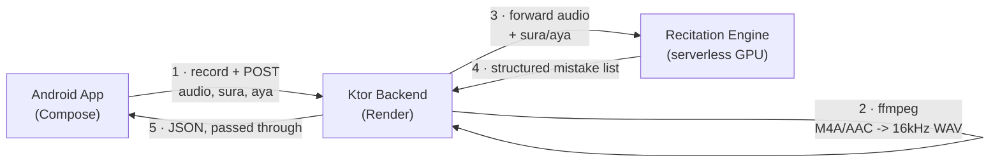

# Architecture

Current state of the system as built, not as originally planned. This replaces an earlier draft that described a Whisper → ML classifier → LLM → TTS pipeline with Supabase auth and a Postgres database — none of that was built. What exists today is a much smaller working loop.

## System overview

Two services: an Android app and a Ktor backend. The backend is a thin proxy in front of a third-party recitation-analysis model — Bayaan doesn't train or host its own model; it sends audio to an existing pretrained engine and relays the structured result back to the app.

There is no database, no auth, and no user accounts. Every recitation attempt is stateless — nothing is persisted server-side.

## Data flow: one recitation attempt

1. **Pick a verse.** The app's verse picker lists Al-Fatihah and Al-Bayyinah (the only two surahs with hardcoded Uthmani text in the app right now).
2. **Record.** Tapping record starts `MediaRecorder` capturing M4A/AAC. Tapping stop ends it.
3. **Upload.** The app POSTs a multipart request to `{BACKEND_URL}/audio/analyze` with the audio file plus `sura`/`aya` form fields.
4. **Convert.** The backend shells out to `ffmpeg` to convert whatever format the phone sent into 16kHz mono WAV, which is what the recitation engine expects.
5. **Analyze.** The backend forwards the WAV plus `sura`/`aya` (as query params) to the recitation engine, a pretrained model running on a serverless GPU. The backend does not interpret the result — it pipes the engine's JSON body and status code straight back to the app.
6. **Render.** The app parses two result arrays from the response. `errors` maps to character-range highlights on the verse with Arabic/English rule names and length comparisons. `sifat_errors` maps to a separate "Letter Characteristics" section listing per-phoneme attribute mistakes (Qalqalah, Ghunnah, Tafkheem, etc.) detected directly from audio by Muaalem's attribute heads.
7. **Retry or continue.** The user can try the same ayah again or move to the next one.

## Why an external engine instead of training one

Training a Tajweed classifier from scratch (the original plan: wav2vec2 fine-tuning on a small labeled dataset) was dropped in favor of an existing, more capable, MIT-licensed recitation-analysis model. It already detects pronunciation and Tajweed mistakes with enough accuracy for the demo loop, which let the project's own work focus on the app and the integration around it rather than on training and evaluating a classifier. The tradeoff: the engine is a third-party dependency, runs on a scale-to-zero serverless GPU, and the first request after idle has a multi-second cold start. The app's UI accounts for this with an explicit "uploading / analyzing" state rather than expecting an instant response.

## Module responsibilities

### `/android`

Jetpack Compose, single Gradle module (`app/`), Kotlin. No KMP, no shared module — that was planned, never built.

| Component | What it does |
|---|---|
| `VersePickerScreen` | Lists the two demo surahs and their ayat |
| `RecitationScreen` + `RecitationViewModel` | Records audio, uploads it, renders Ready / Recording / Uploading / Result / Error states |
| `VerseText` | Renders Uthmani Arabic text with arbitrary character ranges highlighted |
| `SifatErrorCard` (in `RecitationScreen`) | Renders per-phoneme letter-characteristic errors from the `sifat_errors` response field |

### `/backend`

Ktor server, two endpoints, no framework-level auth or persistence layer (`Application.kt` + `Routing.kt`, nothing else).

| Endpoint | What it does |
|---|---|
| `GET /health` | Liveness check |
| `POST /audio/analyze` | Multipart audio + sura/aya in → ffmpeg conversion → forwarded to the recitation engine → engine's response passed through |

### `/ml`

Hosts the deployment script for the recitation engine (a pretrained model, not something trained in this repo) on a serverless GPU platform. No training code runs here currently.

## Technology choices

| Layer | Technology | Why |
|---|---|---|
| Android | Kotlin + Jetpack Compose, Material 3 | Modern Android UI, single module is enough for two screens |
| Backend | Ktor (Kotlin) | Lightweight, coroutine-native, same language as Android |
| Audio conversion | ffmpeg (shelled out from the backend) | Converts the phone's M4A/AAC to the 16kHz mono WAV the engine expects |
| Recitation analysis | External pretrained model on a serverless GPU | Avoids training/maintaining an in-house classifier; tradeoff is a cold-start latency on first request |
| Backend hosting | Render (Docker, free tier) | Single Dockerfile deploy, free tier is enough for a prototype; cold starts after idle |

## What's deferred

No accounts, no progress tracking, no Arabic-proficiency placement stage, no spoken feedback, no surahs beyond the two demo ones. These are out of scope for the current prototype, not abandoned — see the root [`README.md`](../README.md) for what's next.

## Environment variables

None are required to run the backend locally — the recitation engine's URL has a working default baked into `Routing.kt`, overridable via an environment variable if you need to point at a different deployment. The Android app's backend URL is set at build time via `BuildConfig`. There is currently no `.env` content the app or backend strictly needs to function; `.env.example` lists nothing because nothing is required.
