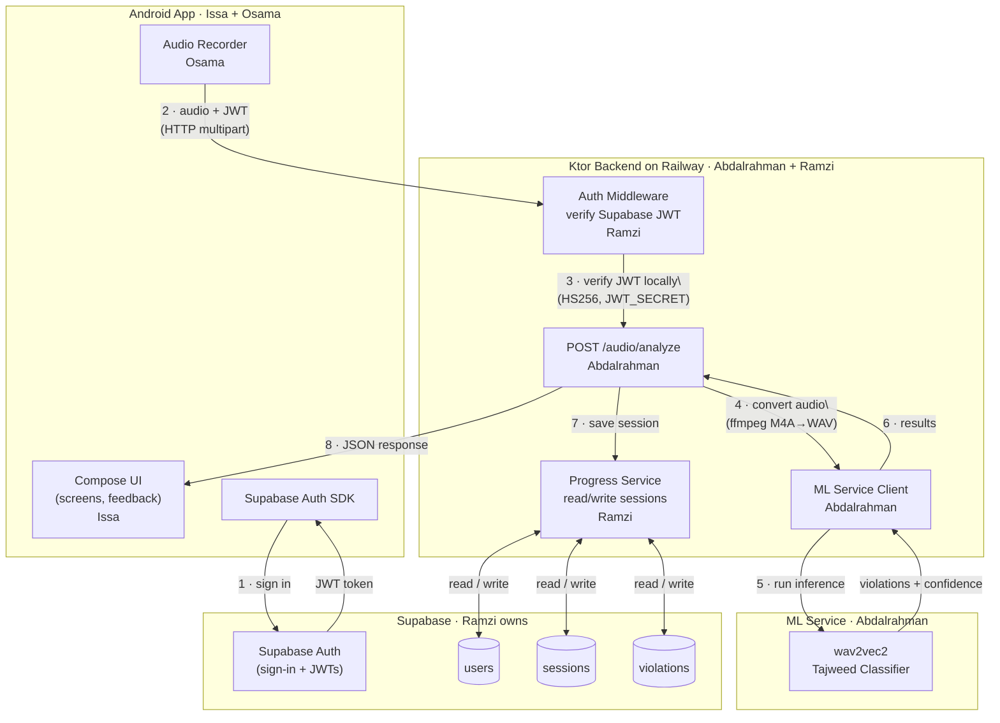

# Architecture

> ⚠️ **OUTDATED (pre-pivot).** Superseded by [`quran-muaalem-decision.md`](./quran-muaalem-decision.md) (2026-06-23). Bayaan no longer trains its own wav2vec2 classifier or runs a Whisper→ML→LLM→TTS pipeline, and the `violations`/`word_index`/`confidence` schema below is dead — recitation checking is now done by the off-the-shelf `obadx/quran-muaalem` engine (deployed on Modal, returns a structured tajweed error diff). The Supabase/Railway/ffmpeg pieces still apply. Kept for history; do not build from this. A revised architecture doc will land with the new backend slice.

## System Overview

Bayaan is a three-tier system: an Android app, a Ktor REST API, and a Python ML service. The Android app never touches the database directly — everything flows through the backend.



---

## Data Flow: Recitation Session (Step by Step)

1. **User opens app** → Supabase Auth SDK checks for a valid session. If none, shows sign-in screen.
2. **User taps Recite** → Android records audio via mic (M4A/AAC format).
3. **Audio sent to backend** → Android POSTs a multipart request to `/audio/analyze`, attaching the audio file and the Supabase JWT in the `Authorization: Bearer *** header.
4. **Backend verifies identity** → Ktor's JWT auth plugin verifies the token locally using `SUPABASE_JWT_SECRET` (HS256). No network call to Supabase needed. If invalid → 401, request stops here.
5. **Audio converted** → Backend converts the uploaded audio to 16kHz mono WAV via ffmpeg. If conversion fails → 422.
6. **Audio routed to ML** → The analyze endpoint forwards WAV bytes to the Python ML inference server.
7. **ML classifies** → The wav2vec2 model outputs violations: which rule/word, confidence score.
8. **Results saved** → Backend writes a session record and violations to Supabase PostgreSQL via direct JDBC (Exposed).
9. **Response returned** → Backend returns JSON to Android: list of violations with pre-written feedback text per rule.

---

## Data Flow: First-Time Sign-In

1. Android → Supabase Auth SDK → user signs in (email/password)
2. Supabase issues a JWT + user UUID
3. Android attaches this JWT to every subsequent HTTP request
4. Ktor verifies the JWT on every protected endpoint using Supabase's JWT secret
5. On first request, Ktor creates a row in the `users` table using the UUID from the token

---

## Module Responsibilities

### `/android` — Issa + Osama

| Component | Owner | What it does |
|-----------|-------|-------------|
| Compose screens + navigation | Issa | All UI: recitation screen, progress screen, feedback overlays |
| Audio recording | Osama | Mic capture, audio encoding |
| Supabase Auth SDK | Issa | Sign-in flow, JWT retrieval, session persistence |
| HTTP client (Retrofit/Ktor client) | Osama | Sends audio + JWT to backend, receives results |
| Feedback rendering | Issa | Highlights violations, triggers TTS playback |

### `/backend` — Abdalrahman + Ramzi

| Component | Owner | What it does |
|-----------|-------|-------------|
| JWT auth plugin (ktor-server-auth-jwt) | Ramzi | Verifies Supabase-issued JWTs locally using HS256 + SUPABASE_JWT_SECRET |
| `POST /audio/analyze` endpoint | Abdalrahman | Receives audio, converts format via ffmpeg, calls ML, saves results, returns JSON |
| Audio conversion (ffmpeg) | Ramzi | M4A/AAC → 16kHz mono WAV utility, called by the analyze endpoint |
| ML service client | Abdalrahman | Ktor HttpClient calling the Python inference server |
| Database connection (Exposed + HikariCP) | Ramzi | Direct JDBC connection to Supabase PostgreSQL |
| Database repositories (Exposed DAO) | Ramzi | Kotlin classes: UserRepository, SessionRepository, ViolationRepository |
| Railway deployment + Dockerfile | Ramzi | Build, deployment config, environment variables, health check |
| `GET /progress` endpoints | Ramzi | Returns session history and per-rule stats from the database |

### `/ml` — Abdalrahman

| Component | Owner | What it does |
|-----------|-------|-------------|
| wav2vec2 fine-tuning | Abdalrahman | Transfer learning on QDAT dataset, Kaggle GPU |
| ONNX export | Abdalrahman | Exports trained model for inference |
| Inference server | Abdalrahman | Loads ONNX model, exposes HTTP endpoint called by backend |
| Per-rule classifiers | Abdalrahman | Binary classifier per Tajweed rule (Ghunnah, Madd) |

---

## Technology Choices

| Layer | Technology | Why |
|-------|-----------|-----|
| Android | Jetpack Compose + Kotlin | Modern Android, reactive UI |
|| Backend | Ktor (Kotlin) | Lightweight, coroutine-native, same language as Android |
|| Auth + Database | Supabase | Auth (JWT issuance) + PostgreSQL. Backend connects directly via JDBC. |
|| ML | PyTorch + wav2vec2 | Pre-trained Arabic speech representations, fine-tunable in hours on free GPU |
|| ML inference format | ONNX | Runs outside PyTorch, portable |
|| Deployment | Railway | Simple Ktor deployment, $5/month Hobby plan |
|| Audio conversion | ffmpeg | Converts Android's M4A/AAC to 16kHz WAV for ML inference |

**Stretch goals (not in MVP):** ElevenLabs TTS, Groq Whisper STT, Claude/Gemini LLM feedback, WebSocket streaming.

---

## Database Schema (MVP)

These tables live inside your Supabase project. Run them in the Supabase SQL editor.

```sql
-- Created automatically by Supabase Auth for each user.
-- auth.users is managed by Supabase — do not create this table yourself.
-- We mirror the fields we need into a public profile table:

CREATE TABLE public.users (
    id          UUID PRIMARY KEY REFERENCES auth.users(id) ON DELETE CASCADE,
    email       TEXT,
    created_at  TIMESTAMPTZ DEFAULT now()
);

-- One row per recitation attempt
CREATE TABLE public.sessions (
    id          UUID PRIMARY KEY DEFAULT gen_random_uuid(),
    user_id     UUID REFERENCES public.users(id) ON DELETE CASCADE,
    surah       TEXT NOT NULL,        -- e.g. "al-fatihah"
    verse       INTEGER NOT NULL,     -- verse number (1-indexed)
    created_at  TIMESTAMPTZ DEFAULT now()
);

-- One row per detected violation in a session
CREATE TABLE public.violations (
    id           UUID PRIMARY KEY DEFAULT gen_random_uuid(),
    session_id   UUID REFERENCES public.sessions(id) ON DELETE CASCADE,
    rule         TEXT NOT NULL,       -- "ghunnah" | "madd"
    word_index   INTEGER NOT NULL,    -- position in verse (0-indexed)
    confidence   FLOAT NOT NULL,      -- model confidence 0.0–1.0
    correct      BOOLEAN NOT NULL     -- true = rule applied correctly, false = violation
);

-- Row Level Security: users can only read their own data
ALTER TABLE public.users ENABLE ROW LEVEL SECURITY;
ALTER TABLE public.sessions ENABLE ROW LEVEL SECURITY;
ALTER TABLE public.violations ENABLE ROW LEVEL SECURITY;

CREATE POLICY "users: own rows only" ON public.users
    FOR ALL USING (auth.uid() = id);

CREATE POLICY "sessions: own rows only" ON public.sessions
    FOR ALL USING (auth.uid() = user_id);

CREATE POLICY "violations: own sessions only" ON public.violations
    FOR ALL USING (
        session_id IN (SELECT id FROM public.sessions WHERE user_id = auth.uid())
    );
```

---

## Environment Variables

All secrets live in `.env` (never committed). See `.env.example` for the full list.

| Variable | Used by | Description |
|----------|---------|-------------|
| `SUPABASE_URL` | Backend + Android | Your Supabase project URL |
| `SUPABASE_ANON_KEY` | Android | Public anon key (safe to include in app) |
| `SUPABASE_JWT_SECRET` | Backend | Used by Ktor's JWT plugin to verify Supabase-issued tokens locally (HS256) |
| `SUPABASE_DB_URL` | Backend | Direct PostgreSQL connection string (e.g. `jdbc:postgresql://...`) for Exposed/JDBC |
| `ML_SERVICE_URL` | Backend | URL of the Python ML inference server (e.g. `http://localhost:8001`) |
| `PORT` | Backend | Port Railway assigns — read from env, bind to `0.0.0.0:$PORT` |
