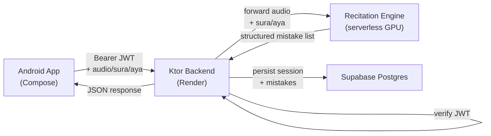

# Architecture

Current state of the system as built. This replaces an earlier draft that described a no-auth, no-DB proxy — that was the initial prototype; auth, persistence, and progress tracking have since been added.

## System overview

Three services: an Android app, a Ktor backend, and a serverless GPU recitation engine. The backend handles auth verification, audio forwarding, and persistence.

## Data flow: one recitation attempt

1. **Pick a verse.** The app calls `GET /surahs` to get the available list, then the user picks a surah and ayah.
2. **Record.** Tapping record captures 16kHz mono PCM via `AudioRecord` and wraps it as WAV in-memory — no server-side conversion needed.
3. **Upload.** The app POSTs `multipart/form-data` to `/audio/analyze` with a `Authorization: Bearer <supabase-jwt>` header. The backend verifies the JWT locally against `SUPABASE_JWT_SECRET`.
4. **Analyze.** The backend forwards the WAV to the recitation engine (serverless GPU). The engine returns structured JSON with phoneme-level errors (`errors`) and letter-characteristic errors (`sifat_errors`).
5. **Persist.** The backend inserts a row into `sessions` and batch-inserts one row per mistake into `mistakes` (via HikariCP → Supabase Postgres).
6. **Render.** The app parses the response. `errors` maps to character-range highlights on the verse text. `sifat_errors` maps to a "Letter Characteristics" section.
7. **Progress.** The user can check `GET /progress` to see aggregate stats and `GET /progress/sessions` for a paginated history.

## Module responsibilities

### `/android`

Jetpack Compose, single Gradle module (`app/`), Kotlin.

| Component | What it does |
|---|---|
| `VersePickerScreen` | Fetches `/surahs`, lists available surahs and ayat |
| `RecitationScreen` + `RecitationViewModel` | Records audio, uploads, renders Ready / Recording / Uploading / Result / Error states |
| `VerseText` | Renders Uthmani Arabic with arbitrary character ranges highlighted |
| `SifatErrorCard` | Renders per-phoneme letter-characteristic errors from `sifat_errors` |

### `/backend`

Ktor server. Six endpoints; all except `/health` and `/surahs` require a Supabase JWT.

| Endpoint | Auth | What it does |
|---|---|---|
| `GET /health` | No | Liveness check |
| `GET /surahs` | No | Hardcoded list of available surahs |
| `POST /auth/sync` | Yes | Upsert user into `users` table on first login |
| `POST /audio/analyze` | Yes | ffmpeg + engine call + persist session/mistakes |
| `GET /progress` | Yes | Aggregate stats for the authenticated user |
| `GET /progress/sessions` | Yes | Paginated session history |
| `GET /progress/sessions/{id}` | Yes | Full session detail with all mistakes |

### `/ml`

Deployment script for the recitation engine (a pretrained model, not trained here) on a serverless GPU platform. No training code.

## Database schema

Three tables in Supabase Postgres. Managed via Exposed table objects; the live DDL is in Supabase directly.

| Table | Key columns |
|---|---|
| `users` | `id uuid PK` |
| `sessions` | `id uuid PK`, `user_id → users.id`, `sura`, `aya`, `all_correct`, `created_at` |
| `mistakes` | `id uuid PK`, `session_id → sessions.id CASCADE`, `char_start`, `char_end`, `error_type`, `speech_error_type`, `rule_name_en`, `rule_name_ar`, `expected_len`, `predicted_len`, `created_at` |

## Technology choices

| Layer | Technology | Why |
|---|---|---|
| Android | Kotlin + Jetpack Compose, Material 3 | Modern Android UI |
| Backend | Ktor (Kotlin) | Lightweight, coroutine-native |
| Auth | Supabase JWT (HS256), verified locally | No round-trip to Supabase on every request |
| Database | Exposed ORM + HikariCP → Supabase Postgres | Type-safe queries; Supabase provides managed Postgres |
| Recitation analysis | External pretrained model (serverless GPU) | Avoids training/maintaining an in-house classifier |
| Backend hosting | Render (Docker, free tier) | Single Dockerfile deploy; cold starts after idle are acceptable for a prototype |

## Environment variables

| Variable | Where used | Required |
|---|---|---|
| `SUPABASE_DB_URL` | Backend — HikariCP JDBC URL | Yes, for any DB-touching endpoint |
| `SUPABASE_JWT_SECRET` | Backend — JWT verification | Yes |
| `SUPABASE_PROJECT_REF` | Backend — JWT issuer check | Yes |
| `MUAALEM_URL` | Backend — recitation engine URL | No; defaults to the live Modal endpoint |

The DB connection is initialized lazily on the first DB-touching request, so `/health` and `/surahs` start without `SUPABASE_DB_URL` being set.

## What's deferred

No Arabic-proficiency placement stage, no spoken feedback, no surahs beyond the two demo ones, no offline mode. Out of scope for the current prototype, not abandoned.
